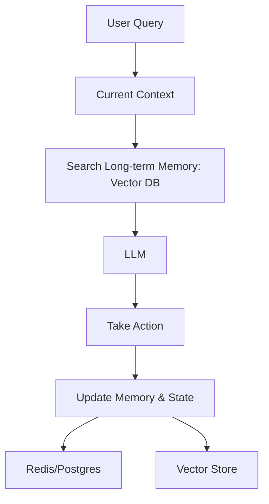

# Agent Memory & State: Remembering the Mission

## 1. Beginner-friendly Hinglish Explanation 🇮🇳
Bhai, socho tum ek research kar rahe ho. Tumne 10 websites dekhi aur kuch notes banaye. Agar tum har website ke baad purana sab bhool jao, toh kya tum research poori kar paoge? Nahi na. 

**Agent Memory** wahi "Yaddasht" hai. 
1. **Short-term Memory**: Yeh "Conversation history" jaisi hai (Jo tumne abhi pucha).
2. **Long-term Memory**: Yeh tumhare "Notes" jaisi hai (Jo tumne 2 din pehle pucha tha aur agent ne vector DB mein save kiya).
3. **State**: Yeh "Process status" hai (Kaunsa step ho gaya, kaunsa bacha hai).
Bina sahi memory aur state management ke, agent sirf ek "Bhullakad" (Forgetful) robot bankar reh jayega.

---

## 2. Deep Technical Explanation
Managing state and memory is the hardest part of building production agents.
- **Short-term Memory (Working Memory)**: Managed via the LLM context window. Techniques like "Conversation Summary Buffer" are used to keep it manageable.
- **Long-term Memory (Episodic/Semantic)**: Managed via Vector Databases (RAG). The agent retrieves relevant "past experiences" before taking an action.
- **State Persistence**: Using databases (Postgres/Redis) to store the agent's current variables, task list, and variables. This allows an agent to "Sleep" and "Resume" later.
- **Entity Memory**: Tracking specific details about entities (e.g., "The user's dog is named Rex").

---

## 3. Mathematical Intuition
Memory can be viewed as a **Weighted Context**.
$C_t = [P, M_{short}, M_{long}]$
where:
- $P$: The current prompt.
- $M_{short}$: Last $k$ messages.
- $M_{long}$: Top $n$ retrieved snippets from memory DB using $f_{embedding}(P)$.
The "Recall Quality" depends on the embedding model's ability to match the *current intent* with *past context*.

---

## 4. Architecture Diagrams


---

## 5. Production-ready Examples
Managing state with `LangGraph` (Checkpointing):

```python
from langgraph.checkpoint.sqlite import SqliteSaver

# Using a SQLite database to save agent state
memory = SqliteSaver.from_conn_string(":memory:")

# The graph will automatically save and load the state 
# based on the thread_id.
config = {"configurable": {"thread_id": "user_123"}}

# This allows 'Human-in-the-loop' where the agent pauses, 
# and the state stays safe until the human responds.
```

---

## 6. Real-world Use Cases
- **Customer Support**: Remembering that the user complained about a broken screen 2 days ago.
- **Learning Assistants**: Tracking which topics a student has mastered and which ones they struggle with.
- **Game Agents**: Remembering the player's choices to change the story later.

---

## 7. Failure Cases
- **Memory Overload**: Retrieving too much irrelevant "Old stuff" that makes the current prompt confusing.
- **State Corruption**: A bug in the code saves a "Half-finished" task as "Finished", causing the agent to skip a critical step.

---

## 8. Debugging Guide
1. **Context Inspection**: Always print the "Final Prompt" sent to the LLM (including retrieved memories). If it's 20,000 words long, your memory retrieval is too broad.
2. **Relevance Filtering**: Check if the "Long-term memories" retrieved are actually useful for the current goal.

---

## 9. Tradeoffs
| Memory Type | Pros | Cons |
|---|---|---|
| In-Context (History) | Instant/Accurate | Expensive/Token Limit |
| RAG (Vector) | Unlimited Size | Can be Irrelevant |
| Persistent State (SQL)| Resumable | Latency (DB calls) |

---

## 10. Security Concerns
- **Memory Hijacking**: If an agent remembers a malicious prompt from 1 week ago, it might execute it today.
- **PII Storage**: Accidental storage of user passwords or private info in the "Long-term memory" vector DB.

---

## 11. Scaling Challenges
- **Multi-user Memory**: How to efficiently manage 1 Million separate vector indexes for 1 Million users? (Answer: Use metadata filtering).

---

## 12. Cost Considerations
- **Storage Cost**: Storing millions of conversation turns in a vector DB (Pinecone/Weaviate) can cost $100s per month.

---

## 13. Best Practices
- **Summarize Old Conversations**: Instead of storing every word, store a "Summary" in the DB.
- **Forgetfulness by Design**: Use a "TTL" (Time to Live) for short-term memories so the context doesn't get cluttered.
- **Use a Schema**: Don't just store "Text". Store `{"action": "...", "result": "...", "timestamp": "..."}`.

---

## 14. Interview Questions
1. What is the difference between Episodic and Semantic memory for AI agents?
2. How do you handle an agent that has reached its context window limit?

---

## 15. Latest 2026 Patterns
- **MemGPT (MemoryGPT)**: An architecture that manages its own memory by "swapping" info between its context (RAM) and a DB (Disk) automatically.
- **Shared Team Memory**: Multi-agent systems where agents "Publish" their findings to a shared memory pool for others to see.
