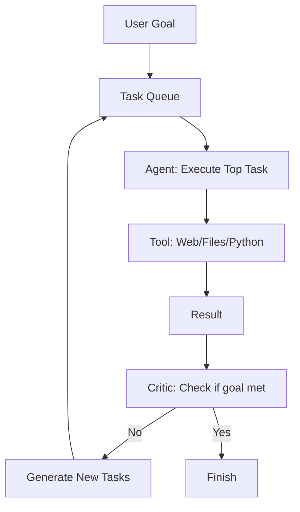

# AutoGPT & BabyAGI: The Pioneers of Autonomy

## 1. Beginner-friendly Hinglish Explanation 🇮🇳
Bhai, socho tumne ek AI ko bola: "Mujhe ek naya business shuru karna hai, market research se lekar website banane tak sab tum kar lo". Normal ChatGPT yahan haar maan jayega. Lekin **AutoGPT** aur **BabyAGI** ne dikhaya ki AI "Autonomous" ho sakta hai. 

Inhone ek "Loop" banaya: 
1. **Plan**: Kya karna hai?
2. **Do**: Kaam karo.
3. **Check**: Kya hua?
4. **Task List**: Agla kaam kya hai?
Yeh 2023-2024 ke woh "Viral" projects the jinhone agents ka craze shuru kiya. Bhale hi yeh thode "Unstable" the, lekin inhone dikhaya ki AI ko sirf "Chat" nahi, balki "Execute" karne ke liye bhi use kiya ja sakta hai.

---

## 2. Deep Technical Explanation
AutoGPT and BabyAGI were the first frameworks to implement recursive task execution.
- **Task Management**: Using an internal queue to manage "To-do" lists.
- **Long-term Memory**: Using Vector DBs (like Pinecone) to remember what was done in previous steps.
- **Continuous Loop**: The agent generates tasks, executes them, and then generates *new* tasks based on the results, theoretically running until the goal is met.
- **Self-Prompting**: The LLM writes prompts for itself to handle the next stage of the project.

---

## 3. Mathematical Intuition
Autonomous loops can be modeled as a **State Space Search**.
The goal is to find a sequence of actions $\{a_1, a_2, ..., a_n\}$ that reaches state $G$.
AutoGPT uses a **Greedy Search** at each step:
$$a_t = \arg \max P(a | s_{t-1}, G)$$
The main limitation was the lack of **Backtracking**; once a wrong task was added to the queue, the agent often went down a rabbit hole of irrelevant actions.

---

## 4. Architecture Diagrams


---

## 5. Production-ready Examples
Simplified BabyAGI logic:

```python
def baby_agi(objective):
    task_list = ["First task"]
    while task_list:
        task = task_list.pop(0)
        result = execute_task(task, objective)
        # 1. Store result in Vector DB
        vector_db.add(task, result)
        # 2. Generate new tasks based on result
        new_tasks = generate_tasks(objective, result, task_list)
        task_list.extend(new_tasks)
        # 3. Prioritize tasks
        task_list = prioritize_tasks(task_list, objective)
```

---

## 6. Real-world Use Cases
- **Autonomous Coding**: AutoGPT trying to fix a bug by reading files and running tests.
- **Market Intelligence**: Searching for competitors, pricing, and features, and summarizing it in a report.
- **Personalized News**: Monitoring 100 sources and creating a daily briefing on specific topics.

---

## 7. Failure Cases
- **Infinite Loops**: The agent keeps searching for the same thing without realizing it already has the answer.
- **Budget Burn**: Running a GPT-4 agent for 5 hours without supervision can cost $100+ in tokens.
- **Task Hallucination**: The agent creates tasks like "Fly to the moon" when asked to "Buy a pizza".

---

## 8. Debugging Guide
1. **Interrupt Signal**: Always have a way to manually stop the agent or set a `max_budget` limit.
2. **Task Audit**: If the task list grows to 50+ items, the agent has lost its way. Clear the queue and re-prompt.

---

## 9. Tradeoffs
| Feature | Manual Chat | Autonomous Agent |
|---|---|---|
| Autonomy | Zero | High |
| Reliability| High | Low |
| Speed | Fast (one pass) | Slow (multi-step) |

---

## 10. Security Concerns
- **Recursive Resource Exhaustion**: An agent creating 1000 tasks that each trigger 1000 sub-tasks, crashing your API account and your server.

---

## 11. Scaling Challenges
- **Context Management**: As the "History" grows, the agent becomes slower and more confused. Modern frameworks (like LangGraph) solve this with **State Management**.

---

## 12. Cost Considerations
- **Efficiency**: AutoGPT was notoriously inefficient. 2026 agents use "Plan-then-Execute" to save 70% on token costs.

---

## 13. Best Practices
- **Define a clear "Exit Condition"**.
- **Use a "Critic" model**: A second model that reviews every task before it's executed.
- **Provide specific tools**: Don't just give it "Google Search"; give it a tool to "Search for recent prices".

---

## 14. Interview Questions
1. Why did AutoGPT often fail in real-world production settings?
2. How does BabyAGI prioritize its task list?

---

## 15. Latest 2026 Patterns
- **Memory-Augmented Agents**: Agents that use "Memory Transformers" to handle 1M+ steps of history without forgetting.
- **Self-Healing Loops**: Agents that detect when they are in an infinite loop and automatically reset their internal state.
