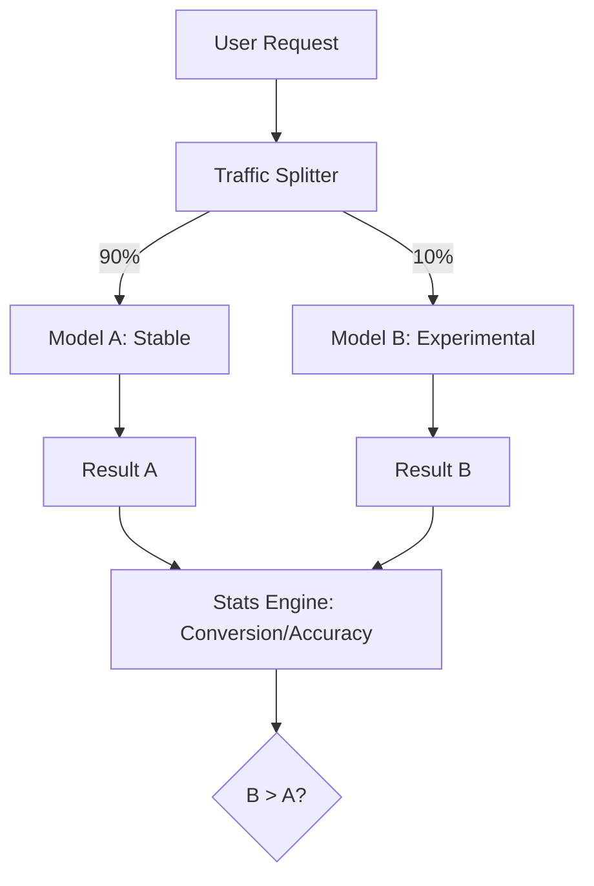

# A/B Testing LLMs: Data-Driven Deployment

## 1. Beginner-friendly Hinglish Explanation 🇮🇳
Bhai, socho tumne ek naya prompt likha hai aur tumhe lagta hai ki yeh puraane waale se "Better" hai. Lekin "Lagta hai" aur "Hai" mein farak hota hai. 

**A/B Testing** wahi tareeka hai jismein hum 50% users ko puraana prompt dikhate hain (Model A) aur 50% ko naya (Model B). Phir hum dekhte hain ki kaunse model mein users ne zyada "Thumbs Up" diye, ya kisne zyada purchases karwayi. Bina A/B testing ke, tum andhere mein teer chala rahe ho. Production mein hamesha "Data" ki sunni chahiye, apne "Gut feeling" ki nahi.

---

## 2. Deep Technical Explanation
A/B testing for LLMs involves comparing two different configurations (Models, Prompts, or RAG strategies) in a live environment.
- **Random Assignment**: Users are assigned to either Group A or Group B based on their UserID (Consistent hashing).
- **Metric Tracking**: Recording business-level KPIs (Conversion, Click-through rate) and model-level KPIs (Accuracy, Hallucination rate).
- **Statistical Significance**: Using p-values to ensure that Model B is *actually* better and not just lucky.
- **Canary Deployment**: Starting with 1% of traffic to Model B and gradually increasing it if no errors occur.

---

## 3. Mathematical Intuition
**Chi-Squared Test** for Conversion:
If Model A had 100 successes out of 1000, and Model B had 120 out of 1000.
$$ \chi^2 = \sum \frac{(O-E)^2}{E} $$
where $O$ is Observed and $E$ is Expected.
If $p < 0.05$, we can say with 95% confidence that Model B is superior.
For LLMs, we also use **Elo ratings** derived from human/AI comparisons in the test phase.

---

## 4. Architecture Diagrams


---

## 5. Production-ready Examples
Simple traffic splitting logic:

```python
import hashlib

def get_variant(user_id, experiment_name):
    # Deterministic hashing ensures user always gets the same variant
    hash_val = int(hashlib.md5(f"{user_id}_{experiment_name}".encode()).hexdigest(), 16)
    return "B" if (hash_val % 100) < 10 else "A" # 10% traffic to B

user_id = "user_789"
variant = get_variant(user_id, "new_prompt_v2")

if variant == "B":
    response = call_model_b(prompt)
else:
    response = call_model_a(prompt)
```

---

## 6. Real-world Use Cases
- **E-commerce Chatbots**: Testing if a "Friendly" persona leads to more sales than a "Formal" one.
- **Coding Assistants**: Testing if adding "Type Hints" to the prompt leads to fewer bugs in the generated code.

---

## 7. Failure Cases
- **Metric Dilution**: Testing too many things at once (Prompt + Model + Temperature). If results improve, you won't know which change caused it.
- **Small Sample Size**: Drawing conclusions from only 50 users. The results will be noisy and unreliable.

---

## 8. Debugging Guide
1. **Consistency Check**: Ensure that the *same* user doesn't see Model A in the morning and Model B in the evening. This ruins the user experience.
2. **Health Check**: If Model B has a 500 Error rate > 1%, kill the experiment immediately.

---

## 9. Tradeoffs
| Feature | Shadow Deployment | A/B Testing |
|---|---|---|
| User Impact | Zero | High |
| Real Feedback | None | High |
| Implementation | Complex | Medium |

---

## 10. Security Concerns
- **Variant Leakage**: A malicious user finding out they are in the "Experimental" group and trying to find vulnerabilities that aren't present in the "Stable" version.

---

## 11. Scaling Challenges
- **Latency Overload**: Running two different models in production means you need to maintain enough GPU capacity for both, especially during the split.

---

## 12. Cost Considerations
- **Infrastructure Cost**: If Model B is a larger model (e.g., 70B vs 8B), your operational costs will increase during the test period.

---

## 13. Best Practices
- **Test one variable at a time**.
- **Define success metrics BEFORE starting the test**.
- **Use a "Kill Switch"**: An automated way to revert all traffic to Model A if something goes wrong.

---

## 14. Interview Questions
1. How do you ensure that A/B testing doesn't degrade the user experience?
2. What is "Statistical Significance" and why is it important for LLM evals?

---

## 15. Latest 2026 Patterns
- **Multi-Armed Bandit (MAB)**: Instead of a fixed 50/50 split, an algorithm "Learns" in real-time which model is better and gradually sends more traffic to the winner.
- **Counterfactual Evaluation**: Using past user data to "Simulate" what would have happened if they had seen Model B, saving time and money on live tests.
