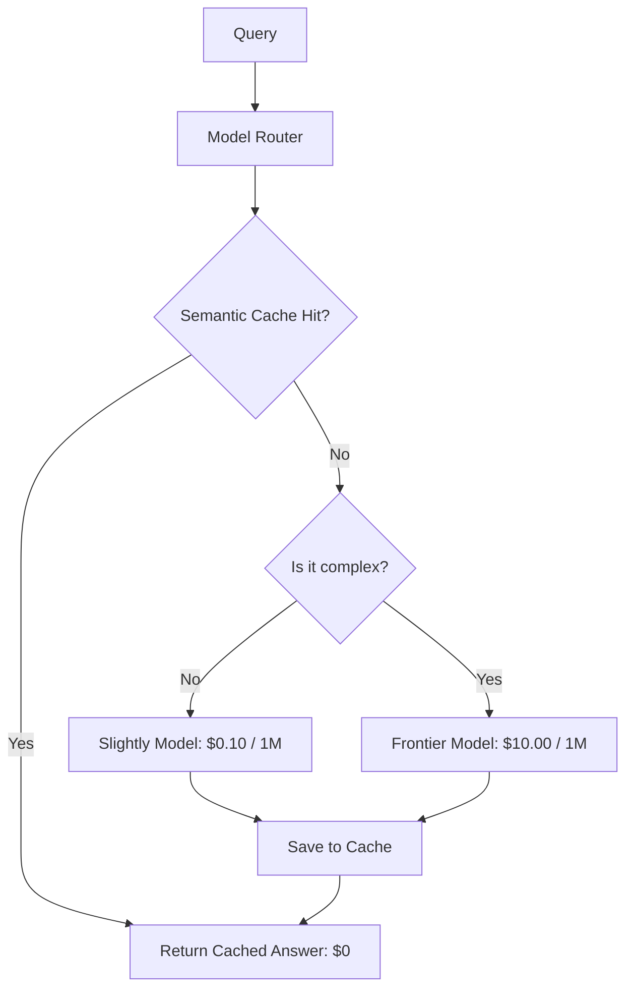

# 💸 Cost Optimization Strategies: AI Economics
> **Objective:** Master the engineering techniques to reduce LLM operational costs by 80% or more using semantic caching, model routing, quantization, and prompt engineering | **Language:** Hinglish | **Standard:** 2026 Expert Framework

---

## 🧭 1. Beginner-Friendly Hinglish Explanation
Cost Optimization ka matlab hai "AI ka kharcha kam karna bina quality giraye".

- **The Problem:** LLMs bahut mehenge ho sakte hain. Har token ka paisa lagta hai. Agar aapka app popular ho gaya, toh aapka bill lakhon mein aa sakta hai.
- **The Solution:** Cost Optimization. 
  - **Caching:** Agar do log ek hi sawal puchte hain, toh dusri baar model ko paise mat do, purana answer hi dikha do.
  - **Routing:** Chote kaamo ke liye sasta model (Llama-3 8B) aur bade kaamo ke liye mehenga model (GPT-4o) use karo.
- **Intuition:** Ye ek "Taxi" aur "Bus" jaisa hai. Office jane ke liye taxi theek hai, par roz sabke liye bus chalana sasta padta hai.

---

## 🧠 2. Deep Technical Explanation
Operational costs in 2026 are managed through four primary layers:

1. **Semantic Caching (GPTCache/Redis):** Storing responses for queries that are semantically similar. Even if the user asks "What's the weather?" vs "How is the climate?", the cache hits.
2. **Model Cascading/Routing:** A "Router" model (very tiny) predicts the complexity of the query and sends it to the cheapest capable model.
3. **Token Pruning:** Removing "Useless" words from the prompt (like 'please', 'thank you', 'a', 'the') before sending to the API.
4. **Prompt Caching:** Using provider-level caching (OpenAI/Anthropic) for static prefixes (e.g., a 100k-word PDF context).

---

## 📐 3. Mathematical Intuition
**Cost Saving Formula:**
$$\text{Total Cost} = (1 - \text{Hit Rate}) \times \text{LLM Cost} + \text{Hit Rate} \times \text{Cache Cost}$$
If your cache hit rate is $30\%$ and cache cost is nearly $\$0$, you've instantly cut your bill by **$30\%$**.
For **Prompt Caching**, you pay a "Write price" once and a "Read price" (usually $90\%$ cheaper) for every subsequent query.

---

## 🏗️ 4. Architecture Diagrams


---

## 💻 5. Production-Ready Examples
Using **LiteLLM** for automated model routing and cost tracking:
```python
import litellm

# Router automatically tries the cheapest model first
response = litellm.completion(
    model="gpt-4o-mini", # Cheap
    messages=messages,
    fallbacks=["gpt-4o"] # Smart but expensive (only if mini fails)
)

print(f"Cost of this call: {response._response_ms}")
```

---

## 🌍 6. Real-World Use Cases
- **Customer Support:** Caching answers to common questions like "Where is my order?".
- **Content Generation:** Using a cheap model to generate "Drafts" and a smart model only to "Finalize" them.
- **Academic Research:** Caching the summary of a popular paper that 1000 students are reading.

---

## ❌ 7. Failure Cases
- **Stale Cache:** Giving an answer from yesterday for a question about "Today's stock price". **Fix: Set a 'Time-to-Live' (TTL) for sensitive queries.**
- **Router Failure:** The router thinks a complex legal question is "Simple" and sends it to a small model that gives a wrong answer.

---

## 🛠️ 8. Debugging Guide
| Problem | Reason | Solution |
| :--- | :--- | :--- |
| **Cache hit rate is 0%** | Exact match only | Switch to **Semantic Search** (Vector-based) for the cache. |
| **Costs are still high** | Long context repeats | Enable **Prompt Caching** (header based) to save on input tokens. |

---

## ⚖️ 9. Tradeoffs
- **Aggressive Caching (High savings / Risk of old info).**
- **No Caching (High cost / Always fresh info).**

---

## 🛡️ 10. Security Concerns
- **Cache Poisoning:** If an attacker can inject a wrong answer into your cache (e.g., by asking a question and providing a "Corrective" feedback), all subsequent users will see that wrong answer.

---

## 📈 11. Scaling Challenges
- **The "Cache Context" Problem:** Caching for one user is easy. Caching for 1 million users with different "Privacy permissions" is hard. (User A shouldn't see User B's cached private data).

---

## 💰 12. Cost Considerations
- In 2026, "Input Tokens" are usually $10x$ cheaper than "Output Tokens". Focus on making the model give **concise** answers to save the most money.

漫
---

## 📝 14. Interview Questions
1. "Explain the difference between Exact Caching and Semantic Caching."
2. "What is 'Model Cascading' and when should it be used?"
3. "How does Prompt Caching reduce costs for long-context RAG?"

---

## 🚀 15. Latest 2026 LLM Engineering Patterns
- **Speculative Execution for Cost:** Running a small model to predict if the large model is even needed.
- **Token-Efficient Compression:** Using specialized "Compressor" models that turn a 1000-word prompt into a 100-token "Code" that the LLM still understands.
漫
漫
