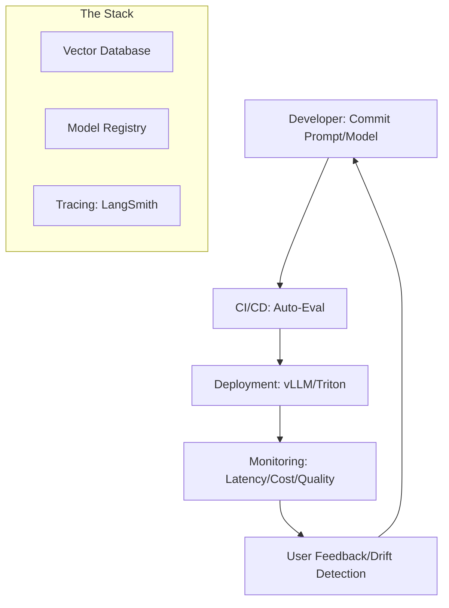

# LLMOps Fundamentals: AI in Production

## 1. Beginner-friendly Hinglish Explanation 🇮🇳
Bhai, socho tumne apne laptop par ek badhiya AI model bana liya jo perfectly kaam kar raha hai. Ab tumhe ise 1 million users ke liye deploy karna hai. Kya tum apna laptop on rakhoge? Nahi na. 

**LLMOps (Large Language Model Operations)** wahi practice hai jismein hum seekhte hain ki kaise ek AI model ko production mein "Reliably" aur "Efficiently" chalaya jaye. Ismein models ki versioning, data ki safai, deployment, aur cost control sab aata hai. Yeh bilkul waise hi hai jaise ek choti shop ko "Amazon" level ka warehouse banana. Bina LLMOps ke, tumhara AI project sirf ek "Lab experiment" bankar reh jayega.

---

## 2. Deep Technical Explanation
LLMOps extends DevOps and MLOps to handle the unique challenges of Large Language Models.
- **Data Lifecycle**: Managing prompt templates, RAG datasets, and synthetic data.
- **Model Lifecycle**: Managing model versions (Llama-3 v1 vs v2), quantization variants (4-bit vs 8-bit), and adapters (LoRAs).
- **Inference Lifecycle**: Scaling GPU clusters, managing throughput vs latency, and caching.
- **Feedback Loop**: Collecting user ratings and "thumbs-up/down" to improve the model via fine-tuning.

---

## 3. Mathematical Intuition
Operational efficiency is measured by **P99 Latency** and **Throughput**.
Throughput $T$:
$$T = \frac{\text{Total Tokens Generated}}{\text{Total Time} \times \text{Number of GPUs}}$$
LLMOps aim to maximize $T$ while keeping $P99 < 2s$ (for the first token). This requires balancing batch sizes and memory usage.

---

## 4. Architecture Diagrams


---

## 5. Production-ready Examples
A standard `docker-compose` for a production LLM stack:

```yaml
version: '3.8'
services:
  vllm-server:
    image: vllm/vllm-openai
    command: --model meta-llama/Llama-3-8B
    deploy:
      resources:
        reservations:
          devices:
            - driver: nvidia
              count: 1
              capabilities: [gpu]
  vector-db:
    image: qdrant/qdrant
  observability:
    image: arize-phoenix/phoenix
```

---

## 6. Real-world Use Cases
- **Scaling Startups**: Moving from an OpenAI API (Prototype) to a self-hosted Llama-3 model on AWS/GCP (Production).
- **Enterprise Governance**: Tracking every prompt and response for compliance and auditing.

---

## 7. Failure Cases
- **Silent Degradation**: The model's answers become worse over time (Model Drift) but the "Success" code (HTTP 200) stays the same.
- **Cost Spike**: A recursive loop or a viral user causes a $10,000 GPU bill overnight.

---

## 8. Debugging Guide
1. **Tracing**: Use **LangSmith** or **Arize Phoenix** to trace exactly where a request failed (Was it the retrieval? The prompt? The model?).
2. **Error Analysis**: Cluster 100 failed requests to see if there's a common pattern (e.g., "All failures are about medical questions").

---

## 9. Tradeoffs
| Feature | Managed (OpenAI/Anthropic) | Self-Hosted (Llama/vLLM) |
|---|---|---|
| Ops Overhead | Low | High |
| Privacy | Medium | High |
| Long-term Cost | High (per token) | Low (per GPU hour) |

---

## 10. Security Concerns
- **API Key Leakage**: Accidentally committing your $10,000/mo OpenAI key to a public GitHub repo.
- **Access Control**: Ensuring only authorized users can query the internal company Vector DB.

---

## 11. Scaling Challenges
- **Cold Starts**: Spinning up a new GPU instance and loading a 70B model can take 5-10 minutes, making "Serverless" LLMs difficult.

---

## 12. Cost Considerations
- **Token Budgeting**: Implementing "Quotas" for users so they don't burn the company's AI budget in one day.

---

## 13. Best Practices
- **Version everything**: Models, Prompts, and Datasets.
- **Automated Evals**: Never deploy a new prompt without running it against your "Golden Dataset".
- **Monitor Token Usage**: Set up alerts for sudden spikes in spending.

---

## 14. Interview Questions
1. How does LLMOps differ from traditional MLOps?
2. What are the key metrics you would monitor for a production RAG system?

---

## 15. Latest 2026 Patterns
- **PromptOps**: Treating prompt engineering as a first-class citizen with its own branching, testing, and deployment cycles.
- **Multi-Model Orchestration**: Dynamically switching between models (GPT-4o for complex tasks, Llama-3-8B for simple ones) to optimize cost and speed.
