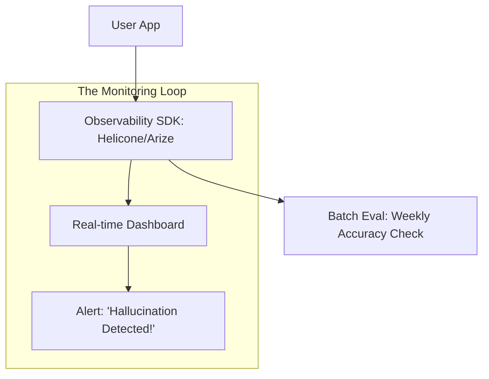

# 👁️ Model Monitoring and Observability: AI Auditing
> **Objective:** Master the tools and techniques to track LLM performance, costs, and quality in real-time, moving beyond basic logs to deep semantic observability | **Language:** Hinglish | **Standard:** 2026 Expert Framework

---

## 🧭 1. Beginner-Friendly Hinglish Explanation
Model Monitoring ka matlab hai "Model par nazar rakhna".

- **The Problem:** AI model ek "Black Box" jaisa hai. Aapko nahi pata ki wo andar kya soch raha hai ya wo kab "Galat" rasta pakad lega.
- **The Solution:** Observability. 
  - Hum har ek "Chat" ko record karte hain. 
  - Hum dekhte hain ki kitne tokens kharch hue (Money). 
  - Hum ye bhi check karte hain ki kya user khush hai ya nahi (Sentiment).
- **Intuition:** Ye ek "CCTV Camera" jaisa hai jo 24/7 AI ki harkaton par nazar rakhta hai takki galti hote hi hum "Alarm" baja sakein.

---

## 🧠 2. Deep Technical Explanation
Observability in 2026 consists of **Tracing, Feedback, and Evaluation**:

1. **Distributed Tracing (LangSmith/LangFuse):** Recording the entire "Chain" of thoughts. (e.g., User Query $\rightarrow$ Agent Thought $\rightarrow$ Tool Call $\rightarrow$ Result $\rightarrow$ Response).
2. **Semantic Monitoring:** Using embeddings to detect if the model's answers are "Drifting" (changing over time).
3. **Sentiment Analysis of Logs:** Detecting when users are getting angry ("You are stupid", "Wrong answer") and flagging those logs for manual review.
4. **Latency Bucketing:** Tracking TTFT (Time to First Token) and TPOT (Time per Output Token) to identify server bottlenecks.
5. **Cost Attribution:** Tracking which specific user or department is spending the most on API tokens.

---

## 📐 3. Mathematical Intuition
**Drift Detection using KL Divergence:**
We compare the probability distribution of model outputs in Week 1 ($P$) vs Week 2 ($Q$).
$$D_{KL}(P \| Q) = \sum P(x) \log \frac{P(x)}{Q(x)}$$
If $D_{KL}$ exceeds a threshold, it means the model's behavior has changed significantly (potentially due to an update in the underlying API).

---

## 🏗️ 4. Architecture Diagrams


---

## 💻 5. Production-Ready Examples
Integrating **LangSmith** for full-trace observability:
```python
import os
from langsmith import traceable

os.environ["LANGCHAIN_TRACING_V2"] = "true"

@traceable
def my_ai_function(query):
    # Every step inside this function will be recorded
    # including tool calls and internal logic.
    response = model.invoke(query)
    return response
```

---

## 🌍 6. Real-World Use Cases
- **Customer Support:** Identifying that $20\%$ of users are asking about a specific "New Bug" that the AI doesn't know about yet.
- **Cost Control:** Finding out that one developer's test script used \$2000 of tokens in 2 hours.
- **Quality Assurance:** Re-playing a "Failed" conversation to see exactly where the agent made a mistake.

---

## ❌ 7. Failure Cases
- **Metric Overload:** Having so many alerts that the developers start ignoring them (Alert Fatigue).
- **Sampling Error:** Only monitoring $1\%$ of logs and missing a critical safety violation that happened in the other $99\%$.
- **Privacy Leak:** Capturing "User Feedback" that contains their private phone number and storing it in a 3rd party dashboard.

---

## 🛠️ 8. Debugging Guide
| Problem | Reason | Solution |
| :--- | :--- | :--- |
| **Costs are rising but users are same** | Model is getting wordy | Implement a **Conciseness Monitor**; penalize long responses. |
| **Model is slow for some users** | Region latency | Use **Multi-region model deployment** (Edge serving). |

---

## ⚖️ 9. Tradeoffs
- **Full Logging (Max Debugging / High Cost / Privacy Risk).**
- **Sampled Logging (Low Cost / Lower Privacy Risk / Might miss edge cases).**

---

## 🛡️ 10. Security Concerns
- **Dashboard Hijacking:** If an attacker gets access to your observability dashboard, they can see ALL your users' private conversations. **Use 2FA and strict RBAC (Role-Based Access Control).**

---

## 📈 11. Scaling Challenges
- **Log Volume:** If you have 100M tokens/day, your "Observability Bill" might be bigger than your "Model Bill". **Fix: Self-host your logs or use intelligent sampling.**

---

## 💰 12. Cost Considerations
- Observability platforms usually charge per "Trace" or "Token". Budget for an extra $5-10\%$ overhead for monitoring.

漫
---

## 📝 14. Interview Questions
1. "What is a 'Trace' in the context of an AI agent?"
2. "How do you detect 'Semantic Drift' without human labels?"
3. "What are the key performance metrics (KPIs) for a production LLM?"

---

## 🚀 15. Latest 2026 LLM Engineering Patterns
- **Real-time Hallucination Detection:** Running a tiny, cheap model alongside the main model just to "Verify" the facts in every sentence.
- **Automated Feedback Loop:** If a user clicks "Thumbs Down," the system automatically sends that trace to a "Fine-tuning" pipeline for the next model version.
漫
漫
