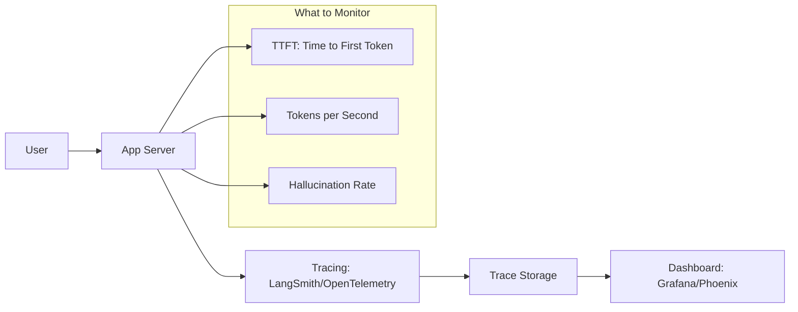

# Monitoring & Observability: Seeing Inside the Black Box

## 1. Beginner-friendly Hinglish Explanation 🇮🇳
Bhai, jab tumhara AI system production mein jata hai, toh woh ek "Black Box" ban jata hai. Tumhe kaise pata chalega ki woh sahi answers de raha hai ya nahi? Ya phir users use kaise use kar rahe hain? 

**Monitoring aur Observability** wahi "X-ray" hai jo tumhe system ke andar ki khabar deti hai. 
- **Monitoring**: "Kya system chal raha hai?" (Latency, Error rate, Cost).
- **Observability**: "System aisa kyun behave kar raha hai?" (Tracing the prompt, checking the retrieved chunks, looking at the attention logs). 
Bina sahi monitoring ke, tum tab tak nahi jaonoge ki tumhara AI "Pagal" (Hallucinating) ho gaya hai jab tak koi customer complain na kare.

---

## 2. Deep Technical Explanation
Observability for LLMs goes beyond standard HTTP metrics.
- **Traces**: Seeing the full lifecycle of a request - from the user's query to the vector search, to the prompt construction, to the final model output.
- **Span Analysis**: Measuring how long each sub-step takes (e.g., "Vector search took 200ms, Model generation took 1.5s").
- **Quality Drift**: Using a "Shadow Model" or an "LLM-Judge" to score production outputs in real-time.
- **Cost Tracking**: Attributing token usage to specific users, features, or organizations.

---

## 3. Mathematical Intuition
**Drift Detection**:
We monitor the distribution of embeddings of user queries $P_{queries}$. If the distribution shifts significantly (measured using **Kullback-Leibler Divergence** or **Cosine Similarity** mean shift), it means users are asking things the model wasn't prepared for.
$$D_{KL}(P || Q) = \sum_i P(i) \log \frac{P(i)}{Q(i)}$$
A high $D_{KL}$ is a signal to update your RAG database or fine-tune your model.

---

## 4. Architecture Diagrams


---

## 5. Production-ready Examples
Using `Arize Phoenix` for OTel tracing (Conceptual):

```python
from phoenix.trace.openai import OpenAIInstrumentor

# 1. Initialize Tracing
OpenAIInstrumentor().instrument()

# 2. Run your LLM code as usual
# All calls to OpenAI will now be automatically traced
# and visible in the Phoenix dashboard.

# 3. Check for Hallucinations in the background
# phoenix.eval(llm_judge, traces)
```

---

## 6. Real-world Use Cases
- **Enterprise Support**: Detecting when the model is frequently saying "I don't know" to specific product questions (Signal to add more docs to RAG).
- **Abuse Detection**: Flagging users who are trying to "Jailbreak" the model by analyzing their trace history.

---

## 7. Failure Cases
- **Metric Overload**: Monitoring 1000 different things and ignoring the 1 thing that actually matters (Accuracy).
- **Latency of Observability**: If your monitoring system is slow, it might slow down the user's response too much. Use **Asynchronous logging**.

---

## 10. Security Concerns
- **PII in Logs**: Traces often contain the full user prompt and model response. If these logs aren't encrypted or access-controlled, they are a massive privacy risk.

---

## 11. Scaling Challenges
- **Massive Trace Volumes**: Storing every single token for a system with 1M users can take petabytes of space. Use **Sampling** (e.g., log only 1% of successful requests but 100% of errors).

---

## 12. Cost Considerations
- **Storage Cost**: Many observability platforms charge by the number of "Spans" or "Tokens" logged.

---

## 13. Best Practices
- **TTFT (Time to First Token)**: This is the most important latency metric for user experience.
- **Log the "Retrieved Chunks"**: If the answer is wrong, you need to know if the retriever failed or the generator failed.
- **Use OpenTelemetry (OTel)**: Don't lock yourself into one vendor's tracing format.

---

## 14. Interview Questions
1. What is the difference between Monitoring and Observability in the context of LLMs?
2. How would you detect "Model Drift" in a production RAG application?

---

## 15. Latest 2026 Patterns
- **AI-Native Observability**: Using a small model to "Watch" your production traces and alert you only when it finds something "Interesting" or "Wrong".
- **Semantic Monitoring**: Monitoring the "Meanings" of user queries in vector space to find gaps in your knowledge base automatically.
