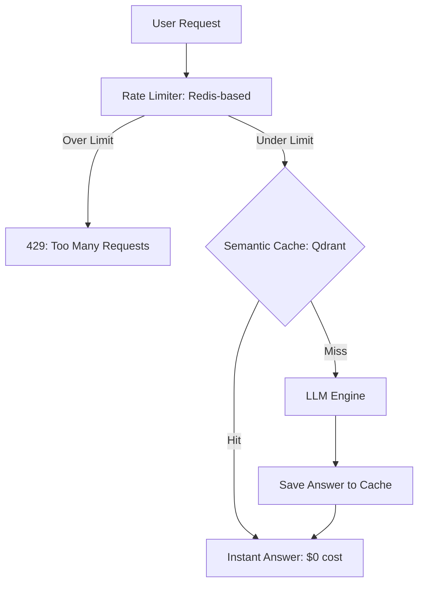

# 🚦 Rate Limiting and Caching: Controlling the Flow
> **Objective:** Master the traffic management and performance optimization techniques required for stable LLM services—focusing on token-based rate limiting and semantic caching strategies | **Language:** Hinglish | **Standard:** 2026 Expert Framework

---

## 🧭 1. Beginner-Friendly Hinglish Explanation
Rate Limiting aur Caching ka matlab hai "Traffic ko control karna aur speed badhana".

- **The Problem:** 
  1. Ek user bohot saare sawal puch kar aapka pura GPU "Hog" kar sakta hai (Rate Limiting).
  2. Ek hi sawal 100 log puchenge toh 100 baar paise kyu dena? (Caching).
- **The Solution:** 
  - **Rate Limiting:** Har user ki ek limit set karna (e.g., 50 tokens per minute).
  - **Caching:** Popular answers ko "Memory" mein save karna takki agali baar instant answer mile.
- **Intuition:** Ye ek "Buffet Restaurant" jaisa hai. Rate limiting ye hai ki ek baar mein sirf ek plate milegi. Caching ye hai ki popular dishes pehle se taiyar rakhi jayein takki queue na lage.

---

## 🧠 2. Deep Technical Explanation
Effective traffic management for LLMs requires **Token-Aware** strategies:

1. **Token-Bucket Algorithm:** Instead of "Requests per minute", we use "Tokens per minute". A user might send 1 long request that uses their entire "Bucket" for the hour.
2. **Semantic Caching (Vector-based):** Storing responses based on the *meaning* of the query. 
   - Query: "How to fix a flat tire?" $\rightarrow$ Cache Miss.
   - Query: "Flat tire repair guide" $\rightarrow$ Cache Hit (if semantic similarity $> 0.95$).
3. **Multi-layer Caching:** 
   - **L1 (Local Memory):** Ultra-fast, for the same user.
   - **L2 (Redis/Shared):** Across all users for global queries.
4. **Tiered Rate Limiting:** Free users get slow models/low limits; Paid users get fast models/high limits.

---

## 📐 3. Mathematical Intuition
**Token Rate Limiting ($R$):**
If a user has a refill rate of $\rho$ tokens/sec and a bucket size of $B$:
$$\text{Available Tokens} = \min(B, \text{Previous} + \rho \times \Delta t)$$
This prevents "Bursty" traffic from crashing your GPU cluster while allowing occasional long queries.

---

## 🏗️ 4. Architecture Diagrams


---

## 💻 5. Production-Ready Examples
Implementing **Rate Limiting** with Redis (Conceptual):
```python
# Limit by Tokens Per Minute (TPM)
def check_rate_limit(user_id, tokens_requested):
    current_tokens = redis.get(f"user:{user_id}:tpm")
    if current_tokens + tokens_requested > MAX_TPM:
        raise Exception("Rate limit exceeded")
    redis.incrby(f"user:{user_id}:tpm", tokens_requested)
```

Setting up **Semantic Caching**:
```python
from gptcache import cache
from gptcache.embedding import OpenAI

# Initialize cache with semantic similarity
cache.init(
    embedding_handler=OpenAI(),
    similarity_threshold=0.9
)
# Next queries will check embeddings in a vector DB first.
```

---

## 🌍 6. Real-World Use Cases
- **Public Chatbots:** Preventing a single script/bot from draining \$10,000 of your API credits in one night.
- **Internal Tools:** Giving "Data Scientists" more tokens than "HR" because their queries (Code) are longer.
- **E-commerce:** Caching answers for "Return Policy" or "Shipping Times" during a sale.

---

## ❌ 7. Failure Cases
- **Cache Drift:** The cache has an old answer to "Who is the Prime Minister?". **Fix: Set a low TTL (Time To Live) for news-related topics.**
- **False Cache Hit:** User asks "Is the iPhone 15 good?" and gets a cached answer for "Is the iPhone 14 good?" because they are semantically similar. **Fix: Use a higher similarity threshold (0.98).**

---

## 🛠️ 8. Debugging Guide
| Problem | Reason | Solution |
| :--- | :--- | :--- |
| **Legitimate users get blocked** | Limit is too low for 'Chat' | Use **Rolling Windows** instead of fixed windows for rate limiting. |
| **Cache is filling up RAM** | No eviction policy | Use **LRU (Least Recently Used)** eviction in Redis. |

---

## ⚖️ 9. Tradeoffs
- **Semantic Cache (High hit rate / Risk of wrong answer / Vector DB cost).**
- **Exact Cache (100% accurate / Low hit rate / Fast).**

---

## 🛡️ 10. Security Concerns
- **Rate Limit Bypass:** Attackers using 1000 different IP addresses (Sybil attack) to bypass your "Per-IP" limit. **Fix: Limit by User ID / API Key.**

---

## 📈 11. Scaling Challenges
- **The "Centralized Bottleneck":** If 100k users hit one Redis instance for rate limiting, the Redis itself becomes the slow part. **Fix: Use Distributed Rate Limiting (Cluster mode).**

---

## 💰 12. Cost Considerations
- Caching can save **$50\%-90\%$** of your LLM bill. In 2026, an app without caching is considered "un-engineered".

---

## ✅ 13. Best Practices
- **Cache 'Static' information only.**
- **Set aggressive Rate Limits for Free users.**
- **Monitor the 'Cache Hit Rate' KPI daily.**

漫
---

## 📝 14. Interview Questions
1. "Why is Token-based rate limiting better than Request-based for LLMs?"
2. "How do you handle 'Semantic Drift' in a cache?"
3. "Explain the 'Token Bucket' algorithm."

---

## 🚀 15. Latest 2026 LLM Engineering Patterns
- **Dynamic Rate Limits:** The system automatically increases your limit if you are a "Good user" (high feedback score).
- **Proactive Caching:** The AI "Predicts" what questions will be popular today (e.g., news events) and pre-fills the cache.
漫
漫
漫
漫
漫
