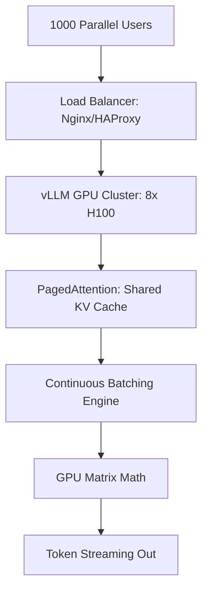

# 🏗️ Scalable Inference Infrastructure: Serving Millions
> **Objective:** Master the engineering behind high-throughput LLM serving—from dynamic batching and PagedAttention to multi-GPU orchestration and auto-scaling GPU clusters | **Language:** Hinglish | **Standard:** 2026 Expert Framework

---

## 🧭 1. Beginner-Friendly Hinglish Explanation
Scalable Inference Infrastructure ka matlab hai "Ek aisa engine banana jo hazaro logo ko ek sath service de sake".

- **The Problem:** LLMs bahut heavy hote hain. Ek request ek poore GPU ko "Busy" kar sakti hai. Agar 100 log ek sath aayein, toh system crash ho jayega.
- **The Solution:** Scalable Infrastructure. 
  - **Dynamic Batching:** Alag-alag logo ke sawalo ko ek "Batch" mein daal kar GPU ko dena (Jaise ek bus mein 50 log jate hain).
  - **Auto-scaling:** Jab traffic badhe, toh apne aap naye GPUs "On" ho jayein.
- **Intuition:** Ye ek "Railway System" jaisa hai. Sirf engine (Model) kaafi nahi hai, aapko tracks (Infra) aur schedules (Batching) chahiye takki sab log time par pahunch sakein.

---

## 🧠 2. Deep Technical Explanation
Serving LLMs at scale requires optimizing the **Memory and Compute** bottleneck:

1. **Continuous Batching (vLLM/TGI):** Instead of waiting for a whole batch to finish, a new request is added to the batch as soon as an old one finishes a single token.
2. **PagedAttention:** Managing the KV Cache like OS Virtual Memory (paging). This eliminates memory fragmentation and allows for $10x$ higher throughput.
3. **Speculative Decoding:** Using a tiny model to "Guess" tokens and a large model to "Verify" them in parallel, doubling the generation speed.
4. **Quantized Kernels:** Using AWQ or GPTQ to fit larger models on smaller GPUs with near-zero loss in accuracy.
5. **Multi-Host Inference:** Splitting a 405B model across 8 or 16 GPUs using **Tensor Parallelism**.

---

## 📐 3. Mathematical Intuition
**Inference Throughput ($T$):**
$$T = \frac{\text{Batch Size} \times \text{Tokens per Second}}{\text{Hardware Latency}}$$
To increase $T$, we must increase **Batch Size**. However, increasing batch size increases VRAM usage linearly. **PagedAttention** allows us to push Batch Size from 4 to 128 on a single A100 GPU.

---

## 🏗️ 4. Architecture Diagrams


---

## 💻 5. Production-Ready Examples
Deploying a scalable model with **vLLM** (The 2026 gold standard):
```bash
# Start a multi-GPU serving engine
python -m vllm.entrypoints.openai.api_server \
    --model neural-chat-7b-v3-1 \
    --tensor-parallel-size 2 \
    --gpu-memory-utilization 0.9 \
    --max-num-seqs 256 # Massive batch size
```

Client-side streaming for better UX:
```python
# Streaming tokens as they are generated
for chunk in client.chat.completions.create(..., stream=True):
    print(chunk.choices[0].delta.content, end="")
```

---

## 🌍 6. Real-World Use Cases
- **Social Media Bots:** Handling 100,000 comments per second across a global network.
- **Gaming:** Serving 1 million NPCs (non-player characters) that talk to players in real-time.
- **Legal Search:** Processing 50,000 PDF documents in a single "Batch" for a law firm.

---

## ❌ 7. Failure Cases
- **VRAM Fragmentation:** The system has 80GB VRAM, but because of fragmentation, it can only use 40GB and then crashes (OOM). **Fix: Use vLLM.**
- **Long-Response Starvation:** One user asks for a 5000-word essay, which "Blocks" the GPU for 2 minutes, making everyone else's short questions wait. **Fix: Use Continuous Batching.**

---

## 🛠️ 8. Debugging Guide
| Problem | Reason | Solution |
| :--- | :--- | :--- |
| **GPU is at 100% but throughput is low** | Small batch size | Increase **`max_num_seqs`**; the GPU is idling between requests. |
| **Tokens are very slow (1 per sec)** | KV Cache offloading to CPU | Increase **GPU memory utilization** or use a smaller model. |

---

## ⚖️ 9. Tradeoffs
- **High Batching (Max Throughput / High Latency per user).**
- **Low Batching (Low Latency per user / Low Total Throughput).**

---

## 🛡️ 10. Security Concerns
- **GPU Side-Channel Attacks:** An attacker measuring the timing of token generation might be able to infer the contents of another user's prompt sharing the same batch.

---

## 📈 11. Scaling Challenges
- **The Cold Start Problem:** Loading a 70B model into VRAM takes 30-60 seconds. You can't "Spin up" a new GPU instantly for a traffic spike.

---

## 💰 12. Cost Considerations
- H100 GPUs cost \$2-\$4 per hour. If your throughput is low, you are wasting hundreds of dollars a day. Always aim for **$80\%+$ GPU Utilization**.

漫
---

## 📝 14. Interview Questions
1. "How does PagedAttention solve the VRAM fragmentation problem?"
2. "Explain the difference between Tensor Parallelism and Pipeline Parallelism."
3. "What is 'Continuous Batching' and why is it better than static batching?"

---

## 🚀 15. Latest 2026 LLM Engineering Patterns
- **Serverless GPUs:** Using platforms like Modal or RunPod to spin up GPUs in seconds for specific tasks.
- **Pre-fill Caching:** Storing the "KV Cache" of popular prompts on SSDs and loading them into VRAM in milliseconds to bypass the slow pre-fill stage.
漫
漫
