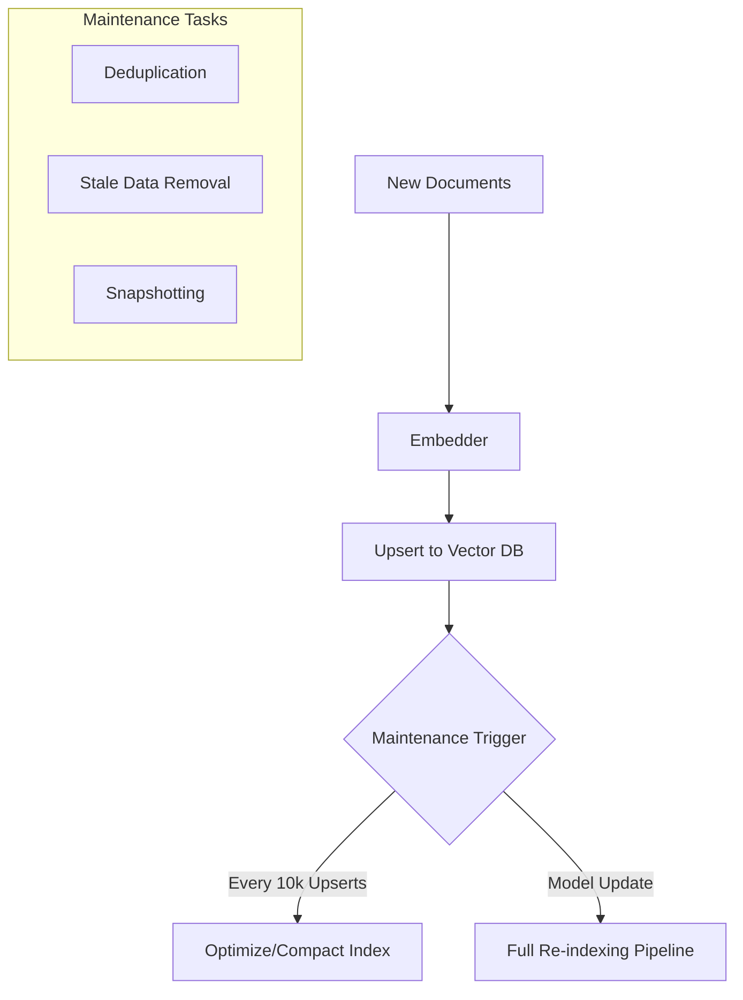

# Vector DB Maintenance: Keeping the Engine Smooth

## 1. Beginner-friendly Hinglish Explanation 🇮🇳
Bhai, socho tumne ek library banayi aur usmein 10,000 books rakh di. Agar tum nayi books bina kisi order ke rakhte jaoge, aur puraani bekaar books nahi hataoge, toh ek din sab kuch "Mess" ho jayega. 

**Vector DB Maintenance** wahi "Cleaning aur Indexing" ka kaam hai. Jab naya data aata hai, toh index ko "Refresh" karna padta hai. Jab purana data galat ho jata hai, toh use "Delete" ya "Update" karna padta hai. Iske bina tumhari search slow ho jayegi aur accuracy kam ho jayegi. Yeh bilkul waise hi hai jaise car ki "Service" karwana—tameez se karoge toh engine (Search) saalo saal chalega.

---

## 2. Deep Technical Explanation
Vector databases require active maintenance to prevent performance degradation over time.
- **Index Rebuilding**: As you add/delete vectors, the HNSW graph or IVF clusters become fragmented. You need to "Optimize" or "Compact" the index periodically.
- **Embedding Model Versioning**: If you update your embedding model (e.g., from `text-embedding-ada-002` to `text-embedding-3-small`), you MUST re-index every single document.
- **Stale Data Removal**: Implementing TTL (Time to Live) or metadata-based deletion for outdated information.
- **Backup & Recovery**: Standard database practices apply—snapshotting the vector index and metadata store.

---

## 3. Mathematical Intuition
Index Fragmentation:
In an HNSW index, the quality of search depends on the graph's connectivity. After many deletions, the graph can become "Disconnected" (Islands of nodes).
The **Recall** drop can be modeled as:
$$\text{Recall}_{\text{actual}} = \text{Recall}_{\text{baseline}} \times (1 - \text{Fragmentation Ratio})$$
Periodic rebuilding resets the fragmentation ratio to zero, restoring baseline performance.

---

## 4. Architecture Diagrams


---

## 5. Production-ready Examples
Optimizing a Qdrant collection (Conceptual):

```python
# Periodic optimization call
import requests

# Tells the database to compact segments and rebuild the index
requests.post("http://localhost:6333/collections/my_docs/optimize")

# Note: In production, do this during 'Off-peak' hours 
# because it can consume a lot of CPU/RAM.
```

---

## 6. Real-world Use Cases
- **News Aggregators**: Deleting articles older than 30 days to keep the search relevant and fast.
- **E-commerce**: Updating product prices and descriptions in the vector space every hour.

---

## 7. Failure Cases
- **The "Model Drift" Trap**: Changing the embedding model but forgetting to re-index. This will result in 0% search accuracy (The model and the DB are "speaking different languages").
- **Downtime during Rebuild**: Some databases block searches while rebuilding the index. Use a "Blue-Green" deployment for your Vector DB.

---

## 8. Debugging Guide
1. **Search Latency Spikes**: If search is getting slower every day, your index is likely fragmented.
2. **Missing Documents**: Check if your "Upsert" calls are succeeding or if they are failing due to rate limits.

---

## 9. Tradeoffs
| Action | Benefit | Drawback |
|---|---|---|
| Frequent Indexing | Real-time Search | High CPU/Cost |
| Batch Indexing | Low Cost | Search is "Outdated" |
| Full Re-index | Fixes Model Drift | Extremely Slow/Expensive |

---

## 10. Security Concerns
- **Orphaned Metadata**: Deleting a vector but forgetting to delete the corresponding metadata in the SQL DB, which might still show up in search results.

---

## 11. Scaling Challenges
- **Massive Deletions**: Deleting 1 Million vectors from an HNSW index is much harder than adding them, as it involves "Healing" the graph connections.

---

## 12. Cost Considerations
- **Storage Overhead**: During an index rebuild, you might need 2x the RAM/Disk space (for the old and the new index simultaneously).

---

## 13. Best Practices
- **Implement a "Collection Version"**: e.g., `prod_v1`, `prod_v2`. When model changes, build `prod_v2` in the background and then switch the traffic.
- **Monitor the "Delete Ratio"**: If you delete > 20% of your data, it's time for a full index rebuild.
- **Automated Deduplication**: Check if a document already exists before embedding it to save costs.

---

## 14. Interview Questions
1. Why is re-indexing necessary when you change your embedding model?
2. How do you handle "Eventually Consistent" search in a high-traffic vector DB?

---

## 15. Latest 2026 Patterns
- **Serverless Auto-Indexing**: Databases that automatically spin up worker nodes to rebuild the index whenever they detect fragmentation.
- **Delta Re-indexing**: Only updating the parts of the vector space that have changed, rather than a full rebuild.
