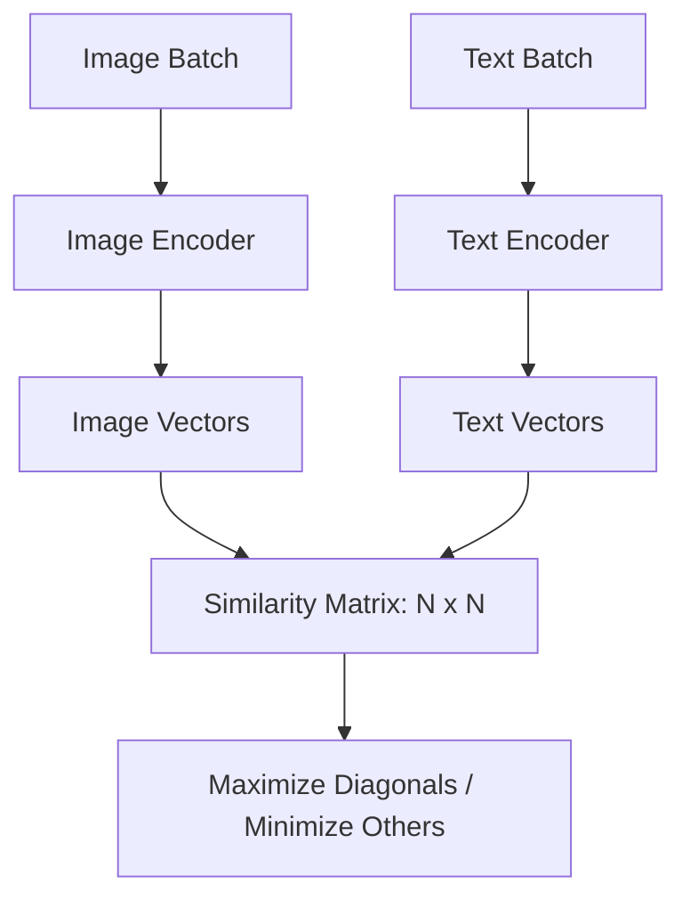

# CLIP & Contrastive Learning: Connecting Pixels to Words

## 1. Beginner-friendly Hinglish Explanation 🇮🇳
Bhai, socho tumne ek bache ko "Kutta" (Dog) ki photo dikhayi aur bola "Yeh Kutta hai". Phir tumne use "Billi" (Cat) dikhayi aur bola "Yeh Kutta nahi hai". Bache ne kya kiya? Usne photo aur naam ke beech ka "Connection" seekha.

**CLIP (Contrastive Language-Image Pretraining)** wahi "Connection" hai jo AI ko pixels aur words ke beech sikhata hai. Ismein hum billions of "Photo + Caption" pairs use karte hain. Model ko training ke waqt yeh sikhaya jata hai ki "Dog" ki photo "Dog" word ke pass honi chahiye aur "Cat" word se door. Isse AI "Zero-shot" (bina kisi training ke) nayi photos ko pehchan sakta hai. Yeh multimodal AI ki "Buniyad" (Foundation) hai.

---

## 2. Deep Technical Explanation
CLIP uses a dual-encoder architecture to align images and text in a joint embedding space.
- **Image Encoder**: Usually a ResNet or a Vision Transformer (ViT).
- **Text Encoder**: A standard Transformer (GPT-style).
- **Contrastive Learning**: Instead of predicting a specific label (Classification), CLIP predicts which text snippet matches which image in a large batch.
- **Joint Embedding Space**: Images and text are mapped to the same vector space, where distance represents semantic similarity.

---

## 3. Mathematical Intuition
CLIP is trained using the **InfoNCE Loss**.
Given a batch of $N$ (image, text) pairs, there are $N$ positive pairs and $N^2 - N$ negative pairs.
The goal is to maximize the cosine similarity $s_{i,i}$ and minimize $s_{i,j}$ for $i \neq j$.
$$\text{Loss} = \frac{1}{2} \left( \mathcal{L}_{I \to T} + \mathcal{L}_{T \to I} \right)$$
where $\mathcal{L}_{I \to T}$ is the cross-entropy loss over the similarity scores of images to text. This forces the model to learn "Meanings" rather than just "Shapes".

---

## 4. Architecture Diagrams


---

## 5. Production-ready Examples
Using CLIP for zero-shot classification:

```python
import torch
from PIL import Image
import clip

model, preprocess = clip.load("ViT-B/32", device="cuda")

# 1. Prepare inputs
image = preprocess(Image.open("image.jpg")).unsqueeze(0).to("cuda")
text = clip.tokenize(["a diagram", "a dog", "a cat"]).to("cuda")

with torch.no_grad():
    # 2. Encode
    image_features = model.encode_image(image)
    text_features = model.encode_text(text)
    
    # 3. Calculate similarity
    logits_per_image, _ = model(image, text)
    probs = logits_per_image.softmax(dim=-1).cpu().numpy()

print(f"Label Probs: {probs}")
```

---

## 6. Real-world Use Cases
- **Image Search**: Finding "A red car on a rainy day" in a library of millions of photos.
- **Content Moderation**: Flagging images that match "Violent" or "Illegal" text descriptions.
- **DALL-E / Stable Diffusion**: CLIP is the "Brain" that guides these models to draw what you type.

---

## 7. Failure Cases
- **Spatial Reasoning**: CLIP often struggles with "A red ball on top of a blue cube" vs "A blue cube on top of a red ball". It sees the objects but misses the "On top of" relation.
- **Counting**: It can't distinguish between "One apple" and "Three apples" reliably.

---

## 8. Debugging Guide
1. **Modality Gap**: If all your text vectors are in one corner of the space and image vectors in another, your model isn't well-aligned.
2. **Batch Size Sensitivity**: CLIP needs HUGE batch sizes (32k+) to learn well. If training locally on a small batch, it will fail to generalize.

---

## 9. Tradeoffs
| Metric | Softmax Classifier | Contrastive (CLIP) |
|---|---|---|
| New Categories | Needs Retraining | Zero-shot (Works instantly) |
| Training Data | Labeled (Hard) | Web-scraped (Easy) |
| Speed | Fast | Slow (Dual Encoders) |

---

## 10. Security Concerns
- **Typographic Attacks**: Writing the word "IPHONE" on a picture of an "APPLE". CLIP might read the text and ignore the image, classifying it as an iPhone.

---

## 11. Scaling Challenges
- **Compute**: Training CLIP from scratch requires 100s of GPUs and weeks of time. Most people use "Pre-trained" versions from OpenAI or LAION.

---

## 12. Cost Considerations
- **Storage**: Storing embeddings for 1 Billion images in a Vector DB like Pinecone is expensive. Use quantization (INT8).

---

## 13. Best Practices
- **L2 Normalize** your vectors before doing a dot product.
- Use **ViT-L/14** for the best accuracy-to-latency balance in 2026.
- Combine with **Reranking** for high-precision image search.

---

## 14. Interview Questions
1. Why is CLIP better than a standard ImageNet classifier for real-world tasks?
2. What is the role of "Temperature" in contrastive loss?

---

## 15. Latest 2026 Patterns
- **SigLIP**: A more efficient version of CLIP that uses sigmoid loss instead of softmax, allowing for smaller batch sizes during training.
- **Video-CLIP**: Aligning video clips with text descriptions for "Action Search" (e.g., "Find a scene where someone is jumping").
