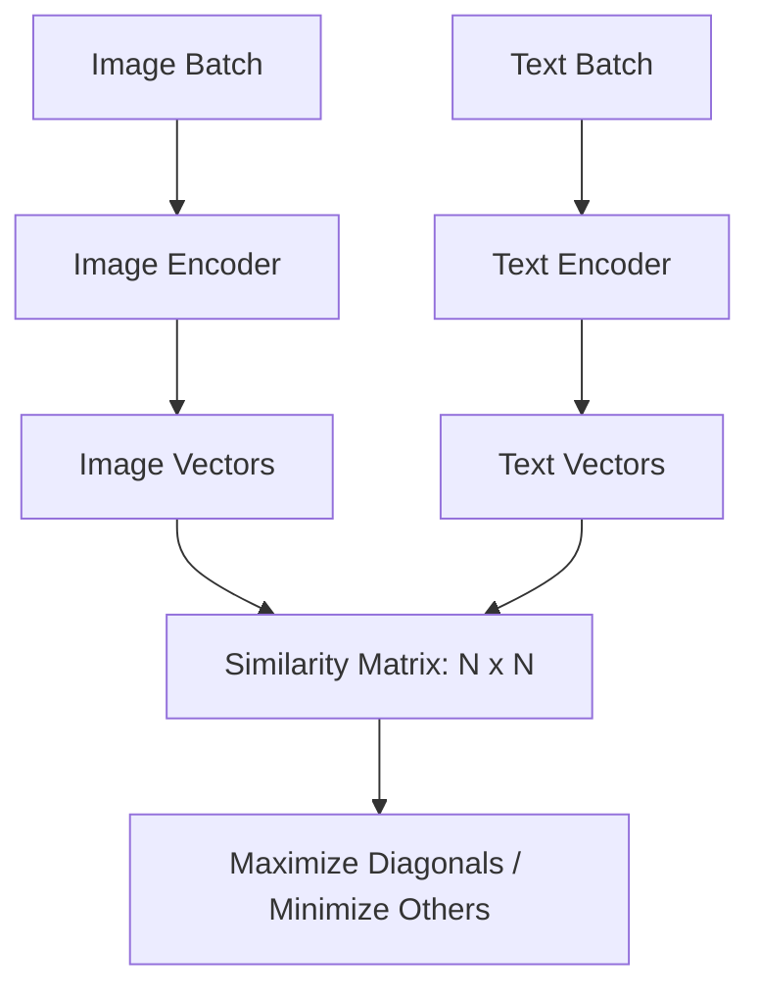

# CLIP aur Contrastive Learning: Pixels ko Words se Connect Karna

## 1. Beginner-friendly Hinglish Samjhaai 🇮🇳
Bhai, socho tumne ek bache ko "Kutta" (Dog) ki photo dikhayi aur bola "Yeh Kutta hai". Phir tumne use "Billi" (Cat) dikhayi aur bola "Yeh Kutta nahi hai". Bache ne kya kiya? Usne photo aur naam ke beech ka "Connection" seekha.

**CLIP (Contrastive Language-Image Pretraining)** wahi "Connection" hai jo AI ko pixels aur words ke beech sikhata hai. Ismein hum billions of "Photo + Caption" pairs use karte hain. Model ko training ke waqt yeh sikhaya jata hai ki "Dog" ki photo "Dog" word ke pass honi chahiye aur "Cat" word se door. Isse AI "Zero-shot" (bina kisi training ke) nayi photos ko pehchan sakta hai. Yeh multimodal AI ki "Buniyad" (Foundation) hai.

---

## 2. Gehri Technical Samjhaai
CLIP dual-encoder architecture use karta hai images aur text ko joint embedding space mein align karne ke liye.
- **Image Encoder**: Generally ResNet ya Vision Transformer (ViT) hota hai.
- **Text Encoder**: Standard Transformer (GPT-style) hota hai.
- **Contrastive Learning**: Specific label (Classification) predict karne ke bajaye, CLIP predict karta hai ki ek large batch mein konse text snippet konse image se match karta hai.
- **Joint Embedding Space**: Images aur text ek hi vector space mein map hote hain, jahaan distance semantic similarity represent karta hai.

---

## 3. Mathematical Samajh
CLIP ko **InfoNCE Loss** use karke train kiya jata hai.
Given a batch of $N$ (image, text) pairs, usme $N$ positive pairs hote hain aur $N^2 - N$ negative pairs.
Goal hai cosine similarity $s_{i,i}$ ko maximize karna aur $s_{i,j}$ ko minimize karna for $i \neq j$.
$$\text{Loss} = \frac{1}{2} \left( \mathcal{L}_{I \to T} + \mathcal{L}_{T \to I} \right)$$
jahaan $\mathcal{L}_{I \to T}$ images to text ke similarity scores par cross-entropy loss hai.
Yeh model ko "Meanings" sikhne par majboor karta hai, na ki sirf "Shapes".

---

## 4. Architecture Diagrams

```mermaid
graph TD
    Img[Image Batch] --> ImgEnc[Image Encoder]
    Txt[Text Batch] --> TxtEnc[Text Encoder]
    ImgEnc --> ImgVec[Image Vectors]
    TxtEnc --> TxtVec[Text Vectors]
    ImgVec & TxtVec --> Matrix[Similarity Matrix: N x N]
    Matrix --> Loss[Maximize Diagonals / Minimize Others]
```

---

## 5. Production-ready Udaaharan
CLIP ko zero-shot classification ke liye use karna:

```python
import torch
from PIL import Image
import clip

model, preprocess = clip.load("ViT-B/32", device="cuda")

# 1. Prepare inputs
image = preprocess(Image.open("image.jpg")).unsqueeze(0).to("cuda")
text = clip.tokenize(["a diagram", "a dog", "a cat"]).to("cuda")

with torch.no_grad():
    # 2. Encode
    image_features = model.encode_image(image)
    text_features = model.encode_text(text)
    
    # 3. Calculate similarity
    logits_per_image, _ = model(image, text)
    probs = logits_per_image.softmax(dim=-1).cpu().numpy()

print(f"Label Probs: {probs}")
```

---

## 6. Real-world Use Cases
- **Image Search**: Millions of photos ki library mein "A red car on a rainy day" dhundhna.
- **Content Moderation**: "Violent" ya "Illegal" text descriptions se match karne wali images ko flag karna.
- **DALL-E / Stable Diffusion**: CLIP "Brain" hai jo in models ko guide karta hai ki jo aap type karein, wahi draw karein.

---

## 7. Failure Cases
- **Spatial Reasoning**: CLIP often struggle karta hai "A red ball on top of a blue cube" vs "A blue cube on top of a red ball" ke saath. Yeh objects ko dekh leta hai lekin "On top of" relation miss kar deta hai.
- **Counting**: Yeh "One apple" aur "Three apples" ke bech reliably distinguish nahi kar sakta.

---

## 8. Debugging Guide
1. **Modality Gap**: Agar aapke saare text vectors ek corner mein hain aur image vectors doosre corner mein, to aapka model well-aligned nahi hai.
2. **Batch Size Sensitivity**: CLIP ko well learn karne ke liye HUGE batch sizes (32k+) chahiye. Agar aap locally small batch par training kar rahe hain, to generalize karne mein fail hoga.

---

## 9. Tradeoffs
| Metric | Softmax Classifier | Contrastive (CLIP) |
|---|---|---|
| Nayi Categories | Retraining ki zaroorat | Zero-shot (Turant kaam karta hai) |
| Training Data | Labeled (Mushkil) | Web-scraped (Aasaan) |
| Gati | Tez | Dheema (Dual Encoders) |

---

## 10. Security Concerns
- **Typographic Attacks**: "APPLE" ki picture par "IPHONE" word likhna. CLIP text padh leta hai aur image ignore kar deta hai, use iPhone classify kar deta hai.

---

## 11. Scaling Challenges
- **Compute**: CLIP ko scratch se train karne ke liye 100s of GPUs aur weeks ka time chahiye. Zyada log OpenAI ya LAION se "Pre-trained" versions use karte hain.

---

## 12. Cost Considerations
- **Storage**: Vector DB (jaise Pinecone) mein 1 Billion images ke embeddings store karna expensive hai. Quantization (INT8) use karein.

---

## 13. Best Practices
- **L2 Normalize** karein apne vectors ko dot product karne se pehle.
- 2026 mein best accuracy-to-latency balance ke liye **ViT-L/14** use karein.
- High-precision image search ke liye **Reranking** ke saath combine karein.

---

## 14. Interview Questions
1. CLIP standard ImageNet classifier se real-world tasks ke liye better kyun hai?
2. Contrastive loss mein "Temperature" ka role kya hai?

---

## 15. Latest 2026 Patterns
- **SigLIP**: CLIP ka ek zyada efficient version jo softmax ke bajaye sigmoid loss use karta hai, training ke dauran smaller batch sizes allow karta hai.
- **Video-CLIP**: Video clips ko text descriptions ke saath align karna "Action Search" ke liye (jaise, "Aisa scene dhundho jahan koi jump kar raha ho").