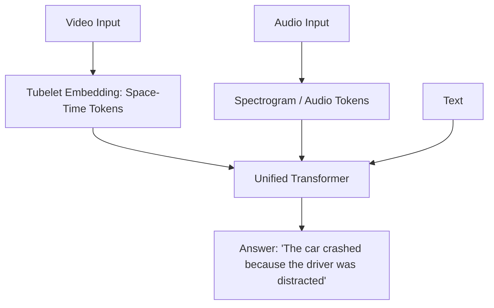

# Video & Audio LLMs: The Future of Perception

## 1. Beginner-friendly Hinglish Explanation 🇮🇳
Bhai, ab tak hum sirf "Text" aur "Images" ki baat kar rahe the. Lekin 2026 mein AI ab "Sun" (Audio) sakta hai aur "Dekh" (Video) sakta hai real-time mein. 

**Video LLMs** (jaise Sora ya Gemini 1.5 Pro) video ko frame-by-frame nahi, balki "Space-Time Tokens" ki tarah dekhte hain. Woh samajhte hain ki video mein kya ho raha hai aur aage kya hoga. **Audio LLMs** (jaise GPT-4o ya Whisper) sirf "Voice to Text" nahi karte, balki woh awaaz ki "Bhavna" (Emotion) aur "Sangeet" (Music) ko bhi samajhte hain. Yeh multimodal AI ka "Top Level" hai jahan AI insaan ki tarah duniya ko mahsoos karta hai.

---

## 2. Deep Technical Explanation
Processing temporal data (Audio/Video) requires handling an extra dimension of time.
- **Audio LLMs**: Convert audio into spectrograms or discrete tokens using models like **EnCodec**. The LLM then treats these as "Audio Words".
- **Video LLMs**: Treat video as a sequence of image patches across time. Use **3D Convolutions** or **Space-Time Transformers** to capture motion.
- **Native Multimodality**: Instead of separate encoders, models like GPT-4o are trained "Natively" on all three modalities (Text, Audio, Video) simultaneously, allowing for seamless reasoning (e.g., "Tell me what's funny in this video based on the sound").

---

## 3. Mathematical Intuition
**Temporal Attention**:
Standard attention $O = \text{softmax}(QK^T)V$ is $O(N^2)$. For a 1-minute video at 24fps, $N$ is massive.
We use **Sparse Attention** or **Tubelet Embedding**:
- Tubelet: Grouping $4 \times 4 \times 4$ pixels (Space x Space x Time) into a single token.
This reduces the sequence length by a factor of 64, making video Transformers feasible.

---

## 4. Architecture Diagrams


---

## 5. Production-ready Examples
Using `Whisper` for audio and `Gemini API` for video analysis:

```python
# Whisper Audio Transcription
import whisper
model = whisper.load_model("base")
result = model.transcribe("meeting.mp3")

# Gemini Video Analysis (Conceptual)
response = gemini.generate_content([
    "Summarize this 10-minute security footage.",
    video_file_handle
])
# Gemini can handle 1M+ tokens, enough for hours of video.
```

---

## 6. Real-world Use Cases
- **Security**: "Find the person wearing a red shirt who entered the building at 2 PM."
- **Podcast Editing**: "Remove all the parts where the guest sounds 'Hesitant' or 'Nervous'."
- **Autonomous Driving**: Predicting the next 5 seconds of a pedestrian's movement.

---

## 7. Failure Cases
- **Temporal Confusion**: The model sees a person "Eating a sandwich" but can't tell if the video is playing forward or backward.
- **Hallucinated Sound**: In video-to-audio generation, the AI might add a "Bark" sound to a "Cat" if the scene is ambiguous.

---

## 8. Debugging Guide
1. **Frame Selection**: If the model misses an event, ensure your "Sampling Rate" (FPS) is high enough to capture that specific movement.
2. **Audio Artifacts**: Check for "Robotic" sounds in generated audio, which usually indicates poor tokenization.

---

## 9. Tradeoffs
| Modality | Memory | Latency | Compute |
|---|---|---|---|
| Text | Low | Very Fast | Low |
| Audio | Medium | Fast | Medium |
| Video | Extremely High | Slow | Ultra-High |

---

## 10. Security Concerns
- **Deepfakes**: Generating highly realistic video/audio of people without their consent.
- **Voice Cloning Attacks**: Using a 3-second clip of someone's voice to bypass bank security.

---

## 11. Scaling Challenges
- **Data Scarcity**: High-quality "Video + Transcript + Action" data is much harder to find than simple text data.
- **VRAM**: Loading a Video Transformer can require multiple H100s just for a 10-second clip.

---

## 12. Cost Considerations
- **Video API Pricing**: Google and OpenAI charge per second of video or per 1000 video tokens, which is 100x more expensive than text.

---

## 13. Best Practices
- **Compress First**: Don't feed 4K video to an LLM. Downscale to 224x224 or 512x512.
- **Keyframe Extraction**: Instead of all 24fps, use only 1-2 frames per second to save tokens.

---

## 14. Interview Questions
1. How does a Space-Time Transformer differ from a standard Vision Transformer?
2. What are "Tubelet Embeddings"?

---

## 15. Latest 2026 Patterns
- **World Models**: LLMs that act as "Simulators" for the real world (e.g., Sora predicting how physics works in a video).
- **Infinite Video Context**: Using Ring Attention to process 24-hour long live streams in real-time.
