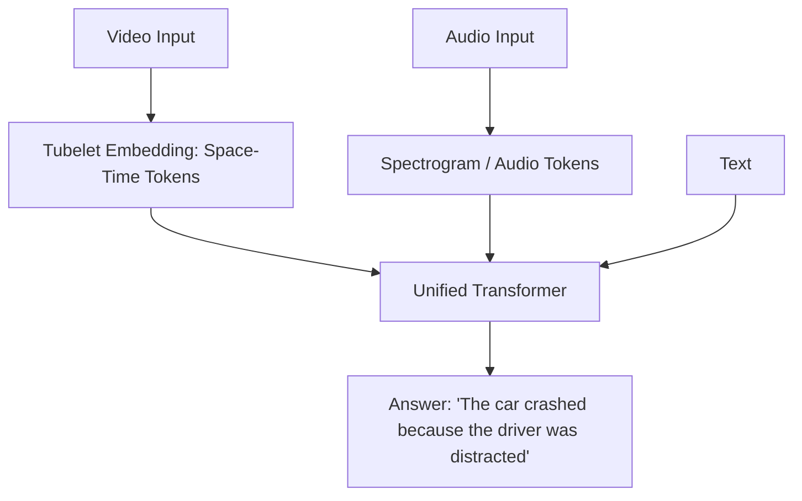

# Video & Audio LLMs: Perception ka Future

## 1. Beginner-friendly Hinglish Explanation 🇮🇳
Bhai, ab tak hum sirf "Text" aur "Images" ki baat kar rahe the. Lekin 2026 mein AI ab "Sun" (Audio) sakta hai aur "Dekh" (Video) sakta hai real-time mein. 

**Video LLMs** (jaise Sora ya Gemini 1.5 Pro) video ko frame-by-frame nahi, balki "Space-Time Tokens" ki tarah dekhte hain. Woh samajhte hain ki video mein kya ho raha hai aur aage kya hoga. **Audio LLMs** (jaise GPT-4o ya Whisper) sirf "Voice to Text" nahi karte, balki woh awaaz ki "Bhavna" (Emotion) aur "Sangeet" (Music) ko bhi samajhte hain. Yeh multimodal AI ka "Top Level" hai jahan AI insaan ki tarah duniya ko mahsoos karta hai.

---

## 2. Gehri Technical Explanation
Temporal data (Audio/Video) process karne ke liye time ka extra dimension handle karna padta hai.
- **Audio LLMs**: Audio ko spectrograms ya discrete tokens mein convert karte hain **EnCodec** jaise models se. Phir LLM inhe "Audio Words" ki tarah treat karta hai.
- **Video LLMs**: Video ko time ke across image patches ke sequence ki tarah treat karte hain. Motion capture karne ke liye **3D Convolutions** ya **Space-Time Transformers** use karte hain.
- **Native Multimodality**: Alag encoders ki jagah, GPT-4o jaise models tino modalities (Text, Audio, Video) par "Natively" train kiye jaate hain simultaneously, jisse seamless reasoning hota hai (e.g., "Batao is video mein kya funny hai sound ke basis par").

---

## 3. Mathematical Intuition (Ganit ki Samajh)
**Temporal Attention (Samayik Dhyan)**:
Standard attention $O = \text{softmax}(QK^T)V$ ka complexity $O(N^2)$ hai. 24fps par 1-minute video ke liye, $N$ bahut bada hota hai.
Hum **Sparse Attention** ya **Tubelet Embedding** use karte hain:
- Tubelet: $4 \times 4 \times 4$ pixels (Space x Space x Time) ko ek single token mein group karna.
Isse sequence length 64 gunaa kam ho jaati hai, jo video Transformers ko feasible banata hai.

---

## 4. Architecture Diagrams (Aarkitektur Diagram)

```mermaid
graph TD
    Video[Video Input] --> Patch[Tubelet Embedding: Space-Time Tokens]
    Audio[Audio Input] --> Spectro[Spectrogram / Audio Tokens]
    Patch & Spectro & Text[Text] --> Unified[Unified Transformer]
    Unified --> Answer[Answer: 'The car crashed because the driver was distracted']
```

---

## 5. Production-ready Examples (Production ke Liye Tayar Examples)
Audio ke liye `Whisper` aur video analysis ke liye `Gemini API` use karte hain:

```python
# Whisper Audio Transcription
import whisper
model = whisper.load_model("base")
result = model.transcribe("meeting.mp3")

# Gemini Video Analysis (Conceptual)
response = gemini.generate_content([
    "Summarize this 10-minute security footage.",
    video_file_handle
])
# Gemini can handle 1M+ tokens, enough for hours of video.
```

---

## 6. Real-world Use Cases (Vastavik Duniya ke Use Cases)
- **Security**: "Wo shakhs dhundho jisne laal shirt pehna hai aur 2 PM par building mein enter kiya."
- **Podcast Editing**: "Saare parts hatao jahan guest ki awaaz 'Hesitant' ya 'Nervous' lagti hai."
- **Autonomous Driving**: Pedestrian ki agle 5 seconds ki movement predict karna.

---

## 7. Failure Cases (Fail Hone ke Mamle)
- **Temporal Confusion**: Model ek vyakti ko "Sandwich khaate" dekhta hai lekin yeh nahi bata paata ki video forward chal rahi hai ya backward.
- **Hallucinated Sound**: Video-to-audio generation mein, AI scene ambiguous hone par "Cat" mein "Bark" ki awaaz add kar sakta hai.

---

## 8. Debugging Guide (Debugging ke Nirdesh)
1. **Frame Selection**: Agar model kisi event ko miss kare, toh ensure karo ki tumhara "Sampling Rate" (FPS) us specific movement ko capture karne ke liye kaafi high hai.
2. **Audio Artifacts**: Generated audio mein "Robotic" awaaz check karo, jo usually poor tokenization ko indicate karta hai.

---

## 9. Tradeoffs (Samjhauta)
| Modality | Memory | Latency | Compute |
|---|---|---|---|
| Text | Low | Very Fast | Low |
| Audio | Medium | Fast | Medium |
| Video | Extremely High | Slow | Ultra-High |

---

## 10. Security Concerns (Suraksha Chintayein)
- **Deepfakes**: Bina consent ke logon ke highly realistic video/audio generate karna.
- **Voice Cloning Attacks**: Kisi ki awaaz ka 3-second clip use karke bank security bypass karna.

---

## 11. Scaling Challenges (Badhne ki Chunautiyaan)
- **Data Scarcity**: Simple text data ke comparison mein high-quality "Video + Transcript + Action" data dhundhna bahut mushkil hai.
- **VRAM**: Video Transformer load karne ke liye sirf 10-second clip ke liye bhi multiple H100s ki zaroorat pad sakti hai.

---

## 12. Cost Considerations (Kharch ke Vichaar)
- **Video API Pricing**: Google aur OpenAI video ke per second ya per 1000 video tokens charge karte hain, jo text se 100x zyada expensive hai.

---

## 13. Best Practices (Sabse Achhe Tareeke)
- **Pehle Compress Karo**: LLM ko 4K video mat khao. Use 224x224 ya 512x512 par downscale karo.
- **Keyframe Extraction**: Saare 24fps ki jagah, tokens bachane ke liye prati second 1-2 frames istemal karo.

---

## 14. Interview Questions (Interview ke Sawal)
1. Space-Time Transformer standard Vision Transformer se kaise alag hai?
2. "Tubelet Embeddings" kya hote hain?

---

## 15. Latest 2026 Patterns (2026 ke Naye Pattern)
- **World Models**: LLMs jo real world ke "Simulators" ki tarah act karte hain (e.g., Sora video mein physics kaise kaam karti hai predict karta hai).
- **Infinite Video Context**: Ring Attention ka use karke 24-hour long live streams ko real-time mein process karna.