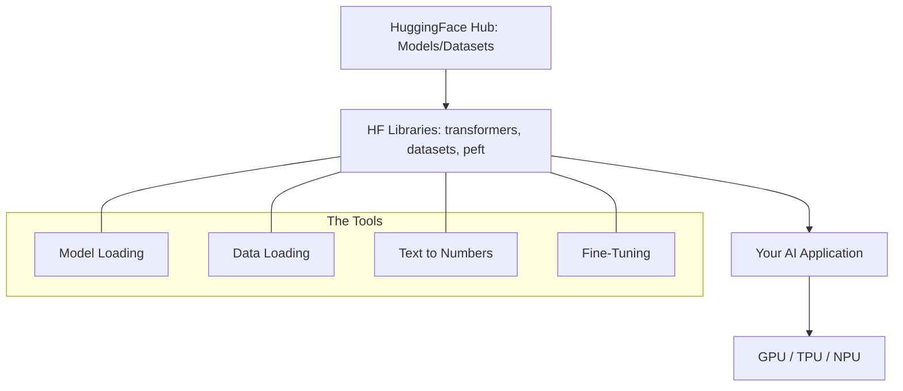

# HuggingFace Hub & Libraries: The Heart of Open Source

## 1. Beginner-friendly Hinglish Explanation 🇮🇳
Bhai, socho agar tumhe ek AI model chahiye aur tumhe use zero se train na karna pade. Tum bas ek "App Store" par jao aur wahan se model download kar lo. **HuggingFace Hub** wahi "App Store" (ya GitHub) hai AI ke liye. 

Wahan tumhe lakhs of models (jaise Llama, Mistral, BERT), datasets, aur demos (Spaces) milenge. Unki libraries jaise `transformers` (models ke liye), `datasets` (data ke liye), aur `diffusers` (images ke liye) ne AI development ko itna asaan bana diya hai ki ek 10th class ka bacha bhi AI app bana sakta hai. Bina HuggingFace ke, open-source AI itna fast grow nahi kar pata.

---

## 2. Deep Technical Explanation
HuggingFace (HF) open-source AI community ke liye essential infrastructure provide karta hai.
- **Transformers Library**: Ek unified API hai downloading, training, aur deploying thousands of pre-trained models ke liye (PyTorch, TensorFlow, JAX).
- **HuggingFace Hub**: Ek git-based repository hai models, datasets, aur "Spaces" (web apps) ke liye.
- **Tokenizers**: Ultra-fast subword tokenization (BPE, WordPiece) jo Rust mein implement kiya gaya hai.
- **PEFT (Parameter-Efficient Fine-Tuning)**: LoRA aur QLoRA ke liye go-to library.
- **Accelerate**: Easy multi-GPU aur TPU training ke liye library.

---

## 3. Mathematical Intuition
HF ki success uske **Abstraction Layer** mein hai.
Naye model architecture ke liye 1000 lines of CUDA/PyTorch code likhne ki jagah, HF use abstract karta hai:
$$Output = \text{Model}(\text{Tokenizer}(Input))$$
Yeh standardization researchers ko aisa code share karne deta hai jo "just works" different hardware aur frameworks par, aur massive network effect create hota hai.

---

## 4. Architecture Diagrams


---

## 5. Production-ready Examples
HF se 4-bit quantization ke saath model load aur run karna:

```python
from transformers import AutoModelForCausalLM, AutoTokenizer, BitsAndBytesConfig

# 1. Setup 4-bit quantization
quant_config = BitsAndBytesConfig(load_in_4bit=True)

# 2. Load model and tokenizer from Hub
model_id = "meta-llama/Llama-3-8B-Instruct"
tokenizer = AutoTokenizer.from_pretrained(model_id)
model = AutoModelForCausalLM.from_pretrained(
    model_id, 
    quantization_config=quant_config,
    device_map="auto"
)

# 3. Generate
inputs = tokenizer("Hello, who are you?", return_tensors="pt").to("cuda")
outputs = model.generate(**inputs, max_new_tokens=50)
print(tokenizer.decode(outputs[0]))
```

---

## 6. Real-world Use Cases
- **Enterprise AI**: HF ka use karke specialized "Legal" model find karna aur use company data par fine-tune karna.
- **Research**: Naye paper ka architecture jo kal Hub pe upload hua, usse quickly test karna.
- **Hobbyists**: Local PC par `diffusers` library ka use karke "Stable Diffusion" run karna.

---

## 7. Failure Cases
- **Version Mismatch**: `transformers` v4.30 ka use karna with a model that needs v4.40 weird errors ya silently wrong results cause kar sakta hai.
- **Hub Downtime**: Agar HF Hub down hai aur tumne model locally cached nahi kiya, toh tumhara production deployment fail hoga. Hamesha **Download aur Save** karo models production ke liye.

---

## 8. Debugging Guide
1. **Cache Management**: `huggingface-cli delete-cache` use karo agar disk full hai (HF models save karta hai `~/.cache/huggingface/hub` mein).
2. **Device Map**: Agar "Out of Memory" aata hai, toh `device_map="auto"` check karo. Kabhi-kabhi manually specific GPUs set karna better hai.

---

## 9. Tradeoffs
| Feature | Custom Implementation | HuggingFace |
|---|---|---|
| Development ki Speed | Dheema | Bahut Tez |
| Performance | Optimized (100%) | Near-Optimal (95%) |
| Flexibility | High | Medium (Standardized) |

---

## 10. Security Concerns
- **Pickle Exploits**: Hub par kisi untrusted user se model file load karna aapki machine par malicious code execute kar sakta hai. Hamesha **`safetensors`** format use karo `.bin` ya `.pt` ki jagah.

---

## 11. Scaling Challenges
- **Large Model Downloads**: 140GB model (Llama-3-70B) download karte waqt hours lag sakte hain aur beech mein fail ho sakta hai. `huggingface-cli download` resume support ke saath use karo.

---

## 12. Cost Considerations
- **Bandwidth**: HF free hai open models ke liye, lekin aapka cloud provider data ingress charge kar sakta hai agar aap massive models VPC mein download karte ho.

---

## 13. Best Practices
- **Use `safetensors=True`**: Yeh faster aur safer hai.
- **Pin your versions**: `requirements.txt` mein `transformers==4.40.0` use karo breaking changes se bachne ke liye.
- **Model Card**: HF par hamesha Model Card padho taaki model ke training data aur bias ko samajh sako.

---

## 14. Interview Questions
1. `AutoModel` aur specific model class jaise `LlamaForCausalLM` mein kya farak hai?
2. `safetensors` kya hain aur yeh PyTorch pickles se kyun preferred hain?

---

## 15. Latest 2026 Patterns
- **HuggingFace TGI (Text Generation Inference)**: Ek high-performance production server jo specifically HF models ke liye built hai continuous batching aur PagedAttention ke saath.
- **In-Browser Models**: Transformers.js ka use karke BERT ya Whisper directly user ke browser mein WebGPU ke through run karna.