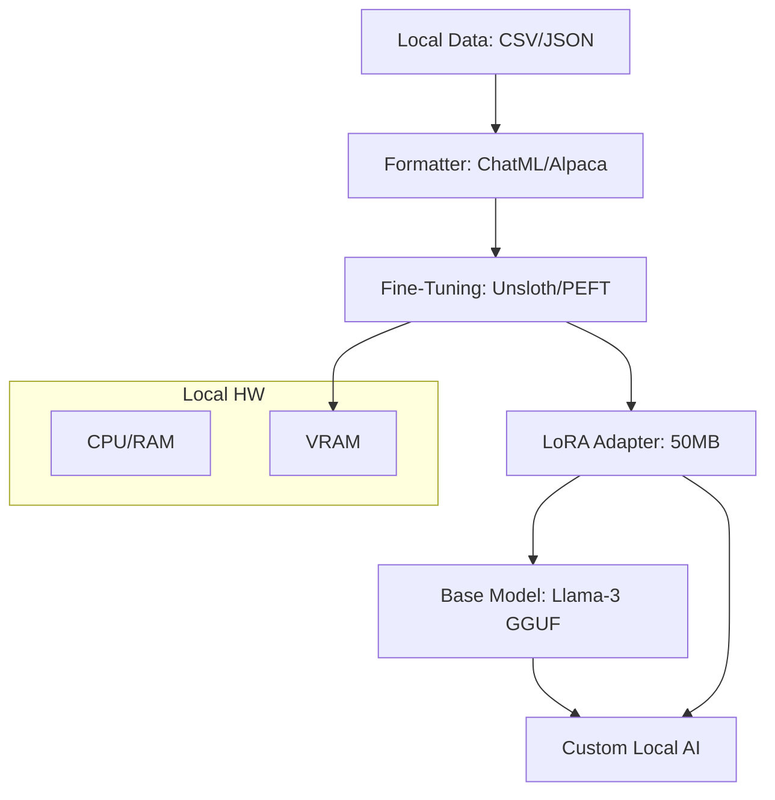

# Llama.cpp & Local Fine-Tuning: Master Your Model

## 1. Beginner-friendly Hinglish Explanation 🇮🇳
Bhai, socho tumne Llama-3 download kar li, lekin woh tumhari company ke rules nahi jaanti. Tum use "Sikhana" (Fine-tune) chahte ho, lekin tumhare paas koi bada server nahi hai. 

**Llama.cpp** wahi software hai jo AI ko "Efficient" banata hai taaki woh ordinary computers (jaise Macbook ya Gaming PC) par chale. Aur **Local Fine-Tuning** (jaise Unsloth ya LoRA) woh technique hai jismein tum apne ghar ke computer par hi model ko naya gyan de sakte ho. Is module mein hum seekhenge ki kaise model ke "Weights" ke saath choti-choti changes karke use apne kaam ke liye "Siddh" (Perfect) banaye.

---

## 2. Deep Technical Explanation
`llama.cpp` ek high-performance C++ implementation hai Transformer architecture ka jisme zero dependencies hain.
- **Metal/CUDA Support**: Yeh Apple Silicon (Metal) aur NVIDIA GPUs (CUDA) ko acceleration ke liye leverage karta hai.
- **Mixed Precision**: Model ke parts ko FP16 mein aur dusron ko 4-bit mein run karne ki support karta hai.
- **Local Fine-Tuning (PEFT)**: Libraries jaise **Unsloth** ya **LoRA_MLX** ka use karte hain local GPUs par models fine-tune karne ke liye. Yeh libraries memory optimize karti hain taake aap 7B model ko sirf 6GB VRAM par fine-tune kar sakte hain.
- **Dataset Prep**: Apne local JSONL/CSV data ko specific format (Alpaca/ChatML) mein convert karna jo fine-tuning ke liye required hai.

---

## 3. Mathematical Intuition
**LoRA (Low-Rank Adaptation)** ke saath fine-tuning:
Full weight matrix $W$ ($d \times d$) ko update karne ke bajay, hum sirf do chhoti matrices $A$ aur $B$ ko update karte hain.
$$W_{new} = W_{base} + \Delta W = W_{base} + B \cdot A$$
jahan $B \in \mathbb{R}^{d \times r}$ aur $A \in \mathbb{R}^{r \times d}$ hain rank $r \ll d$ ke saath.
Yeh number of parameters ko train karne mein 10,000x reduce karta hai, jisse local GPUs memory mein backpropagation gradients ko handle kar sakte hain.

---

## 4. Architecture Diagrams


---

## 5. Production-ready Examples
`Unsloth` ke saath Fine-tuning (2x faster, 70% less memory):

```python
from unsloth import FastLanguageModel
import torch

# 1. Load Model + LoRA
model, tokenizer = FastLanguageModel.from_pretrained(
    model_name = "unsloth/llama-3-8b-bnb-4bit",
    max_seq_length = 2048,
    load_in_4bit = True,
)

model = FastLanguageModel.get_peft_model(
    model,
    r = 16, # Rank
    target_modules = ["q_proj", "k_proj", "v_proj", "o_proj"],
    lora_alpha = 16,
)

# 2. Train (Standard HuggingFace Trainer)
# ... [Insert Trainer setup here] ...
# model.train()

# 3. Save as GGUF (for use in Ollama)
model.save_pretrained_gguf("my_model", tokenizer)
```

---

## 6. Real-world Use Cases
- **Specific Domain Expert**: Apni company ke internal Slack messages ya documentation par model fine-tune karke "Company Bot" banana.
- **Dialect Support**: Llama-3 ko specific language ya dialect mein bolna sikhana (e.g., Hinglish, Bhojpuri).
- **Function Calling**: Model ko strictly valid JSON output karne ki training dena API integration ke liye.

---

## 7. Failure Cases
- **Catastrophic Forgetting**: Model naya data seekh leta hai lekin basic English bolna ya math solve karna bhool jaata hai. (Solve karein "Base model" mix use karke).
- **Overfitting**: Model aapke 10 training examples ko perfectly yaad kar leta hai lekin user ke thode different query ko handle nahi kar pata.

---

## 8. Debugging Guide
1. **Loss Curves**: Agar loss instantly 0 ho jata hai, toh aap overfit kar rahe hain. Agar high rehta hai, toh aapki learning rate bahut low hai.
2. **Tokenizer Mismatch**: Ensure karein ki aap wahi tokenizer use karein fine-tuning ke dauran jo inference mein use karenge.

---

## 9. Tradeoffs
| Feature | Full Fine-Tuning | LoRA (Local) |
|---|---|---|
| Hardware | 8x A100 GPUs | 1x RTX 3060 |
| Speed | Slow | Fast |
| Intelligence | 100% | 98-99% |

---

## 10. Security Concerns
- **Data Poisoning**: Agar koi aapke local training set mein "Wrong" answers inject kar de, toh aapka model jhooth bolne lagega.

---

## 11. Scaling Challenges
- **Context Length**: Local fine-tuning usually limited hota hai 2k-4k context length tak VRAM ki wajah se. 128k context par fine-tuning ke liye massive GPU cluster chahiye.

---

## 12. Cost Considerations
- **Training Time**: 7B model ko fine-tune karne mein 1-4 hours lag sakte hain ek modern local GPU par.

---

## 13. Best Practices
- **Use "Rank 16"**: Yeh usually enough hai most tasks ke liye.
- **Dataset Quality > Quantity**: 500 perfect examples 10,000 noisy ones se behtar hain.
- **Save as GGUF**: Yeh compatible banata hai har cheez ke saath (Ollama, LM Studio, etc.).

---

## 14. Interview Questions
1. LoRA ka benefit kya hai full-parameter fine-tuning ke upar?
2. `llama.cpp` high performance kaise achieve karta hai bina heavy libraries jaise PyTorch ke use kiye?

---

## 15. Latest 2026 Patterns
- **Q-LoRA**: Quantized LoRA, jo aapko 4-bit model ko directly fine-tune karne ki anumati deta hai.
- **GaLore (Gradient Low-Rank Projection)**: Ek nayi technique jo consumer GPUs par full-parameter training ki anumati deti hai gradients ko project karke.