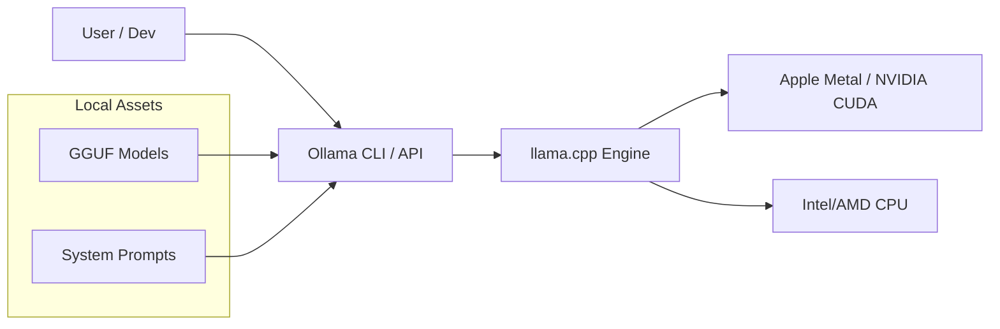

# Ollama aur Local Inference: Privacy-First AI

## 1. Shuruwat ke liye Asaan Hinglish Samjhaiye 🇮🇳
Bhai, socho tum chahte ho ki tumhara AI tumhare internet ke bina chale, aur tumhare "Private Documents" kabhi tumhare computer se bahar na jayen. **Ollama** wahi "Magic Tool" hai jo is kaam ko super-easy banata hai. 

Pehle local model chalana bohut mushkil tha (Python scripts, CUDA paths, etc.). Ab tum sirf ek command likhte ho `ollama run llama3` aur AI start ho jata hai. Yeh tumhare laptop ki power use karta hai aur tumhe ek ChatGPT jaisa interface deta hai jo 100% offline aur free hai. 2026 mein, developers apne coding aur personal notes ke liye Ollama hi use karte hain.

---

## 2. Gehri Technical Samjhaiye
Ollama ek Go-based wrapper hai `llama.cpp` ke upar jo local LLMs ke management aur serving ko simplify karta hai.
- **Model Management**: Yeh ek "Modelfile" (Dockerfile jaisa) use karta hai jo model parameters, system prompts, aur quantization levels define karta hai.
- **API Server**: Ollama ek local HTTP server (port 11434) chalata hai jo OpenAI-compatible API provide karta hai.
- **Memory Management**: Yeh automatically models ko GPU (Metal/CUDA) ya CPU memory mein handle karta hai.
- **Cross-Platform**: macOS, Linux, aur Windows pe natively chalta hai.

---

## 3. Ganeetiya Samajh
Local inference speed **Tokens Per Second (TPS)** mein naapa jata hai.
$$TPS = \frac{\text{System Bandwidth (GB/s)}}{\text{Model Size (GB)}}$$
Agar aap 4-bit Llama-3-8B (~5GB) ko Macbook pe 100GB/s bandwidth ke saath chalate hain, toh aapki theoretical speed ~20 TPS hai. Ollama ise `llama.cpp` kernels ka upyog karke optimize karta hai jo specific CPU/GPU architectures ke liye hand-tuned hote hain.

---

## 4. Architecture Diagrams


---

## 5. Production-ready Udaharan
Modelfile ke saath ek custom persona banana:

```dockerfile
# 1. Create a file named 'Modelfile'
FROM llama3
# Set the system prompt
SYSTEM "You are a sarcastic coding expert who answers in Hinglish."
# Set creativity
PARAMETER temperature 0.7
```

```bash
# 2. Build and run
ollama create sarcastobot -f Modelfile
ollama run sarcastobot
```

---

## 6. Vastavik Duniya ke Upyog
- **Privacy-First Coding**: VS Code extension (jaise Continue) ka upyog karke Ollama ko local autocomplete ke liye use karna.
- **Home Servers**: Raspberry Pi ya purane gaming PC par AI assistant chalana.
- **Data Scraping**: Local models ka upyog karke hazaaron articles ko summarize karna bina API cost ke.

---

## 7. Asafalta ke Mamle
- **Slow Inference**: 8GB RAM waale laptop par 70B model chalane par system "Swap" karega aur speed 0.1 tokens per second ho jayegi.
- **Model Drift**: Local models aksar chhote (8B) hote hain aur complex tasks mein GPT-4 se zyada hallucinate kar sakte hain.

---

## 8. Debugging Margdarshan
1. **Logs**: `~/.ollama/logs` check karein ki model load kyun fail hua.
2. **GPU Check**: `nvidia-smi` ya Activity Monitor chalayein aur confirm karein ki model GPU use kar raha hai, sirf CPU nahi.

---

## 9. Tradeoffs (Samjhauta)
| Feature | OpenAI API | Ollama (Local) |
|---|---|---|
| Gopaneeyata | Kam | 100% |
| Speed | Internet par nirbhar | Hardware par nirbhar |
| Kharcha | Har token ke liye pay | Free (jab aap hardware kharid lete hain) |

---

## 10. Suraksha Chintayein
- **Malicious Modelfiles**: Kisi untrusted source se Modelfile download karke usme aisa system prompt ho jo aapki jaankari chura le jab aap usse chat mein copy-paste karein.

---

## 11. Scaling Chunautiyan
- **Concurrent Users**: Ek laptop ek samay mein sirf 1-2 users ko handle kar sakta hai. Team ke liye aapko ek dedicated "Local LLM Server" chahiye jisme multiple GPUs hon.

---

## 12. Laagat Sanshodhan
- **Electricity**: GPU ko 100% load par poore din chalane se aapke monthly electricity bill mein $10-$20 ka izafa ho sakta hai.

---

## 13. Sabse Uttam Practices
- **Use GGUF Q4_K_M**: 4-bit quantization ka "Sweet spot" hai – intelligence mein minimal loss, speed mein bada boost.
- **Clear RAM**: Bade local model ko chalane se pehle Chrome tabs band karein taki performance lag na ho.

---

## 14. Interview Prashn
1. Kaise Ollama LLM deployment process ko raw Python scripts ki tulna mein simplify karta hai?
2. Local inference ecosystem mein `llama.cpp` ki kya bhumika hai?

---

## 15. 2026 ke Naye Patterns
- **Ollama on the Edge**: Mobile NPUs par specialized models chalana Ollama-like wrappers ke through.
- **Distributed Local Inference**: Apne laptop aur desktop GPUs ko milkar ek bade model ko local network par chalana (Petals/EXL2 style).