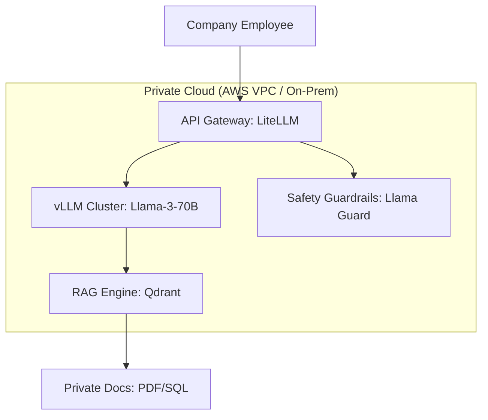

# Private LLM Stacks: Enterprise Autonomy

## 1. Beginner-friendly Hinglish Explanation 🇮🇳
Bhai, socho tum ek badi company ho (jaise Reliance ya Tata). Kya tum chahoge ki tumhari "Board Meeting" ke secret notes OpenAI ke server par jaye? Kabhi nahi! 

**Private LLM Stacks** wahi system hai jahan ek company apna pura "AI Ecosystem" khud ke servers par setup karti hai. Ismein **vLLM** (Speed ke liye), **Qdrant** (Vector search ke liye), aur **LangGraph** (Agents ke liye) jaise tools use hote hain. Isse saara data company ke firewalls ke andar rehta hai. Yeh bilkul waise hi hai jaise "Public Cloud" ke bajaye apna khud ka "Private Data Center" chalana. 2026 mein privacy hi sabse badi priority hai.

---

## 2. Gehri Technical Explanation
Private LLM stack ek self-hosted tools ka suite hai jo OpenAI/Anthropic ki functionality mimic karta hai.
- **Inference Engine**: **vLLM** production inference ka king hai. Yeh **PagedAttention** use karta hai jo thousands of concurrent users ko handle karta hai with 24x more throughput than standard PyTorch.
- **Vector Database**: Self-hosted **Milvus** ya **Qdrant** high-speed semantic search ke liye.
- **API Gateway**: **LiteLLM** ya **Kong** jo single OpenAI-compatible endpoint provide karta hai jo multiple local models ke beech requests route karta hai.
- **Orchestration**: **LangChain** ya **LangGraph** logic, RAG, aur agentic workflows ke liye.

---

## 3. Mathematical Intuition
**PagedAttention (vLLM)**:
Standard KV Cache tokens ko contiguous memory mein store karta hai. Iski wajah se **60-80% memory waste** hota hai fragmentation ki vajah se.
PagedAttention KV cache ko treat karta hai jaise OS mein Virtual Memory hoti hai. Yeh tokens ko "Pages" mein split karta hai aur unhe non-contiguously store karta hai.
$$\text{Memory Waste} \approx 0\%$$
Isse vLLM same VRAM mein bahut bade batch sizes fit kar pata hai, jisse GPU utilization maximize hota hai.

---

## 4. Architecture Diagrams


---

## 5. Production-ready Examples
Docker ke saath private vLLM server launch karna:

```bash
docker run --runtime nvidia --gpus all \
    -v ~/.cache/huggingface:/root/.cache/huggingface \
    -p 8000:8000 \
    vllm/vllm-openai \
    --model meta-llama/Llama-3-70B \
    --tensor-parallel-size 4 # Split across 4 GPUs
```

```python
# Querying your private stack
from openai import OpenAI
client = OpenAI(base_url="http://company-internal-ai:8000/v1", api_key="sk-local")

response = client.chat.completions.create(
    model="meta-llama/Llama-3-70B",
    messages=[{"role": "user", "content": "Analyze our Q3 revenue."}]
)
```

---

## 6. Real-world Use Cases
- **Banking**: Loan applications analyze karna bina PII US-based cloud servers par bheje.
- **Government**: "Internal Knowledge Base" create karna policy making aur law enforcement ke liye.
- **Medical Research**: Proprietary drug trial data mein search karna bina competitors ko leak kiye.

---

## 7. Failure Cases
- **Hardware Bottleneck**: Agar aapka GPU cluster down ho jata hai, toh poori company ke AI tools kaam karna band ho jaate hain. Aapko high-availability (HA) setups chahiye.
- **Maintenance Overload**: Latest models aur security patches ke saath up-to-date rehne ke liye dedicated "AI Platform Team" chahiye.

---

## 8. Debugging Guide
1. **GPU P2P**: Agar multiple GPUs use kar rahe hain, toh `NCCL_P2P_DISABLE=0` set karein taaki fast inter-GPU communication ho sake.
2. **vLLM Logs**: "Engine is overloaded" warnings par dhyan dein. Iska matlab hai aapko aur query nodes chahiye.

---

## 9. Tradeoffs
| Metric | Public API (GPT-4) | Private Stack (vLLM) |
|---|---|---|
| Security | Medium | Ultra-High |
| Setup Time | 5 minute | 5 din |
| Cost | Variable (prati token) | Fixed (GPU Cluster) |

---

## 10. Security Concerns
- **Insider Threats**: Agar kisi employee ke paas physical servers ka access hai, toh woh entire fine-tuned model aur private vector database chura sakta hai.

---

## 11. Scaling Challenges
- **Dynamic Load**: Ek town hall meeting ke dauran, 10,000 employees ek saath AI use kar sakte hain. Aapko "Auto-scaling" GPU groups chahiye.

---

## 12. Cost Considerations
- **CAPEX vs OPEX**: Aap A100/H100 GPUs ke liye upfront $100k+ pay karte hain, lekin aapka monthly token cost zero ho jata hai.

---

## 13. Best Practices
- **Use LiteLLM**: Yeh Llama, Mistral, aur Claude-on-prem ke beech switching ko seamless banata hai aapke developers ke liye.
- **Enable Streaming**: Hamesha `stream=True` use karein taaki UI users ke liye fast lage.
- **Monitor with Prometheus/Grafana**: vLLM ke built-in Prometheus metrics hain throughput aur latency ke liye.

---

## 14. Interview Questions
1. PagedAttention vLLM mein throughput kaise improve karta hai?
2. Enterprise-grade private AI stack ke key components kya hain?

---

## 15. Latest 2026 Patterns
- **SkyPilot**: Ek tool jo automatic cheapest cloud GPU provider dhundh leta hai (Lambda, RunPod, AWS) aur wahan aapke private LLM stack ko deploy karta hai.
- **KubeRay**: Elastic scaling ke liye Kubernetes par vLLM clusters run karna.