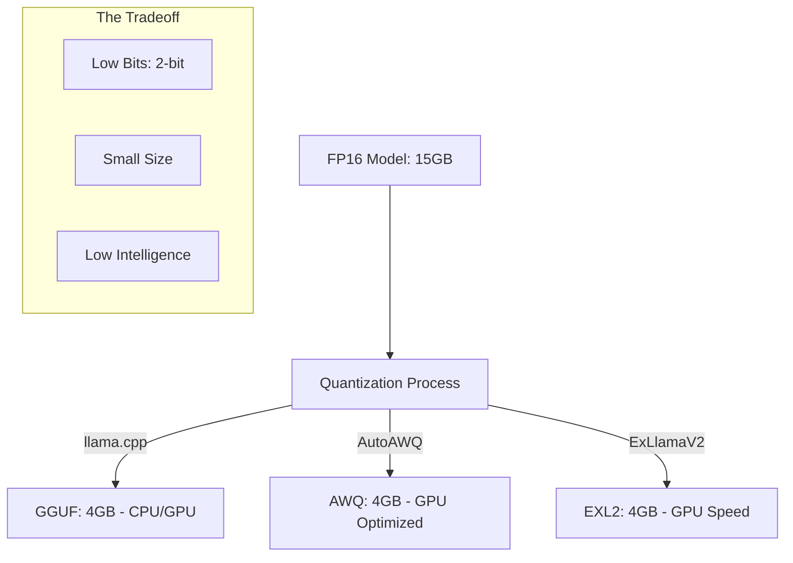

# Quantization: GGUF, AWQ, aur EXL2

## 1. Beginner-friendly Hinglish Explanation 🇮🇳
Bhai, socho tumhare paas ek 100GB ki 4K movie hai, lekin tumhare phone mein sirf 5GB space hai. Tum kya karoge? Tum use "Compress" karoge (jaise MP4 ya MKV format mein). AI models ke saath bhi yahi hota hai. 

Ek normal LLM "FP16" (16-bit) mein hota hai jo bohot bada hota hai. **Quantization** use 4-bit ya 2-bit mein convert kar deti hai.
- **GGUF**: Yeh "Universal" format hai. Yeh CPU aur GPU dono par chalta hai. Local use ke liye best hai.
- **AWQ**: Yeh "Smart Compression" hai jo sirf zaruri weights ko protect karti hai. Accuracy achhi rehti hai.
- **EXL2**: Yeh "Speed" ka baap hai. Yeh NVIDIA GPUs par ultra-fast chalta hai.

Is module mein hum seekhenge ki kaise model ko chota karein bina use "Gajini" (Dumb) banaye.

---

## 2. Gehri Technical Vyakhya
Quantization model weights ki precision ko 16-bit floats se 8-bit, 4-bit, ya 1.5-bit integers mein reduce karne ka process hai.
- **GGUF (GPT-Generated Unified Format)**: GGML ka successor. `llama.cpp` ke liye optimized. Yeh weights, metadata, aur vocabulary ko ek single file mein pack karta hai. K-Quants (layers ke andar mixed precision) ko support karta hai.
- **AWQ (Activation-aware Weight Quantization)**: Important weights ko quantization se pehle scale karta hai taaki rounding errors kam ho. Reasoning capabilities ko preserve karne mein umda hai.
- **EXL2 (ExLlamaV2)**: Variable-bitrate approach use karta hai (e.g., 4.65 bits per weight). NVIDIA GPUs ke Tensor Cores ke liye highly optimized.
- **BitNet / 1.58-bit**: Yeh research ka cutting edge hai jahan weights sirf -1, 0, ya 1 hote hain.

---

## 3. Ganitiya Intuition
Linear Quantization for a weight $w$ to a $b$-bit integer:
$$q = \text{round} \left( \frac{w}{\text{scale}} + \text{zero\_point} \right)$$
The **Quantization Error** is $E = |w - \text{dequant}(q)|$. 
Advanced methods like **GPTQ** use a Hessian-based error minimization to ensure that the change in the model's output is minimized:
$$\min \|W \cdot X - Q(W) \cdot X\|_2^2$$

---

## 4. Architecture Diagrams


---

## 5. Production-ready Udaharan
Using `AutoAWQ` to quantize a model:

```python
from awq import AutoAWQForCausalLM
from transformers import AutoTokenizer

model_path = "meta-llama/Llama-3-8B"
quant_path = "Llama-3-8B-AWQ"
quant_config = { "zero_point": True, "q_group_size": 128, "w_bit": 4, "version": "GEMM" }

# 1. Load and Quantize
model = AutoAWQForCausalLM.from_pretrained(model_path)
tokenizer = AutoTokenizer.from_pretrained(model_path)
model.quantize(tokenizer, quant_config=quant_config)

# 2. Save
model.save_quantized(quant_path)
```

---

## 6. Real-world Upyog ke Cases
- **Mobile Apps**: GGUF use karke 4GB RAM waale phone par 3B model chalana.
- **Low-Cost Hosting**: 70B model ko 4 GPUs ki jagah single 3090/4090 GPU par chalana.
- **Edge Devices**: 1.58-bit models jo specialized AI chips par zero multiplication units ke saath chalte hain.

---

## 7. Failure Cases
- **Perplexity Spike**: Agar aap 3 bits se neeche jaate hain, toh model ki 'Fluency' mein tez drop aata hai (e.g., wo ek hi word ko baar baar repeat karne lagta hai).
- **Format Incompatibility**: Aap CPU par EXL2 model nahi chala sakte; iske liye NVIDIA GPU chahiye.

---

## 8. Debugging Guide
1. **PPL Measurement**: Quantization se pehle aur baad WikiText-2 jaisi dataset par Perplexity hamesha measure karein. Chhota increase (e.g., 0.1 to 0.3) acceptable hai.
2. **Infinite Loops**: Agar model quantization ke baad loop mein phas jaaye, toh aapka `zero_point` ya `scale` calculation galat ho sakta hai.

---

## 9. Tradeoffs
| Format | Kiske Liye Best | Anukulata | Gati |
|---|---|---|---|
| GGUF | Local / CPU | High (Sab Kuch) | Medium |
| AWQ | Production / GPU | Medium (NVIDIA) | High |
| EXL2 | High-Speed Inference | Low (Modern NVIDIA) | Ultra-High |

---

## 10. Security Chintayein
- **Hidden Bias**: Quantization kabhi kabhi model ke existing biases ko 'Amplify' kar sakti hai kyunki 'Safety' guardrails low bitrates par sabse pehle degrade hote hain.

---

## 11. Scaling ki Chunautiyan
- **Calibration Data**: AWQ aur GPTQ ko 'Calibration dataset' chahiye (usually text ke 128 chunks). Agar calibration data kharab hai, toh poora quantized model kharab hoga.

---

## 12. Cost sambandhit Vichaar
- **VRAM Savings**: 4-bit quantization VRAM needs ko **75%** reduce kar deti hai. Yeh cloud costs mein $1,000/mo aur $250/mo ka antar hota hai.

---

## 13. Best Practices (Sarvottam Paddhatiyan)
- GGUF ke liye **Q4_K_M** use karein; yeh gold standard hai.
- VLLM-based production servers ke liye **AWQ** use karein.
- Personal gaming PCs jinmein NVIDIA cards hain, unke liye **EXL2** use karein.

---

## 14. Interview Sawal
1. Quantization mein 'Weight-Activation' mismatch kya hai?
2. INT4 quantization usually LLMs ke liye 'Good enough' kyun hota hai?

---

## 15. 2026 ke Latest Patterns
- **FP4 & FP6**: NVIDIA Blackwell GPUs ke dwara supported naye data formats jo INT4 ke intelligence loss ke bina quantization benefits provide karte hain.
- **AQLM**: Multi-codebook quantization jo 2-bit models ko 4-bit models jaisa perform karne ki anumati deta hai.