# Case Study: DeepSeek-V3 - Efficiency Ka Badshah

## 1. Shuruaati Hinglish Vyakhya 🇮🇳
Bhai, 2024-2025 mein ek Chinese company "DeepSeek" ne puri duniya ko hairan kar diya. Unhone ek aisi model banayi (DeepSeek-V3) jo performance mein GPT-4 ke barabar hai, lekin usne training mein **10x kam paisa** kharch kiya. 

Inhone kya "Magic" kiya? Inhone **MoE (Mixture of Experts)** use kiya jismein sirf 3B-5B parameters active hote hain har token ke liye. Inhone **Multi-Head Latent Attention** use kiya memory bachane ke liye. Yeh case study tumhe dikhayegi ki "Smart Engineering" kaise "Unlimited Compute" ko hara sakti hai. 

---

## 2. Gehri Technical Vyakhya
DeepSeek-V3 ek massive 671B parameter Mixture-of-Experts (MoE) model hai.
- **Architecture**: Yeh **MLA (Multi-head Latent Attention)** use karta hai jo standard MHA ke muqable mein KV cache ko kaafi compress karta hai.
- **MoE Strategy**: 256 experts hain, har token ke liye sirf 8 experts activate hote hain. 'Load Balancing' loss use karta hai taaki saare experts equally trained ho.
- **FP8 Training**: Yeh un pehle models mein se hai jinhone poore training process mein 8-bit floats successfully use kiye, jisse memory aur compute time 50% tak cut hua.
- **Reinforcement Learning**: Yeh **GRPO (Group Relative Policy Optimization)** use karta hai jo alag Critic model ki zaroorat ko hata deta hai, jisse RLHF bahut faster ho jata hai.

---

## 3. Mathematical Intuition
**MLA (Multi-head Latent Attention)**:
Standard KV cache size is $O(L \cdot d_{head} \cdot n_{heads})$.
MLA compresses $K$ and $V$ into a latent vector $c_{kv}$ of much smaller dimension $d_{latent}$:
$$k, v = f(c_{kv})$$
Yeh model ko 128k context support karne deta hai jabki KV cache memory bahut chhote model jaisi hoti hai. Yeh ek 'Compressed Memory' approach hai.

---

## 4. Architecture Diagrams

```mermaid
graph TD
    In[Input Token] --> MLA[MLA: Compressed Attention]
    MLA --> Router[Expert Router]
    Router --> E1[Expert 1]
    Router --> E2[Expert 2]
    Router --> E256[Expert 256]
    E1 & E2 & E256 --> Combine[Weighted Sum]
    Combine --> Out[Next Token]
```


---

## 5. Production-ready Udaharan
Conceptual MLA vs MHA (Python):

```python
# MHA (Memory Heavy)
keys = torch.randn(batch, heads, seq, head_dim) # Huge

# MLA (Memory Efficient)
latent_kv = torch.randn(batch, seq, latent_dim) # Compressed
keys = up_project(latent_kv) # Reconstruct only when needed
```

---

## 6. Vastavik Duniya Ke Use Cases
- **Low-Cost Large Model**: Yeh sabit karta hai ki aap 'GPT-4 class' model ko 1/10th price par serve kar sakte hain.
- **Coding Excellence**: DeepSeek-Coder-V2 (jo is architecture par bana) 2024 mein #1 open-source coding model ban gaya.

---

## 7. Failure Cases
- **Expert Specialization**: Kabhi kabhi router kuch experts ko 'bhool' jata hai, jisse knowledge mein gaps aate hain.
- **Communication Overhead**: Distributed MoE mein, alag alag GPUs par experts ke beech tokens 'pass' karne mein latency aa sakti hai agar network slow ho.

---

## 8. Debugging Guide
1. **Expert Utilization**: Check karo ki kya kuch experts 90% time use ho rahe hain aur kuch 0%? Yeh 'Expert Collapse' ko indicate karta hai.
2. **Precision Stability**: FP8 training ke dauran 'NaN' ke liye monitor karo—yeh large gradients ke liye bahut sensitive hai.

---

## 9. Tradeoffs
| Feature | Dense Model (Llama-3) | MoE Model (DeepSeek) |
|---|---|---|
| Training Cost | High | Low |
| Inference RAM | Low | High (Saare experts RAM mein chahiye) |
| Inference Compute| High | Low (Sirf 8 experts active) |

---

## 10. Security Concerns
- **Expert Fingerprinting**: Ek attacker possibly identify kar sakta hai ki kisi specific topic ke liye kaun sa 'Expert' use ho raha hai, jisse model ki internal data organization reveal ho sakti hai.

---

## 11. Scaling Challenges
- **Pipeline Parallelism**: 256 experts ko hundreds of GPUs par distribute karne ke liye advanced networking (InfiniBand) chahiye.

---

## 12. Cost Considerations
- **Open Source Savings**: DeepSeek ne apne weights free mein release kiye, jisse startups 'Enterprise-grade' AI bana sakte hain bina OpenAI ke high fees diye.

---

## 13. Best Practices
- **Use MoE for huge models**: 100B parameters se aage efficiently scale karne ka yahi ek tareeka hai.
- **FP8 for training**: Agar aapke paas H100s hain, toh BF16 par rehne ka koi reason nahi hai.
- **MLA for long context**: Agar aapka model 100k+ tokens support karta hai, toh MLA hona zaroori hai.

---

## 14. Interview Questions
1. Multi-head Latent Attention (MLA) KV cache memory kaise save karta hai?
2. Har token ke liye 256 mein se sirf 8 experts activate karne ka kya fayda hai?

---

## 15. Latest 2026 Patterns
- **DeepSeek-V4 Preview**: Afwah hai ki yeh 'Vision-MoE' use karega jahan images bhi expert networks dwara process hongi.
- **Native FP8 Inference**: Naye Blackwell architecture ka use karke DeepSeek models ko natively 4x higher speed par chalana.