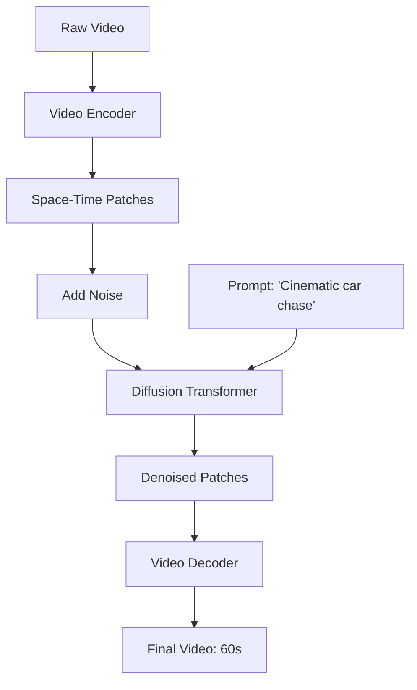

# Case Study: OpenAI Sora - World Simulation

## 1. Beginner-friendly Hinglish Explanation 🇮🇳
Bhai, 2024 mein OpenAI ne ek aisa model launch kiya jismein tum sirf "Text" likhte ho aur woh ek 60-second ki realistic movie bana deta hai. Iska naam hai **Sora**. 

Yeh koi simple video generator nahi hai. Sora duniya ke "Physics" ko samajhta hai. Agar koi cup girta hai, toh woh toot-ta hai; agar pani behta hai, toh woh realistic dikhta hai. Sora ne dikhaya ki LLMs ko sirf "Words" hi nahi, balki "Visual Dynamics" (harkat aur movement) sikhayi ja sakti hai. Is module mein hum seekhenge ki kaise Diffusion models aur Transformers ko mila kar ek "Virtual World" banayi jati hai.

---

## 2. Deep Technical Explanation
Sora ek **Diffusion Transformer (DiT)** architecture hai.
- **Space-Time Patches**: Sora video ko 3D patches mein todta hai (space aur time ke hisaab se) aur unhe LLM ki tarah tokens treat karta hai.
- **Transformer Backbone**: Pehle U-Net based diffusion models se alag, Sora denoising process ke liye Transformer use karta hai. Yeh usse better scale karne aur variable resolutions/aspect ratios handle karne deta hai.
- **Recaptioning**: Training videos ke liye highly descriptive captions generate karne ke liye ek separate model (DALL-E 3 style) use karta hai, jisse model complex instructions samajh sake.
- **Latent Space**: Model compressed latent space mein kaam karta hai Video Encoder/Decoder ka use karke.

---

## 3. Mathematical Intuition
Sora **Diffusion Models** aur **Transformers** ko combine karta hai.
Diffusion process: $x_t \to x_{t-1}$ noise $\epsilon_\theta(x_t, t, c)$ ko predict karke.
Transformer $\epsilon_\theta$ ke liye U-Net ki jagah leta hai.
Ek video $V \in \mathbb{R}^{T \times H \times W \times C}$ ko $N$ patches mein project kiya jata hai:
$$z = \text{Flatten}(\text{Proj}(V))$$
Transformer saare $N$ space-time patches ke beech attention calculate karta hai, jisse temporal consistency bani rehti hai (e.g., koi object tree ke peeche jaane par disappear nahi hota).

---

## 4. Architecture Diagrams


---

## 5. Production-ready Examples
Conceptual DiT Block (Python):

```python
class DiTBlock(nn.Module):
    def __init__(self, hidden_size):
        super().__init__()
        self.attn = MultiHeadAttention(hidden_size)
        self.ffn = FeedForward(hidden_size)
        self.adaLN = AdaptiveLayerNorm(hidden_size) # Conditional on time step t

    def forward(self, x, t, c):
        # Apply time-step and condition embedding
        x = x + self.attn(self.adaLN(x, t, c))
        x = x + self.ffn(self.adaLN(x, t, c))
        return x
```

---

## 6. Real-world Use Cases
- **Film & Entertainment**: Bina full CGI team ke background scenes ya complex VFX shots generate karna.
- **Education**: Learning ke liye realistic "Historical Re-enactments" create karna.
- **Advertising**: Seconds mein 100 different versions of a video ad banana.

---

## 7. Failure Cases
- **Physics Violations**: Ek cookie kha raha hai, but cookie mein bite mark nahi dikhta.
- **Entity Morphing**: Ek cat mid-video mein suddenly dog mein badal jati hai kyunki model frames ke beech confuse ho gaya.

---

## 8. Debugging Guide
1. **Temporal Stability**: Check karo ki background "Wobble" to nahi kar raha. Agar kar raha hai, to tumhara temporal attention window bahut chota hai.
2. **Coherence Check**: Ensure karo ki objects jo frame se bahar jate hain aur wapas aate hain, unka color aur shape same rahe.

---

## 9. Tradeoffs
| Feature | U-Net Diffusion (Stable Video) | Sora (DiT) |
|---|---|---|
| Scaling | Limited | Excellent |
| Consistency | Medium | High |
| Compute | Medium | Ultra-High |

---

## 10. Security Concerns
- **Misinformation**: Aise events ke fake videos banana jo kabhi hue hi nahi (e.g., panic failane ke liye fake natural disaster).
- **Copyright**: Studios ki permission ke bina movies par training karna.

---

## 11. Scaling Challenges
- **The Context Wall**: 24fps par ek 60-second video mein 1440 frames hote hain. Un sab ko ek saath process karne ke liye massive VRAM aur Ring Attention chahiye.

---

## 12. Cost Considerations
- **Generation Time**: H100s ke cluster par 1 minute ka video generate karne mein 10-20 minutes lag sakte hain, jisse yeh per second bahut mehnga padta hai.

---

## 13. Best Practices
- **Use Latent Diffusion**: Kabhi raw pixels ke saath kaam na karein; hamesha compressed latent space mein kaam karein.
- **Long Context Transformers**: Long video mein massive number of patches ko handle karne ke liye RoPE ya Ring Attention use karein.

---

## 14. Interview Questions
1. Sora video ko "Sequence of Patches" ki tarah kaise treat karta hai?
2. Diffusion ke liye U-Net ki jagah Transformer use karne ke kya fayde hain?

---

## 15. Latest 2026 Patterns
- **Interactable World Models**: Aise Sora-like models jahan tum kisi object par "Click" karke real-time mein uski movement change kar sakte ho.
- **Zero-Shot Video-to-Video**: Ek stick-figure animation le kar Sora ko "Renderer" ki tarah use karte hue use realistic cinematic scene mein badalna.