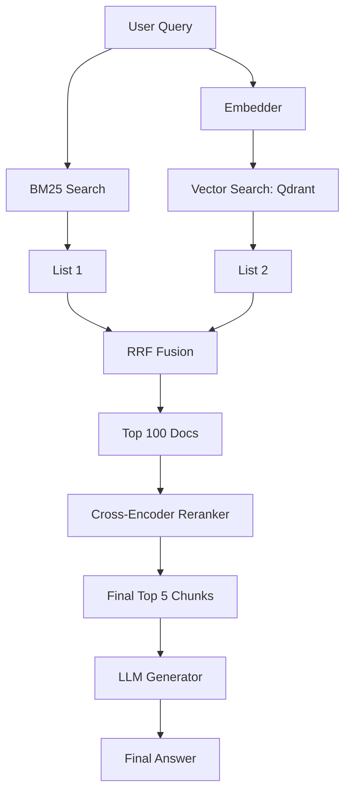

# Project: Enterprise RAG System with Hybrid Search

## 1. Beginner-friendly Hinglish Explanation 🇮🇳
Bhai, yeh tumhara "Grand Project" hai. Tumhe ek aisi system banani hai jo kisi company ke saare PDFs, Emails, aur SQL data ko padh sake aur employees ke sawalon ka sahi jawab de sake.

Sirf "Vector search" kaafi nahi hoga. Tumhe **Hybrid Search** use karni hogi (Keywords + Vectors), **Reranking** use karni hogi (Accuracy ke liye), aur **Semantic Caching** (Paisa bachane ke liye). Yeh project karne ke baad, tum kisi bhi AI company mein "Senior RAG Engineer" ke role ke liye apply kar sakte ho.

---

## 2. Gehri Technical Samjhai
Lakshya hai ek production-grade RAG pipeline banana jo complex enterprise requirements ko handle kare.
- **Data Ingestion**: `LlamaIndex` ya `LangChain` ka use karke messy PDFs ko parse karna aur SQL DB ke saath sync karna.
- **Hybrid Retrieval**: BM25 (Lexical) aur Dense Vectors (Semantic) ko combine karna using Reciprocal Rank Fusion (RRF).
- **Multi-Stage Reranking**: Cross-Encoder (jaise BGE-Reranker) ka use karke top 100 docs ko top 5 mein filter karna.
- **LLM Synthesis**: Llama-3-70B (via vLLM) ka use karke strict system prompt ke saath, hallucinations avoid karna.
- **Observability**: RAGAS ka use karte hue faithfulness aur relevance track karna.

---

## 3. Ganitiya Samajh
**Reciprocal Rank Fusion (RRF)**:
Jab multiple ranked lists of documents diye gaye hain, to document $d$ ke liye final score hai:
$$RRFscore(d \in D) = \sum_{r \in R} \frac{1}{k + r(d)}$$
Yahan $r(d)$ rank hai document $d$ ki list $r$ mein, aur $k$ ek constant hai (usually 60). Yeh aapko Keyword search aur Vector search ke results ko fairly combine karne deta hai bina scores normalize kiye.

---

## 4. Sanrachna Diagram


---

## 5. Production-ready Udaaharan
RRF Fusion implement karna (Conceptual Python):

```python
def rrf_fusion(vector_results, keyword_results, k=60):
    scores = {}
    for rank, doc_id in enumerate(vector_results):
        scores[doc_id] = scores.get(doc_id, 0) + 1 / (k + rank)
    for rank, doc_id in enumerate(keyword_results):
        scores[doc_id] = scores.get(doc_id, 0) + 1 / (k + rank)
    
    return sorted(scores.items(), key=lambda x: x[1], reverse=True)
```

---

## 6. Vaastavik Duniya ke Use Cases
- **Internal HR Portal**: Employees poochhte hain "Germany mein maternity leave policy kya hai?"
- **Technical Support**: Support agents poochhte hain "Model Y ke liye error code X-999 ko kaise fix karein?"

---

## 7. Asafalta ke Mamle
- **The "Wrong Version" problem**: Agent ko 2024 ki jagah 2021 ki policy mil jaati hai. (Solution: 'Date' ke liye metadata filtering add karo).
- **Context Window Overflow**: Bahut saare retrieved chunks model ko user ka original sawaal bhoola dete hain.

---

## 8. Debugging Margdarshika
1. **Retrieval Analysis**: Agar jawab galat hai, to top 5 chunks check karo. Agar sahi info wahan nahi hai, to retriever fail hua.
2. **Hallucination Check**: RAGAS se `Faithfulness` metric use karo. Agar yeh low hai, to model woh facts bana raha hai jo chunks mein nahi hain.

---

## 9. Tradeoffs
| Metric | Simple Vector RAG | Enterprise Hybrid RAG |
|---|---|---|
| Accuracy | 70% | 90%+ |
| Latency | < 1s | 2-4s |
| Complexity | Low | High |

---

## 10. Suraksha Chintayein
- **Document Access Control**: User A ko woh document retrieve nahi karna chahiye jo sirf User B (Manager) ke paas access hai. Aapko har vector search mein `user_id` filters include karne chahiye.

---

## 11. Scaling Challenges
- **Cold Storage**: Purane trillions logs ko slower disk par move karte hue unhe "Searchable" rakhna.

---

## 12. Kharcha Vichaar
- **Reranker Cost**: Har user query ke liye Cross-Encoder chalana $0.01 per request add kar sakta hai.

---

## 13. Sabse Achchhe Tareeke
- **"Semantic Chunking" ka istemal karein**: Sirf characters se na kate; paragraph ya semantic meaning se katein.
- **Cache Embeddings**: Ek hi query ke liye embedding ko dubara na karein.
- **Feedback Loop implement karein**: Users ko "Incorrect" click karne den taaki aap us query ko test set mein add kar sakein.

---

## 14. Interview ke Sawaal
1. Enterprise data ke liye Hybrid Search Vector-only search se behtar kyun hai?
2. RAG system mein document updates ko kaise handle karte ho?

---

## 15. 2026 ke Naye Patterns
- **Agentic RAG**: System decide karta hai ki use aur search karna hai, ya user se clarifying question poochhna hai search karne se pehle.
- **GraphRAG Integration**: Documents ko Knowledge Graph ke through connect karna taaki "Multi-hop" questions ka jawab de sake.