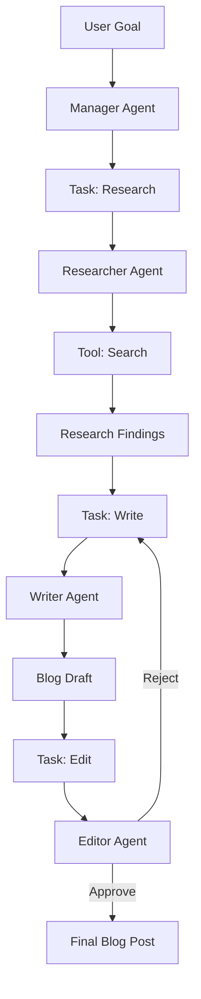

# Project: Autonomous Multi-Agent Team

## 1. Beginner-friendly Hinglish Explanation 🇮🇳
Bhai, socho tumne ek "Virtual Office" banaya hai. Ismein ek **Researcher** hai, ek **Writer** hai, aur ek **Reviewer** hai. Tumne unhe ek task diya: "AI in 2026 par ek blog post likho". 

Yeh teeno AI agents aapas mein baat karenge. Researcher google karega, Writer draft banayega, aur Reviewer galtiyan nikalega. Yeh tab tak chalta rahega jab tak blog post perfect na ho jaye. Tumhe sirf goal dena hai, baaki sab agents khud karenge. Yeh project tumhe **CrewAI** aur **LangGraph** jaise advanced tools ka master bana dega.

---

## 2. Deep Technical Explanation
Multi-agent system build karne mein specialized roles, tools, aur communication protocols define karna padta hai.
- **Roles & Personas**: Har agent ka "Mission" aur "Expertise" explicitly define karna.
- **Task Delegation**: "Manager" agent ya "State Graph" use karke decide karna kaunsa agent next kaam karega.
- **Inter-Agent Communication**: Agents ke beech messages ya shared state (context) pass karna.
- **Tool Access**: Specific agents ko specific tools (e.g., Python Interpreter, Web Search, PDF Reader) assign karna.

---

## 3. Mathematical Intuition
Multi-agent coordination ko ek **Cooperative Game** ki tarah model kiya ja sakta hai.
Goal hai $n$ agents ke across actions $\{a_1, a_2, ..., a_n\}$ ka set dhoondhna jo global utility function $U$ ko maximize kare.
Hum **Hierarchical Planning** use karte hain jahan ek top-level LLM goal ko sub-goals mein tod kar worker nodes ko assign karta hai.

---

## 4. Architecture Diagrams


---

## 5. Production-ready Examples
`CrewAI` ke saath team implement karna:

```python
from crewai import Agent, Task, Crew

# 1. Define Agents
researcher = Agent(
    role='Researcher',
    goal='Find the latest 2026 AI trends',
    backstory='Expert in tech journalism',
    tools=[search_tool]
)
writer = Agent(
    role='Writer',
    goal='Write a viral blog post',
    backstory='Master storyteller'
)

# 2. Define Tasks
task1 = Task(description='Search for 2026 trends', agent=researcher)
task2 = Task(description='Draft the post', agent=writer)

# 3. Create the Crew
my_crew = Crew(agents=[researcher, writer], tasks=[task1, task2])
result = my_crew.kickoff()
```

---

## 6. Real-world Use Cases
- **Software Dev Team**: Ek agent UI ke liye, ek Backend ke liye, ek Testing ke liye.
- **Investment Research**: Ek agent financial news ke liye, ek stock prices ke liye, ek risk analysis ke liye.
- **Legal Team**: Ek agent case law ke liye, ek contract drafting ke liye, ek compliance check ke liye.

---

## 7. Failure Cases
- **Agent Hallucination**: Researcher ek fake trend bana leta hai, aur Writer us jhooth par 2000-word blog post likh deta hai.
- **Infinite Looping**: Editor Writer ke draft ko minor reasons ke liye hamesha reject karta rehta hai.

---

## 8. Debugging Guide
1. **Thought History**: Har agent ka "Internal Monologue" dekho. Agar Researcher kahe "I am done" lekin Manager kahe "Go back", toh tumhara delegation logic galat hai.
2. **Context Window Management**: Jaise agents aapas mein chat karte hain, history badhti jati hai. Tokens bachane ke liye past steps ka **Summarization** use karo.

---

## 9. Tradeoffs
| Metric | Single Agent | Multi-Agent Team |
|---|---|---|
| Quality | Medium | High |
| Latency | Fast | Slow |
| Cost | Low | High |

---

## 10. Security Concerns
- **Agent Collusion**: Agar ek agent prompt injection se compromise ho jata hai, toh woh doosre agents ko harmful actions karne ke liye "Convince" kar sakta hai.

---

## 11. Scaling Challenges
- **Synchronization**: Yeh ensure karna ki saare agents data ke *latest* version par kaam kar rahe hain.

---

## 12. Cost Considerations
- **Multiplier Effect**: Ek multi-agent project single chat prompt ke comparison mein 20x-50x zyada tokens use kar sakta hai. "Editor" aur "Reviewer" steps ke liye chhote models use karo.

---

## 13. Best Practices
- **Define clear "Input" aur "Output" schemas** har agent ke liye.
- **Iterations ki maximum number set karo** (e.g., max 3 revisions).
- **"Self-Correction" loops use karo**: Agent apne kaam ko khud check kare next agent ko bhejne se pehle.

---

## 14. Interview Questions
1. Aap Multi-Agent system kab choose karenge single LLM long prompt ke comparison mein?
2. Agents ko infinite feedback loops mein phansne se kaise rokenge?

---

## 15. Latest 2026 Patterns
- **Meta-Agents**: Agents jo doosre agents ko "Hire" kar sakte hain ya problem solve karne ke liye on-the-fly naye tools "Write" kar sakte hain.
- **Human-in-the-Loop Orchestration**: System pause hota hai aur koi bhi "Real-world" action lene se pehle human signature ka wait karta hai.