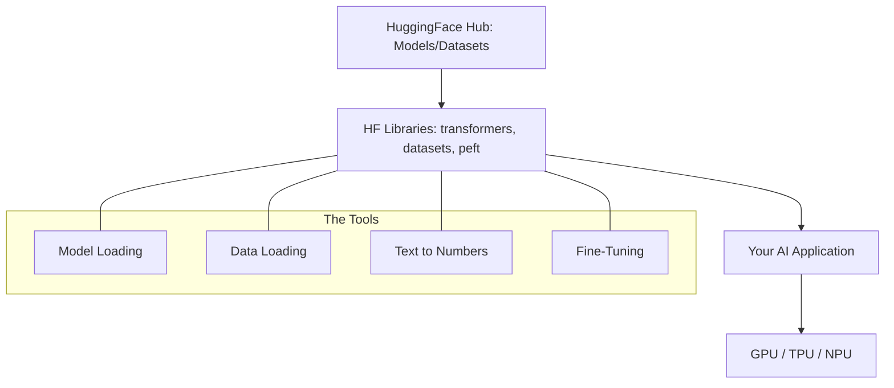

# HuggingFace Hub & Libraries: The Heart of Open Source

## 1. Beginner-friendly Hinglish Explanation 🇮🇳
Bhai, socho agar tumhe ek AI model chahiye aur tumhe use zero se train na karna pade. Tum bas ek "App Store" par jao aur wahan se model download kar lo. **HuggingFace Hub** wahi "App Store" (ya GitHub) hai AI ke liye. 

Wahan tumhe lakhs of models (jaise Llama, Mistral, BERT), datasets, aur demos (Spaces) milenge. Unki libraries jaise `transformers` (models ke liye), `datasets` (data ke liye), aur `diffusers` (images ke liye) ne AI development ko itna asaan bana diya hai ki ek 10th class ka bacha bhi AI app bana sakta hai. Bina HuggingFace ke, open-source AI itna fast grow nahi kar pata.

---

## 2. Deep Technical Explanation
HuggingFace (HF) provides the essential infrastructure for the open-source AI community.
- **Transformers Library**: A unified API for downloading, training, and deploying thousands of pre-trained models (PyTorch, TensorFlow, JAX).
- **HuggingFace Hub**: A git-based repository for models, datasets, and "Spaces" (web apps).
- **Tokenizers**: Ultra-fast subword tokenization (BPE, WordPiece) implemented in Rust.
- **PEFT (Parameter-Efficient Fine-Tuning)**: The go-to library for LoRA and QLoRA.
- **Accelerate**: A library for easy multi-GPU and TPU training.

---

## 3. Mathematical Intuition
HF's success lies in its **Abstraction Layer**.
Instead of writing 1000 lines of CUDA/PyTorch code for a new model architecture, HF abstracts it into:
$$Output = \text{Model}(\text{Tokenizer}(Input))$$
This standardization allows researchers to share code that "just works" across different hardware and frameworks, creating a massive network effect.

---

## 4. Architecture Diagrams


---

## 5. Production-ready Examples
Loading and running a model with 4-bit quantization from HF:

```python
from transformers import AutoModelForCausalLM, AutoTokenizer, BitsAndBytesConfig

# 1. Setup 4-bit quantization
quant_config = BitsAndBytesConfig(load_in_4bit=True)

# 2. Load model and tokenizer from Hub
model_id = "meta-llama/Llama-3-8B-Instruct"
tokenizer = AutoTokenizer.from_pretrained(model_id)
model = AutoModelForCausalLM.from_pretrained(
    model_id, 
    quantization_config=quant_config,
    device_map="auto"
)

# 3. Generate
inputs = tokenizer("Hello, who are you?", return_tensors="pt").to("cuda")
outputs = model.generate(**inputs, max_new_tokens=50)
print(tokenizer.decode(outputs[0]))
```

---

## 6. Real-world Use Cases
- **Enterprise AI**: Using HF to find a specialized "Legal" model and fine-tuning it on company data.
- **Research**: Quickly testing a new paper's architecture that was uploaded to the Hub yesterday.
- **Hobbyists**: Running "Stable Diffusion" on a local PC using the `diffusers` library.

---

## 7. Failure Cases
- **Version Mismatch**: Using `transformers` v4.30 with a model that needs v4.40 can cause weird errors or silently wrong results.
- **Hub Downtime**: If the HF Hub is down and you haven't cached the model locally, your production deployment will fail. Always **Download and Save** models for production.

---

## 8. Debugging Guide
1. **Cache Management**: Use `huggingface-cli delete-cache` if your disk is full (HF saves models in `~/.cache/huggingface/hub`).
2. **Device Map**: If you get "Out of Memory", check `device_map="auto"`. Sometimes manually setting it to specific GPUs is better.

---

## 9. Tradeoffs
| Feature | Custom Implementation | HuggingFace |
|---|---|---|
| Speed of Dev | Slow | Very Fast |
| Performance | Optimized (100%) | Near-Optimal (95%) |
| Flexibility | High | Medium (Standardized) |

---

## 10. Security Concerns
- **Pickle Exploits**: Loading a model file from an untrusted user on the Hub can execute malicious code on your machine. Always use **`safetensors`** format instead of `.bin` or `.pt`.

---

## 11. Scaling Challenges
- **Large Model Downloads**: Downloading a 140GB model (Llama-3-70B) can take hours and fail midway. Use the `huggingface-cli download` with resume support.

---

## 12. Cost Considerations
- **Bandwidth**: HF is free for open models, but your cloud provider might charge you for data ingress if you download massive models to a VPC.

---

## 13. Best Practices
- **Use `safetensors=True`**: It's faster and safer.
- **Pin your versions**: In `requirements.txt`, use `transformers==4.40.0` to avoid breaking changes.
- **Model Card**: Always read the Model Card on HF to understand the training data and bias of a model.

---

## 14. Interview Questions
1. What is the difference between `AutoModel` and a specific model class like `LlamaForCausalLM`?
2. What are `safetensors` and why are they preferred over PyTorch pickles?

---

## 15. Latest 2026 Patterns
- **HuggingFace TGI (Text Generation Inference)**: A high-performance production server specifically built for HF models with continuous batching and PagedAttention.
- **In-Browser Models**: Using Transformers.js to run BERT or Whisper directly in the user's browser via WebGPU.
