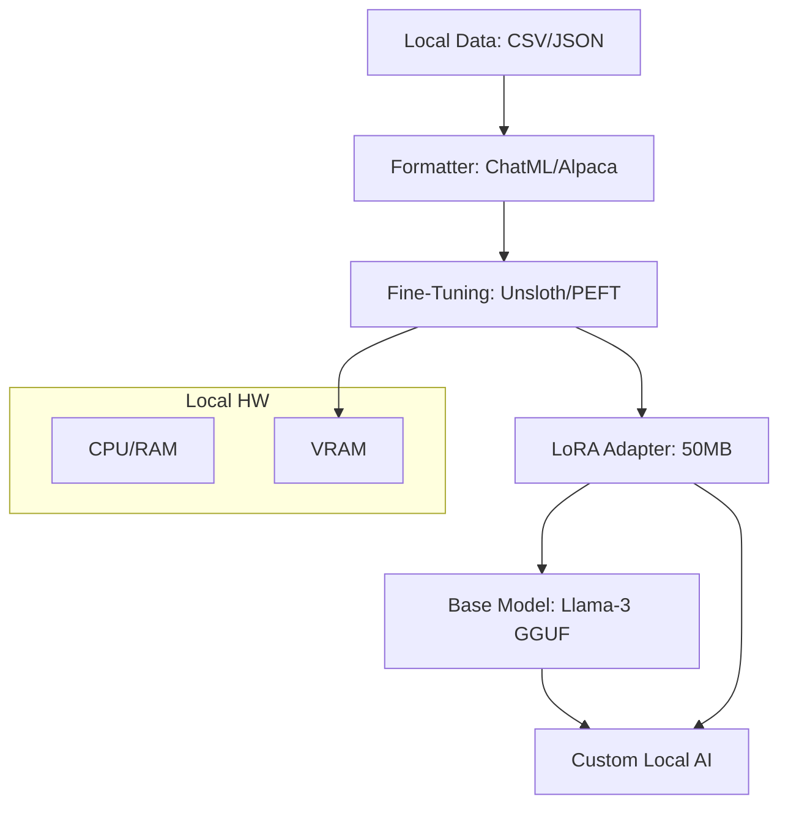

# Llama.cpp & Local Fine-Tuning: Master Your Model

## 1. Beginner-friendly Hinglish Explanation 🇮🇳
Bhai, socho tumne Llama-3 download kar li, lekin woh tumhari company ke rules nahi jaanti. Tum use "Sikhana" (Fine-tune) chahte ho, lekin tumhare paas koi bada server nahi hai. 

**Llama.cpp** wahi software hai jo AI ko "Efficient" banata hai taaki woh ordinary computers (jaise Macbook ya Gaming PC) par chale. Aur **Local Fine-Tuning** (jaise Unsloth ya LoRA) woh technique hai jismein tum apne ghar ke computer par hi model ko naya gyan de sakte ho. Is module mein hum seekhenge ki kaise model ke "Weights" ke saath choti-choti changes karke use apne kaam ke liye "Siddh" (Perfect) banaye.

---

## 2. Deep Technical Explanation
`llama.cpp` is a high-performance C++ implementation of the Transformer architecture with zero dependencies.
- **Metal/CUDA Support**: It leverages Apple Silicon (Metal) and NVIDIA GPUs (CUDA) for acceleration.
- **Mixed Precision**: Supports running parts of the model in FP16 and others in 4-bit.
- **Local Fine-Tuning (PEFT)**: Using libraries like **Unsloth** or **LoRA_MLX** to fine-tune models on local GPUs. These libraries optimize memory so you can fine-tune a 7B model on as little as 6GB of VRAM.
- **Dataset Prep**: Converting your local JSONL/CSV data into the specific format (Alpaca/ChatML) required for fine-tuning.

---

## 3. Mathematical Intuition
Fine-tuning with **LoRA (Low-Rank Adaptation)**:
Instead of updating the full weight matrix $W$ ($d \times d$), we only update two small matrices $A$ and $B$.
$$W_{new} = W_{base} + \Delta W = W_{base} + B \cdot A$$
where $B \in \mathbb{R}^{d \times r}$ and $A \in \mathbb{R}^{r \times d}$ with rank $r \ll d$.
This reduces the number of parameters to train by 10,000x, allowing local GPUs to handle the backpropagation gradients in memory.

---

## 4. Architecture Diagrams


---

## 5. Production-ready Examples
Fine-tuning with `Unsloth` (2x faster, 70% less memory):

```python
from unsloth import FastLanguageModel
import torch

# 1. Load Model + LoRA
model, tokenizer = FastLanguageModel.from_pretrained(
    model_name = "unsloth/llama-3-8b-bnb-4bit",
    max_seq_length = 2048,
    load_in_4bit = True,
)

model = FastLanguageModel.get_peft_model(
    model,
    r = 16, # Rank
    target_modules = ["q_proj", "k_proj", "v_proj", "o_proj"],
    lora_alpha = 16,
)

# 2. Train (Standard HuggingFace Trainer)
# ... [Insert Trainer setup here] ...
# model.train()

# 3. Save as GGUF (for use in Ollama)
model.save_pretrained_gguf("my_model", tokenizer)
```

---

## 6. Real-world Use Cases
- **Specific Domain Expert**: Fine-tuning a model on your company's internal Slack messages or documentation to create a "Company Bot".
- **Dialect Support**: Teaching Llama-3 to speak in a specific language or dialect (e.g., Hinglish, Bhojpuri).
- **Function Calling**: Training a model to strictly output valid JSON for API integration.

---

## 7. Failure Cases
- **Catastrophic Forgetting**: The model learns the new data but forgets how to speak basic English or solve math. (Solve by using a "Base model" mix).
- **Overfitting**: The model memorizes your 10 training examples perfectly but can't handle a slightly different query from a user.

---

## 8. Debugging Guide
1. **Loss Curves**: If the loss goes to 0 instantly, you are overfitting. If it stays high, your learning rate is too low.
2. **Tokenizer Mismatch**: Ensure you use the same tokenizer during fine-tuning that you will use during inference.

---

## 9. Tradeoffs
| Feature | Full Fine-Tuning | LoRA (Local) |
|---|---|---|
| Hardware | 8x A100 GPUs | 1x RTX 3060 |
| Speed | Slow | Fast |
| Intelligence | 100% | 98-99% |

---

## 10. Security Concerns
- **Data Poisoning**: If someone injects "Wrong" answers into your local training set, your model will start lying to you.

---

## 11. Scaling Challenges
- **Context Length**: Local fine-tuning is usually limited to 2k-4k context length due to VRAM. Fine-tuning on 128k context requires a massive GPU cluster.

---

## 12. Cost Considerations
- **Training Time**: A 7B model can take 1-4 hours to fine-tune on a modern local GPU.

---

## 13. Best Practices
- **Use "Rank 16"**: It's usually enough for most tasks.
- **Dataset Quality > Quantity**: 500 perfect examples are better than 10,000 noisy ones.
- **Save as GGUF**: It makes it compatible with everything (Ollama, LM Studio, etc.).

---

## 14. Interview Questions
1. What is the benefit of LoRA over full-parameter fine-tuning?
2. How does `llama.cpp` achieve high performance without using heavy libraries like PyTorch?

---

## 15. Latest 2026 Patterns
- **Q-LoRA**: Quantized LoRA, which allows you to fine-tune a 4-bit model directly.
- **GaLore (Gradient Low-Rank Projection)**: A new technique that allows full-parameter training on consumer GPUs by projecting the gradients.
