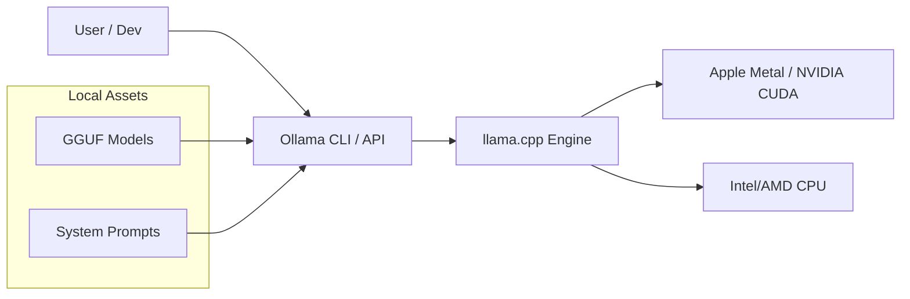

# Ollama & Local Inference: Privacy-First AI

## 1. Beginner-friendly Hinglish Explanation 🇮🇳
Bhai, socho tum chahte ho ki tumhara AI tumhare internet ke bina chale, aur tumhare "Private Documents" kabhi tumhare computer se bahar na jayen. **Ollama** wahi "Magic Tool" hai jo is kaam ko super-easy banata hai. 

Pehle local model chalana bohot mushkil tha (Python scripts, CUDA paths, etc.). Ab tum sirf ek command likhte ho `ollama run llama3` aur AI start ho jata hai. Yeh tumhare laptop ki power use karta hai aur tumhe ek ChatGPT jaisa interface deta hai jo 100% offline aur free hai. 2026 mein, developers apne coding aur personal notes ke liye Ollama hi use karte hain.

---

## 2. Deep Technical Explanation
Ollama is a Go-based wrapper around `llama.cpp` that simplifies the management and serving of local LLMs.
- **Model Management**: It uses a "Modelfile" (similar to Dockerfile) to define model parameters, system prompts, and quantization levels.
- **API Server**: Ollama runs a local HTTP server (port 11434) that provides an OpenAI-compatible API.
- **Memory Management**: It automatically handles loading models into GPU (Metal/CUDA) or CPU memory.
- **Cross-Platform**: Runs natively on macOS, Linux, and Windows.

---

## 3. Mathematical Intuition
Local inference speed is measured in **Tokens Per Second (TPS)**.
$$TPS = \frac{\text{System Bandwidth (GB/s)}}{\text{Model Size (GB)}}$$
If you run a 4-bit Llama-3-8B (~5GB) on a Macbook with 100GB/s bandwidth, your theoretical speed is ~20 TPS. Ollama optimizes this by using `llama.cpp` kernels that are hand-tuned for specific CPU/GPU architectures.

---

## 4. Architecture Diagrams


---

## 5. Production-ready Examples
Creating a custom persona with a Modelfile:

```dockerfile
# 1. Create a file named 'Modelfile'
FROM llama3
# Set the system prompt
SYSTEM "You are a sarcastic coding expert who answers in Hinglish."
# Set creativity
PARAMETER temperature 0.7
```

```bash
# 2. Build and run
ollama create sarcastobot -f Modelfile
ollama run sarcastobot
```

---

## 6. Real-world Use Cases
- **Privacy-First Coding**: Using an VS Code extension (like Continue) to use Ollama for local autocomplete.
- **Home Servers**: Running an AI assistant on a Raspberry Pi or an old gaming PC.
- **Data Scraping**: Using local models to summarize thousands of articles without incurring API costs.

---

## 7. Failure Cases
- **Slow Inference**: Running a 70B model on a laptop with 8GB RAM will cause the system to "Swap" and run at 0.1 tokens per second.
- **Model Drift**: Local models are often smaller (8B) and might hallucinate more than GPT-4 for complex tasks.

---

## 8. Debugging Guide
1. **Logs**: Check `~/.ollama/logs` to see why a model failed to load.
2. **GPU Check**: Run `nvidia-smi` or check Activity Monitor to ensure the model is actually using the GPU and not just the CPU.

---

## 9. Tradeoffs
| Feature | OpenAI API | Ollama (Local) |
|---|---|---|
| Privacy | Low | 100% |
| Speed | Depends on Internet | Depends on Hardware |
| Cost | Pay per token | Free (once you buy hardware) |

---

## 10. Security Concerns
- **Malicious Modelfiles**: Downloading a Modelfile from an untrusted source that includes a system prompt designed to steal your information when you copy-paste it into the chat.

---

## 11. Scaling Challenges
- **Concurrent Users**: A single laptop can only handle 1-2 users at a time. For a team, you need a dedicated "Local LLM Server" with multiple GPUs.

---

## 12. Cost Considerations
- **Electricity**: Running a GPU at 100% load all day can add $10-$20 to your monthly electricity bill.

---

## 13. Best Practices
- **Use GGUF Q4_K_M**: This is the "Sweet spot" for 4-bit quantization—minimal loss in intelligence with a huge boost in speed.
- **Clear RAM**: Close Chrome tabs before running a large local model to avoid performance lag.

---

## 14. Interview Questions
1. How does Ollama simplify the LLM deployment process compared to raw Python scripts?
2. What is the role of `llama.cpp` in the local inference ecosystem?

---

## 15. Latest 2026 Patterns
- **Ollama on the Edge**: Running specialized models on mobile NPUs via Ollama-like wrappers.
- **Distributed Local Inference**: Using your laptop and your desktop GPUs together to run a massive model over the local network (Petals/EXL2 style).
