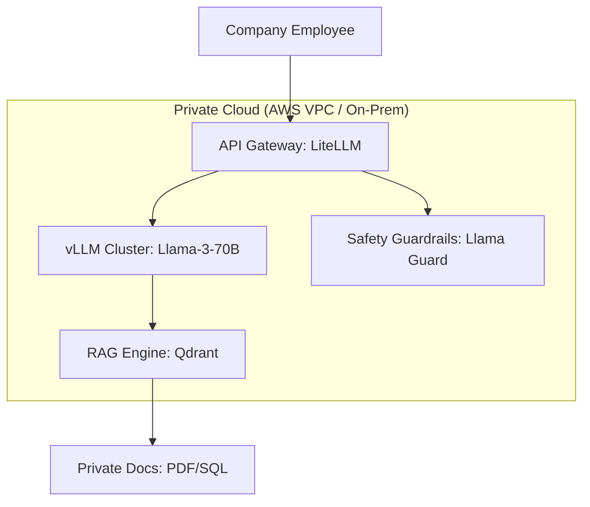

# Private LLM Stacks: Enterprise Autonomy

## 1. Beginner-friendly Hinglish Explanation 🇮🇳
Bhai, socho tum ek badi company ho (jaise Reliance ya Tata). Kya tum chahoge ki tumhari "Board Meeting" ke secret notes OpenAI ke server par jaye? Kabhi nahi! 

**Private LLM Stacks** wahi system hai jahan ek company apna pura "AI Ecosystem" khud ke servers par setup karti hai. Ismein **vLLM** (Speed ke liye), **Qdrant** (Vector search ke liye), aur **LangGraph** (Agents ke liye) jaise tools use hote hain. Isse saara data company ke firewalls ke andar rehta hai. Yeh bilkul waise hi hai jaise "Public Cloud" ke bajaye apna khud ka "Private Data Center" chalana. 2026 mein privacy hi sabse badi priority hai.

---

## 2. Deep Technical Explanation
A private LLM stack is a self-hosted suite of tools that mimic the functionality of OpenAI/Anthropic.
- **Inference Engine**: **vLLM** is the king of production inference. It uses **PagedAttention** to handle thousands of concurrent users with 24x more throughput than standard PyTorch.
- **Vector Database**: Self-hosted **Milvus** or **Qdrant** for high-speed semantic search.
- **API Gateway**: **LiteLLM** or **Kong** to provide a single OpenAI-compatible endpoint that routes requests between multiple local models.
- **Orchestration**: **LangChain** or **LangGraph** for logic, RAG, and agentic workflows.

---

## 3. Mathematical Intuition
**PagedAttention (vLLM)**:
Standard KV Cache stores tokens in contiguous memory. This leads to **60-80% memory waste** due to fragmentation.
PagedAttention treats KV cache like Virtual Memory in OS. It splits tokens into "Pages" and stores them non-contiguously.
$$\text{Memory Waste} \approx 0\%$$
This allows vLLM to fit much larger batch sizes into the same VRAM, maximizing GPU utilization.

---

## 4. Architecture Diagrams


---

## 5. Production-ready Examples
Launching a private vLLM server with Docker:

```bash
docker run --runtime nvidia --gpus all \
    -v ~/.cache/huggingface:/root/.cache/huggingface \
    -p 8000:8000 \
    vllm/vllm-openai \
    --model meta-llama/Llama-3-70B \
    --tensor-parallel-size 4 # Split across 4 GPUs
```

```python
# Querying your private stack
from openai import OpenAI
client = OpenAI(base_url="http://company-internal-ai:8000/v1", api_key="sk-local")

response = client.chat.completions.create(
    model="meta-llama/Llama-3-70B",
    messages=[{"role": "user", "content": "Analyze our Q3 revenue."}]
)
```

---

## 6. Real-world Use Cases
- **Banking**: Analyzing loan applications without sending PII to US-based cloud servers.
- **Government**: Building an "Internal Knowledge Base" for policy making and law enforcement.
- **Medical Research**: Searching through proprietary drug trial data without leaking it to competitors.

---

## 7. Failure Cases
- **Hardware Bottleneck**: If your GPU cluster goes down, the whole company's AI tools stop working. You need high-availability (HA) setups.
- **Maintenance Overload**: Keeping up with the latest models and security patches requires a dedicated "AI Platform Team".

---

## 8. Debugging Guide
1. **GPU P2P**: If using multiple GPUs, ensure `NCCL_P2P_DISABLE=0` to allow fast inter-GPU communication.
2. **vLLM Logs**: Watch for "Engine is overloaded" warnings. This means you need more query nodes.

---

## 9. Tradeoffs
| Metric | Public API (GPT-4) | Private Stack (vLLM) |
|---|---|---|
| Security | Medium | Ultra-High |
| Setup Time | 5 minutes | 5 days |
| Cost | Variable (per token) | Fixed (GPU Cluster) |

---

## 10. Security Concerns
- **Insider Threats**: If an employee has access to the physical servers, they can steal the entire fine-tuned model and the private vector database.

---

## 11. Scaling Challenges
- **Dynamic Load**: During a town hall meeting, 10,000 employees might use the AI at once. You need "Auto-scaling" GPU groups.

---

## 12. Cost Considerations
- **CAPEX vs OPEX**: You pay $100k+ upfront for A100/H100 GPUs, but your monthly token cost becomes zero.

---

## 13. Best Practices
- **Use LiteLLM**: It makes switching between Llama, Mistral, and Claude-on-prem seamless for your developers.
- **Enable Streaming**: Always use `stream=True` to make the UI feel fast for users.
- **Monitor with Prometheus/Grafana**: vLLM has built-in Prometheus metrics for throughput and latency.

---

## 14. Interview Questions
1. How does PagedAttention improve throughput in vLLM?
2. What are the key components of an Enterprise-grade private AI stack?

---

## 15. Latest 2026 Patterns
- **SkyPilot**: A tool that automatically finds the cheapest cloud GPU provider (Lambda, RunPod, AWS) and deploys your private LLM stack there.
- **KubeRay**: Running vLLM clusters on Kubernetes for elastic scaling.
