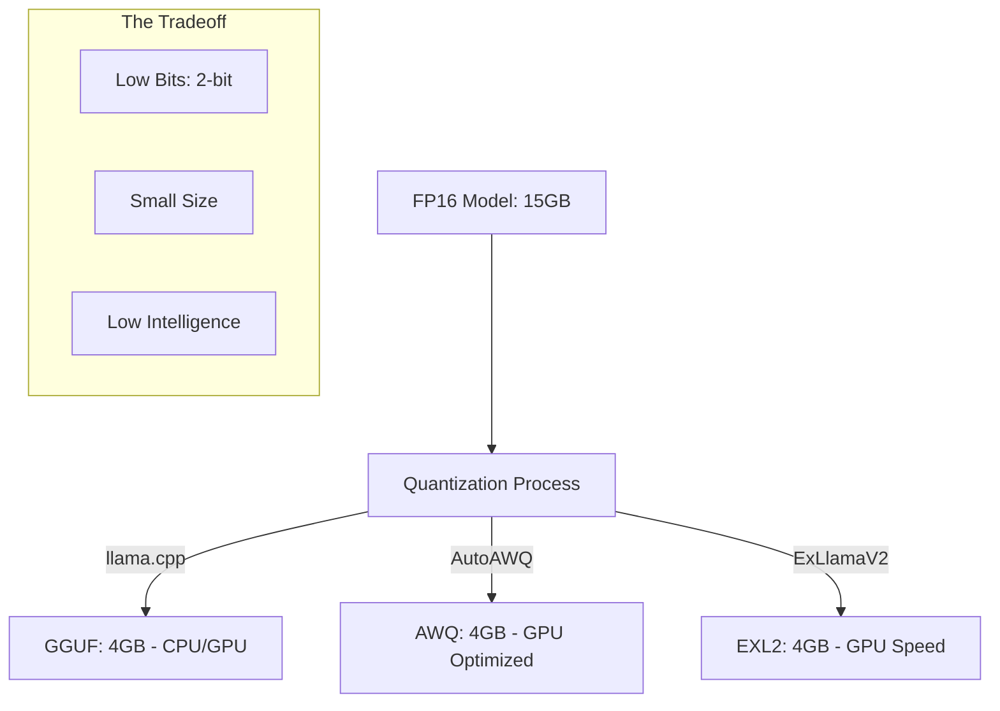

# Quantization: GGUF, AWQ, and EXL2

## 1. Beginner-friendly Hinglish Explanation 🇮🇳
Bhai, socho tumhare paas ek 100GB ki 4K movie hai, lekin tumhare phone mein sirf 5GB space hai. Tum kya karoge? Tum use "Compress" karoge (jaise MP4 ya MKV format mein). AI models ke saath bhi yahi hota hai. 

Ek normal LLM "FP16" (16-bit) mein hota hai jo bohot bada hota hai. **Quantization** use 4-bit ya 2-bit mein convert kar deti hai.
- **GGUF**: Yeh "Universal" format hai. Yeh CPU aur GPU dono par chalta hai. Local use ke liye best hai.
- **AWQ**: Yeh "Smart Compression" hai jo sirf zaruri weights ko protect karti hai. Accuracy achhi rehti hai.
- **EXL2**: Yeh "Speed" ka baap hai. Yeh NVIDIA GPUs par ultra-fast chalta hai.

Is module mein hum seekhenge ki kaise model ko chota karein bina use "Gajini" (Dumb) banaye.

---

## 2. Deep Technical Explanation
Quantization is the process of reducing the precision of the model weights from 16-bit floats to 8-bit, 4-bit, or even 1.5-bit integers.
- **GGUF (GPT-Generated Unified Format)**: Succeeder of GGML. Optimized for `llama.cpp`. It packs weights, metadata, and vocabulary into a single file. Supports "K-Quants" (Mixed precision within layers).
- **AWQ (Activation-aware Weight Quantization)**: Scales important weights before quantization to reduce rounding errors. Excellent for preserving reasoning capabilities.
- **EXL2 (ExLlamaV2)**: Uses a variable-bitrate approach (e.g., 4.65 bits per weight). Highly optimized for Tensor Cores on NVIDIA GPUs.
- **BitNet / 1.58-bit**: The cutting edge of research where weights are only -1, 0, or 1.

---

## 3. Mathematical Intuition
Linear Quantization for a weight $w$ to a $b$-bit integer:
$$q = \text{round} \left( \frac{w}{\text{scale}} + \text{zero\_point} \right)$$
The **Quantization Error** is $E = |w - \text{dequant}(q)|$. 
Advanced methods like **GPTQ** use a Hessian-based error minimization to ensure that the change in the model's output is minimized:
$$\min \|W \cdot X - Q(W) \cdot X\|_2^2$$

---

## 4. Architecture Diagrams


---

## 5. Production-ready Examples
Using `AutoAWQ` to quantize a model:

```python
from awq import AutoAWQForCausalLM
from transformers import AutoTokenizer

model_path = "meta-llama/Llama-3-8B"
quant_path = "Llama-3-8B-AWQ"
quant_config = { "zero_point": True, "q_group_size": 128, "w_bit": 4, "version": "GEMM" }

# 1. Load and Quantize
model = AutoAWQForCausalLM.from_pretrained(model_path)
tokenizer = AutoTokenizer.from_pretrained(model_path)
model.quantize(tokenizer, quant_config=quant_config)

# 2. Save
model.save_quantized(quant_path)
```

---

## 6. Real-world Use Cases
- **Mobile Apps**: Using GGUF to run a 3B model on a phone with 4GB RAM.
- **Low-Cost Hosting**: Running a 70B model on a single 3090/4090 GPU instead of needing 4 of them.
- **Edge Devices**: 1.58-bit models running on specialized AI chips with zero multiplication units.

---

## 7. Failure Cases
- **Perplexity Spike**: If you go below 3 bits, the model's "Fluency" often drops sharply (e.g., it starts repeating the same word forever).
- **Format Incompatibility**: You can't run an EXL2 model on a CPU; it requires an NVIDIA GPU.

---

## 8. Debugging Guide
1. **PPL Measurement**: Always measure Perplexity on a dataset like WikiText-2 before and after quantization. A small increase (e.g., 0.1 to 0.3) is acceptable.
2. **Infinite Loops**: If the model gets stuck in a loop post-quantization, your `zero_point` or `scale` calculation might be wrong.

---

## 9. Tradeoffs
| Format | Best For | Compatibility | Speed |
|---|---|---|---|
| GGUF | Local / CPU | High (Everything) | Medium |
| AWQ | Production / GPU | Medium (NVIDIA) | High |
| EXL2 | High-Speed Inference | Low (Modern NVIDIA) | Ultra-High |

---

## 10. Security Concerns
- **Hidden Bias**: Quantization can sometimes "Amplify" existing biases in the model because the "Safety" guardrails are often the first things to degrade at low bitrates.

---

## 11. Scaling Challenges
- **Calibration Data**: AWQ and GPTQ need a "Calibration dataset" (usually 128 chunks of text). If the calibration data is bad, the whole quantized model will be bad.

---

## 12. Cost Considerations
- **VRAM Savings**: 4-bit quantization reduces VRAM needs by **75%**. This is the difference between $1,000/mo and $250/mo in cloud costs.

---

## 13. Best Practices
- Use **Q4_K_M** for GGUF; it's the gold standard.
- Use **AWQ** for VLLM-based production servers.
- Use **EXL2** for personal gaming PCs with NVIDIA cards.

---

## 14. Interview Questions
1. What is the "Weight-Activation" mismatch in quantization?
2. Why is INT4 quantization usually "Good enough" for LLMs?

---

## 15. Latest 2026 Patterns
- **FP4 & FP6**: New data formats supported by NVIDIA Blackwell GPUs that provide quantization benefits without the intelligence loss of INT4.
- **AQLM**: Multi-codebook quantization that allows 2-bit models to perform like 4-bit ones.
