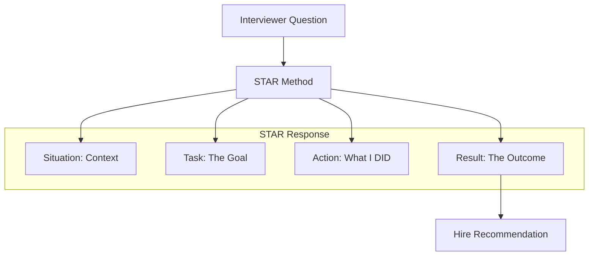

# Behavioral Questions for AI Roles: Winning the Culture Fit

## 1. Beginner-friendly Hinglish Explanation 🇮🇳
Bhai, tum kitne hi bade "Coder" ya "Researcher" kyun na ho, agar tum team ke saath kaam nahi kar sakte toh koi company tumhe hire nahi karegi. AI roles mein "Soft Skills" bohot zaruri hain kyunki yahan cheezein bohot jaldi badalti hain aur failure ke chances zyada hote hain.

Interview mein woh tumse poochenge: "Jab tumhara model production mein fail hua toh tumne kya kiya?" ya "Tumne ek complicated AI concept kisi non-technical manager ko kaise samjhaya?". Is guide mein hum wahi "Situational Questions" dekhenge jo tumhare character aur problem-solving approach ko test karte hain. Yaad rakhna, technical skills tumhe "Interview" tak laati hain, lekin behavioral skills tumhe "Job" dilati hain.

---

## 2. Deep Technical Explanation
Behavioral interviews for AI engineers test three main pillars:
- **Resilience**: How do you handle a project that fails after 3 months of training? (e.g., the model didn't converge).
- **Communication**: Can you explain "Vector Embeddings" to a Product Manager without using math?
- **Ethics**: How do you balance "Model Speed" with "Safety" and "Bias"?
- **Continuous Learning**: How do you keep up with 100+ research papers being published every week?

---

## 3. Mathematical Intuition
While there's no "Math" for behavior, think of it as a **Optimization Problem**.
Your goal is to maximize **Trust** and **Alignment** with the interviewer's company values.
Use the **STAR Method** (Situation, Task, Action, Result) to provide a structured "Vector" of your experience.

---

## 4. Architecture Diagrams

---

## 5. Production-ready Examples
**Question**: "Tell me about a time you had to deal with an ethical dilemma in AI."
**Bad Answer**: "I saw a bias and I fixed it."
**Good STAR Answer**:
- **S**: In my last job, our customer support bot was giving biased answers to users from specific regions.
- **T**: I had to fix this without deleting the entire model.
- **A**: I implemented a "Bias Detection" guardrail and created a more diverse synthetic dataset for fine-tuning.
- **R**: The bias score dropped by 40% and user satisfaction increased by 15%.

---

## 6. Real-world Use Cases
- **Scenario**: "The CEO wants to launch a feature that you know is 30% hallucinated. What do you do?"
    - Answer: Advocate for the user. Propose a "BETA" tag, a clear disclaimer, and a human-in-the-loop fallback.

---

## 7. Failure Cases
- **Blaming Others**: "The model failed because the data team gave me bad data." (Shows lack of ownership).
- **Over-technicality**: Answering a cultural question with a discussion about "Hyperparameters".

---

## 8. Debugging Guide
1. **Mock Interviews**: Record yourself. Are you saying "Umm" too much? Is your story too long?
2. **Review your "STAR" stories**: Ensure every story has a positive, data-backed **Result**.

---

## 9. Tradeoffs
| Response Style | Impact | Risk |
|---|---|---|
| Humble | High Trust | Might sound too junior |
| Confident | High Authority | Might sound arrogant |
| Transparent | High Integrity | Reveals your past mistakes |

---

## 10. Security Concerns
- **NDAs**: Don't reveal "Confidential" details about your previous company's secrets while trying to sound smart in an interview.

---

## 11. Scaling Challenges
- **Cultural Fit at Scale**: How do you maintain a "Safety-first" culture when a team grows from 5 to 500 engineers?

---

## 12. Cost Considerations
- **Time to Hire**: Behavioral rounds are often the "Tie-breaker" between two technically equal candidates.

---

## 13. Best Practices
- **Be Honest about Failure**: Talk about a model that didn't work and what you learned from it.
- **Show Passion**: Talk about an AI paper or a project that actually excites you.
- **Research the Company**: Know their mission. (e.g., Is it "Move fast and break things" or "Safety first"?).

---

## 14. Interview Questions
1. "How do you prioritize which research papers to read?"
2. "Describe a conflict you had with a fellow researcher and how you resolved it."

---

## 15. Latest 2026 Patterns
- **AI Literacy for All**: Interviewers now look for engineers who can mentor non-AI teams (Marketing, Sales) to use AI effectively.
- **Agentic Responsibility**: "If an autonomous agent you built makes a mistake that costs money, who is responsible?" - A common 2026 ethics question.
