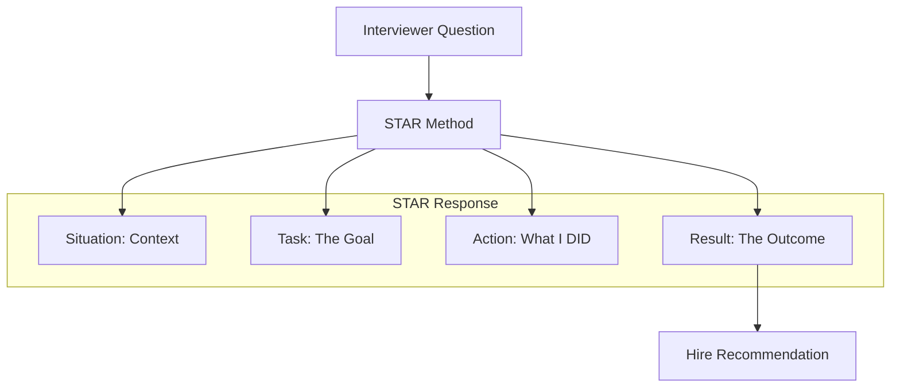

# Behavioral Questions for AI Roles: Culture Fit Kaise Jeetein

## 1. Beginner-friendly Hinglish Explanation 🇮🇳
Bhai, tum kitne hi bade "Coder" ya "Researcher" kyun na ho, agar tum team ke saath kaam nahi kar sakte toh koi company tumhe hire nahi karegi. AI roles mein "Soft Skills" bohot zaruri hain kyunki yahan cheezein bohot jaldi badalti hain aur failure ke chances zyada hote hain.

Interview mein woh tumse poochenge: "Jab tumhara model production mein fail hua toh tumne kya kiya?" ya "Tumne ek complicated AI concept kisi non-technical manager ko kaise samjhaya?". Is guide mein hum wahi "Situational Questions" dekhenge jo tumhare character aur problem-solving approach ko test karte hain. Yaad rakhna, technical skills tumhe "Interview" tak laati hain, lekin behavioral skills tumhe "Job" dilati hain.

---

## 2. Deep Technical Explanation
AI engineers ke liye behavioral interviews teen main pillars test karte hain:
- **Resilience**: Tum ek project ko kaise handle karte ho jo 3 months ki training ke baad fail ho jata hai? (e.g., model converge nahi hua).
- **Communication**: Kya tum "Vector Embeddings" ko ek Product Manager ko bina math use kiye samjha sakte ho?
- **Ethics**: Tum "Model Speed" aur "Safety" aur "Bias" ko kaise balance karte ho?
- **Continuous Learning**: Tum har week publish hone wale 100+ research papers ke saath kaise up-to-date rehte ho?

---

## 3. Mathematical Intuition
Jabki behavior ke liye koi "Math" nahi hai, ise ek **Optimization Problem** ki tarah socho.
Tumhara goal interviewer ki company values ke saath **Trust** aur **Alignment** maximize karna hai.
Apne experience ka structured "Vector" dene ke liye **STAR Method** (Situation, Task, Action, Result) use karo.

---

## 4. Architecture Diagrams

```mermaid
graph TD
    Question[Interviewer Question] --> STAR[STAR Method]
    subgraph "STAR Response"
        S[Situation: Context]
        T[Task: The Goal]
        A[Action: What I DID]
        R[Result: The Outcome]
    end
    STAR --> S & T & A & R
    R --> Score[Hire Recommendation]
```

---

## 5. Production-ready Examples
**Question**: "Mujhe ek aise time ke baare mein batao jab tumhe AI mein ethical dilemma face karna pada."
**Bad Answer**: "Maine ek bias dekha aur maine use fix kar diya."
**Good STAR Answer**:
- **S**: Apni last job mein, hamara customer support bot specific regions ke users ko biased answers de raha tha.
- **T**: Mujhe poora model delete kiye bina ise fix karna tha.
- **A**: Maine ek "Bias Detection" guardrail implement kiya aur fine-tuning ke liye zyada diverse synthetic dataset banaya.
- **R**: Bias score 40% gira aur user satisfaction 15% badh gaya.

---

## 6. Real-world Use Cases
- **Scenario**: "CEO ek feature launch karna chahta hai jo tumhe pata hai 30% hallucinated hai. Tum kya karoge?"
    - Answer: User ke liye advocate karo. Ek "BETA" tag, clear disclaimer, aur human-in-the-loop fallback propose karo.

---

## 7. Failure Cases
- **Blaming Others**: "Model fail hua kyunki data team ne mujhe kharab data diya." (Ownership ki kami dikhata hai).
- **Over-technicality**: Cultural question ka jawab "Hyperparameters" ki discussion se dena.

---

## 8. Debugging Guide
1. **Mock Interviews**: Khud ko record karo. Kya tum "Umm" bohot bol rahe ho? Kya tumhari story bohot lambi hai?
2. **Review your "STAR" stories**: Har story ka positive, data-backed **Result** hona chahiye.

---

## 9. Tradeoffs
| Response Style | Impact | Risk |
|---|---|---|
| Humble | High Trust | Bohot junior lag sakte ho |
| Confident | High Authority | Arrogant lag sakte ho |
| Transparent | High Integrity | Apne past mistakes reveal kar deta hai |

---

## 10. Security Concerns
- **NDAs**: Interview mein smart lagne ke chakkar mein apni previous company ke "Confidential" secrets reveal mat karo.

---

## 11. Scaling Challenges
- **Cultural Fit at Scale**: Jab team 5 se 500 engineers tak badh jaaye toh tum "Safety-first" culture kaise maintain karte ho?

---

## 12. Cost Considerations
- **Time to Hire**: Behavioral rounds aksar do technically equal candidates ke beech "Tie-breaker" hote hain.

---

## 13. Best Practices
- **Be Honest about Failure**: Ek aise model ke baare mein baat karo jo kaam nahi kiya aur tumne usse kya seekha.
- **Show Passion**: Ek AI paper ya project ke baare mein baat karo jo tumhe actually excite karta hai.
- **Research the Company**: Unki mission ko jano. (e.g., Kya ye "Move fast and break things" hai ya "Safety first"?).

---

## 14. Interview Questions
1. "Tum kaise prioritize karte ho ki kaun se research papers padhne hain?"
2. "Ek fellow researcher ke saath tumhara hua conflict aur tumne use kaise resolve kiya, uska describe karo."

---

## 15. Latest 2026 Patterns
- **AI Literacy for All**: Interviewers ab aise engineers dhundhte hain jo non-AI teams (Marketing, Sales) ko AI effectively use karne mein mentor kar sakein.
- **Agentic Responsibility**: "Agar tumne jo autonomous agent banaya hai woh koi aisi galti karta hai jisse paisa lagta hai, toh kaun responsible hai?" - Ek common 2026 ethics question.