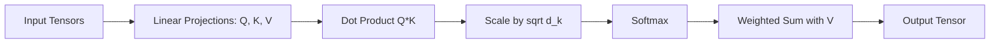

# LLM Coding Interview Tasks: Hands-On Challenges

## 1. Beginner-friendly Hinglish Explanation 🇮🇳
Bhai, AI Engineer ke interview mein sirf "Theoretical" sawal nahi aate. Woh tumhe bolenge: "Ek ghante mein ek chota sa RAG system likh kar dikhao" ya "PyTorch mein Self-Attention module implement karo". 

Yeh module wahi "Practice Ground" hai. Ismein humne woh coding tasks rakhe hain jo Google, Meta, aur OpenAI ke interviews mein aksar pooche jate hain. Agar tumne in tasks ko bina Google kiye solve kar liya, toh samajh lo tumhari "Coding Muscle" bohot strong hai. Ismein math, PyTorch, aur prompt engineering teeno ka test hoga.

---

## 2. Deep Technical Explanation
Coding interviews for AI roles typically fall into three categories:
- **Architecture Implementation**: Implementing core Transformer components (Attention, LayerNorm) from scratch using `torch`.
- **System Integration**: Building a RAG pipeline or an Agentic loop using `LangChain` or `vLLM`.
- **Data Engineering**: Writing scripts for tokenization, data cleaning, or vector database upserts.

---

## 3. Mathematical Intuition
**Task: Implement Scaled Dot-Product Attention**
The formula is:
$$\text{Attention}(Q, K, V) = \text{softmax}\left(\frac{QK^T}{\sqrt{d_k}}\right)V$$
Why divide by $\sqrt{d_k}$? To prevent gradients from vanishing when the dot product grows too large (which pushes the softmax into regions with very small gradients).

---

## 4. Architecture Diagrams


---

## 5. Production-ready Examples
**Task 1: Implement Self-Attention in PyTorch**

```python
import torch
import torch.nn as nn
import torch.nn.functional as F

class SimpleSelfAttention(nn.Module):
    def __init__(self, d_model):
        super().__init__()
        self.q = nn.Linear(d_model, d_model)
        self.k = nn.Linear(d_model, d_model)
        self.v = nn.Linear(d_model, d_model)
        self.d_k = d_model

    def forward(self, x):
        Q = self.q(x)
        K = self.k(x)
        V = self.v(x)
        
        scores = torch.matmul(Q, K.transpose(-2, -1)) / (self.d_k ** 0.5)
        attn = F.softmax(scores, dim=-1)
        return torch.matmul(attn, V)
```

---

## 6. Real-world Use Cases
- **Interview Scenario**: "The model is producing gibberish. You suspect the attention mask is wrong. How do you fix it?"
- **Answer**: Implement a causal mask (lower triangular) to prevent the model from "looking into the future".

---

## 7. Failure Cases
- **Broadcasting Errors**: Forgetting to handle the batch dimension correctly in `torch.matmul`.
- **Memory Inefficiency**: Creating a massive $N \times N$ attention matrix for a 1M sequence length (Solution: use `Flash Attention` or `Ring Attention`).

---

## 8. Debugging Guide
1. **Shape Tracking**: Always print the shapes of your tensors after every operation (`[Batch, Seq, Dim]`).
2. **Nan Detection**: If your loss becomes `NaN`, check for division by zero or very large exponents in your softmax.

---

## 9. Tradeoffs
| Task | Implementation Time | Interview Weight |
|---|---|---|
| Self-Attention | 10 mins | High |
| RAG Setup | 30 mins | Very High |
| Fine-Tuning Script | 45 mins | Medium |

---

## 10. Security Concerns
- **Code Injection**: When building a coding agent, ensure it can't execute harmful commands on the interviewer's machine.

---

## 11. Scaling Challenges
- **Implementing Multi-Head Attention**: Complexity increases as you have to split and concatenate tensors across heads efficiently.

---

## 12. Cost Considerations
- **Mocking APIs**: Use `pytest-mock` or `unittest.mock` to avoid calling expensive APIs (like OpenAI) during your coding test.

---

## 13. Best Practices
- **Write Modular Code**: Don't put everything in one big function.
- **Add Docstrings**: Explain your logic as you code.
- **Test with Edge Cases**: "What if the sequence length is 1?", "What if the batch size is 0?".

---

## 14. Interview Questions
1. How do you implement a causal mask for a decoder-only Transformer?
2. What is the complexity of the attention mechanism?

---

## 15. Latest 2026 Patterns
- **Implementing GQA (Grouped Query Attention)**: A common 2026 interview task for senior roles to test knowledge of inference optimization.
- **Building a Tool-Caller**: Writing a script that parses an LLM's output and executes a specific Python function based on the intent.
