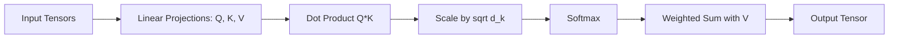

# LLM Coding Interview Tasks: Hands-On Challenges

## 1. Shuruaati-friendly Hinglish Samjhai 🇮🇳
Bhai, AI Engineer ke interview mein sirf "Theoretical" sawal nahi aate. Woh tumhe bolenge: "Ek ghante mein ek chota sa RAG system likh kar dikhao" ya "PyTorch mein Self-Attention module implement karo". 

Yeh module wahi "Practice Ground" hai. Ismein humne woh coding tasks rakhe hain jo Google, Meta, aur OpenAI ke interviews mein aksar pooche jate hain. Agar tumne in tasks ko bina Google kiye solve kar liya, toh samajh lo tumhari "Coding Muscle" bohot strong hai. Ismein math, PyTorch, aur prompt engineering teeno ka test hoga.

---

## 2. Deep Technical Samjhai
AI roles ke coding interviews typically teen categories mein aate hain:
- **Architecture Implementation**: `torch` ka use karke core Transformer components (Attention, LayerNorm) scratch se implement karna.
- **System Integration**: `LangChain` ya `vLLM` ka use karke RAG pipeline ya Agentic loop build karna.
- **Data Engineering**: Tokenization, data cleaning, ya vector database upserts ke scripts likhna.

---

## 3. Mathematical Intuition
**Task: Scaled Dot-Product Attention ko implement karo**
Formula yeh hai:
$$\text{Attention}(Q, K, V) = \text{softmax}\left(\frac{QK^T}{\sqrt{d_k}}\right)V$$
Aise kyu divide karte hain $\sqrt{d_k}$? Taki gradients vanish na hone jab dot product bohot bada ho jata hai (jo softmax ko bohot chhote gradients wale regions mein push kar deta hai).

---

## 4. Architecture Diagrams

```mermaid
graph LR
    Input[Input Tensors] --> QKV[Linear Projections: Q, K, V]
    QKV --> Dot[Dot Product Q*K]
    Dot --> Scale[Scale by sqrt d_k]
    Scale --> Soft[Softmax]
    Soft --> Weighted[Weighted Sum with V]
    Weighted --> Out[Output Tensor]
```

---

## 5. Production-ready Examples
**Task 1: PyTorch mein Self-Attention implement karo**

```python
import torch
import torch.nn as nn
import torch.nn.functional as F

class SimpleSelfAttention(nn.Module):
    def __init__(self, d_model):
        super().__init__()
        self.q = nn.Linear(d_model, d_model)
        self.k = nn.Linear(d_model, d_model)
        self.v = nn.Linear(d_model, d_model)
        self.d_k = d_model

    def forward(self, x):
        Q = self.q(x)
        K = self.k(x)
        V = self.v(x)
        
        scores = torch.matmul(Q, K.transpose(-2, -1)) / (self.d_k ** 0.5)
        attn = F.softmax(scores, dim=-1)
        return torch.matmul(attn, V)
```

---

## 6. Real-world Use Cases
- **Interview Scenario**: "Model gibberish produce kar raha hai. Aapko suspect hai ki attention mask galat hai. Aap kaise fix karoge?"
- **Answer**: Causal mask (lower triangular) implement karo taaki model "future mein dekhne" se bache.

---

## 7. Failure Cases
- **Broadcasting Errors**: `torch.matmul` mein batch dimension ko sahi se handle karna bhool jana.
- **Memory Inefficiency**: 1M sequence length ke liye massive $N \times N$ attention matrix create karna (Solution: `Flash Attention` ya `Ring Attention` use karo).

---

## 8. Debugging Guide
1. **Shape Tracking**: Har operation ke baad apne tensors ke shapes ko print karte raho (`[Batch, Seq, Dim]`).
2. **Nan Detection**: Agar loss `NaN` ho jaye, toh division by zero ya softmax mein bahut bade exponents ko check karo.

---

## 9. Tradeoffs
| Task | Implementation Time | Interview Weight |
|---|---|---|
| Self-Attention | 10 mins | High |
| RAG Setup | 30 mins | Very High |
| Fine-Tuning Script | 45 mins | Medium |

---

## 10. Security Concerns
- **Code Injection**: Coding agent build karte waqt, ensure karo ki woh interviewer's machine par harmful commands execute na kar sake.

---

## 11. Scaling Challenges
- **Multi-Head Attention implement karna**: Complexity badh jati hai kyunki tensors ko heads mein split aur efficiently concatenate karna padta hai.

---

## 12. Cost Considerations
- **Mocking APIs**: Coding test ke dauran expensive APIs (jaise OpenAI) ko call karne se bachne ke liye `pytest-mock` ya `unittest.mock` use karo.

---

## 13. Best Practices
- **Modular Code likho**: Sab kuch ek bade function mein mat daalo.
- **Docstrings add karo**: Code karte waqt apni logic ko samjhao.
- **Edge Cases ke saath test karo**: "Agar sequence length 1 ho toh?", "Agar batch size 0 ho toh?"

---

## 14. Interview Questions
1. Decoder-only Transformer ke liye causal mask kaise implement karte hain?
2. Attention mechanism ki complexity kya hai?

---

## 15. Latest 2026 Patterns
- **GQA (Grouped Query Attention) implement karna**: Senior roles ke liye 2026 mein common interview task jo inference optimization ka test leta hai.
- **Tool-Caller build karna**: Aisa script likhna jo LLM ke output ko parse karke intent ke hisaab se specific Python function execute kare.

``` 

```