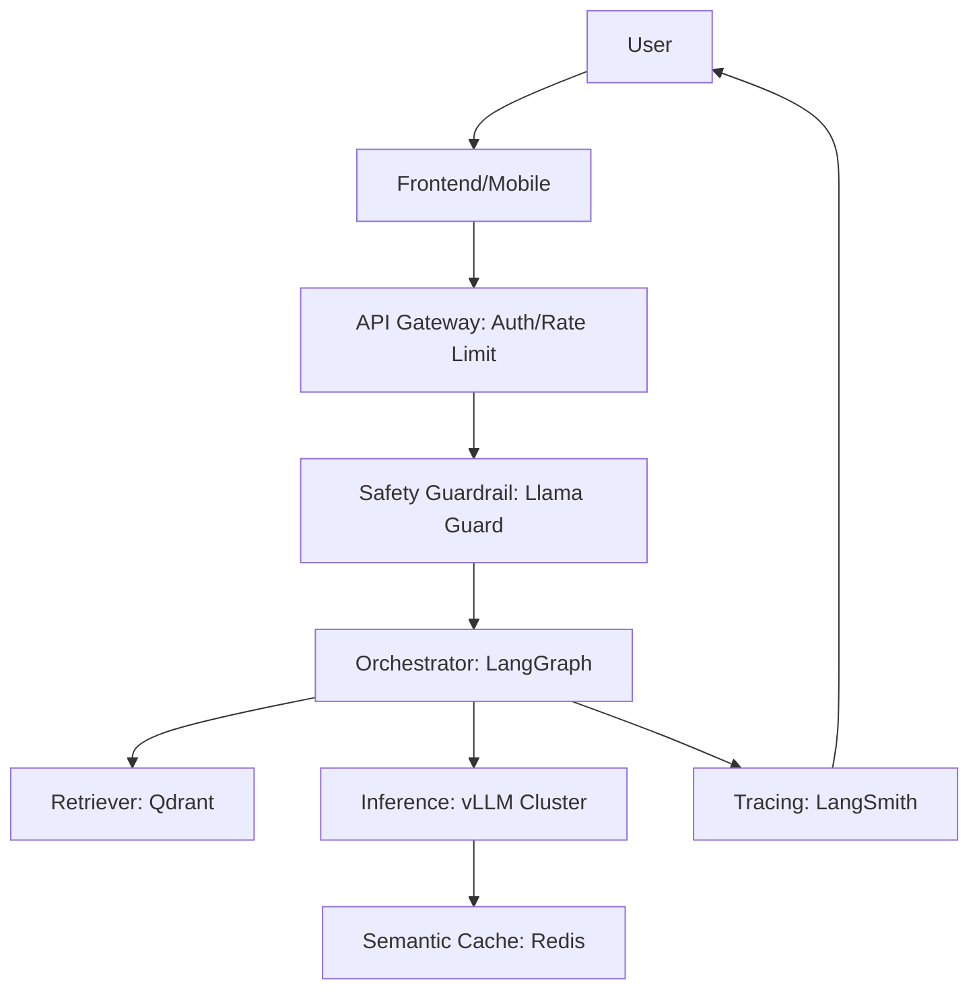

# LLM System Design Interview Guide (2026)

## 1. Beginner-friendly Hinglish Explanation 🇮🇳
Bhai, LLM ka system design normal "Backend design" se bohot alag hai. Yahan sirf "Database" aur "API" ki baat nahi hoti. Yahan tumhe GPU memory, token costs, context window, aur latency ke beech mein balance banana padta hai. 

Interview mein woh tumse bolenge: "Ek AI-powered customer support system design karo jo 1 million daily users handle kar sake." Tumhe batana hoga ki tum kaunsa model chunoge, RAG kaise setup karoge, aur system ko "Fast" kaise banaoge (Caching, vLLM, etc.). Is guide mein hum wahi "High-level patterns" dekhenge jo tumhe senior AI Engineer banayenge.

---

## 2. Deep Technical Explanation
LLM System Design focuses on the lifecycle of a request from Prompt to Token generation.
- **Components**: API Gateway, Guardrails, Orchestrator (LangGraph), Retriever (Vector DB), LLM Cluster (vLLM), and Observability (LangSmith).
- **The "Bottlenecks"**:
    1. **GPU VRAM**: Limits batch size and context length.
    2. **API Latency**: Network overhead + Generation time.
    3. **Token Costs**: Scaling to millions of users.
- **Key Design Choices**: RAG vs. Fine-Tuning, Multi-Agent vs. Single-Agent, Cloud vs. On-Prem.

---

## 3. Mathematical Intuition
**Memory Estimation**:
To run a 70B parameter model in 4-bit quantization:
$$\text{Memory} \approx \frac{70 \times 10^9 \text{ parameters} \times 0.5 \text{ bytes (4-bit)}}{10^9 \text{ (GB)}} \approx 35 \text{ GB}$$
Add ~10-20GB for KV Cache and overhead. Total = ~50-60GB.
This means you need at least one **A100 (80GB)** or two **A6000s** to serve this model effectively.

---

## 4. Architecture Diagrams

---

## 5. Production-ready Examples
The "Golden Stack" for 2026:
- **Model**: Llama-3-70B (Quantized) or GPT-4o-mini.
- **Serving**: vLLM on Kubernetes.
- **Database**: Qdrant (Vector) + Postgres (Metadata).
- **Agents**: CrewAI or LangGraph for multi-step logic.
- **Monitoring**: Arize Phoenix for drift and hallucination detection.

---

## 6. Real-world Use Cases
- **Design Task**: "Build a GitHub Copilot clone for an internal enterprise codebase."
    - Answer: RAG over the local repo, fine-tuned Llama-3-8B for code completion, vLLM for < 100ms TTFT.

---

## 7. Failure Cases
- **The "Context Bomb"**: A user sends a 100k token prompt that eats up all GPU memory, slowing down other users. (Solution: Rate limit by total tokens, not just requests).
- **Cache Poisoning**: Malicious user injects bad data into the RAG database, causing all subsequent answers to be wrong.

---

## 8. Debugging Guide
1. **P99 Latency Analysis**: If your system is slow, check the "Retriever" first. Vector search over millions of docs is often the hidden bottleneck.
2. **TTFT vs. TPOT**: Monitor Time-to-First-Token (User experience) and Time-Per-Output-Token (Overall throughput).

---

## 9. Tradeoffs
| Strategy | Latency | Accuracy | Cost |
|---|---|---|---|
| Zero-shot RAG | High | Medium | Low |
| Fine-tuned Model | Low | High | Medium |
| Agentic Loop | Very High | Very High | High |

---

## 10. Security Concerns
- **Prompt Injection**: Always use a separate "Evaluator" model to scan the user input before sending it to the main orchestrator.

---

## 11. Scaling Challenges
- **GPU Availability**: In 2026, GPUs are still expensive. Design your system to be "Model-Agnostic" so you can switch between providers (AWS, Azure, RunPod) based on price.

---

## 12. Cost Considerations
- **Semantic Caching**: Using Redis to store "Similar" queries and their answers. If User B asks something 95% similar to User A, return the cached answer and save 100% of LLM costs.

---

## 13. Best Practices
- **Implement Streaming**: Users hate waiting. Show tokens as they are generated.
- **Asynchronous Logging**: Don't let your observability platform slow down the main response loop.
- **Use "Flash Attention 3"**: For the best performance on H100 GPUs.

---

## 14. Interview Questions
1. How would you handle a RAG system where the documents change every 5 minutes?
2. What is the difference between "Vertical" and "Horizontal" scaling for LLMs?

---

## 15. Latest 2026 Patterns
- **Serverless LLM Inference**: Scaling to zero during nights and weekends to save 50% on infrastructure costs.
- **Hybrid RAG**: Using a small local model to decide *if* a heavy cloud retrieval is even necessary.
