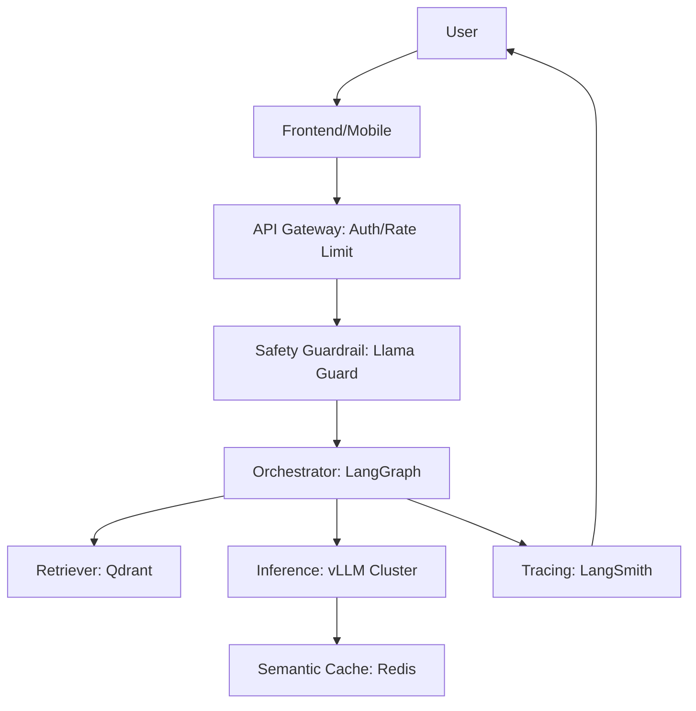

# LLM System Design Interview Guide (2026)

## 1. Beginner ke liye Hinglish Explanation 🇮🇳
Bhai, LLM ka system design normal "Backend design" se bohot alag hai. Yahan sirf "Database" aur "API" ki baat nahi hoti. Yahan tumhe GPU memory, token costs, context window, aur latency ke beech mein balance banana padta hai. 

Interview mein woh tumse bolenge: "Ek AI-powered customer support system design karo jo 1 million daily users handle kar sake." Tumhe batana hoga ki tum kaunsa model chunoge, RAG kaise setup karoge, aur system ko "Fast" kaise banaoge (Caching, vLLM, etc.). Is guide mein hum wahi "High-level patterns" dekhenge jo tumhe senior AI Engineer banayenge.

---

## 2. Gehrai se Technical Explanation
LLM System Design focus karta hai ek request ke lifecycle par, Prompt se Token generation tak.
- **Components**: API Gateway, Guardrails, Orchestrator (LangGraph), Retriever (Vector DB), LLM Cluster (vLLM), and Observability (LangSmith).
- **The "Bottlenecks"**:
    1. **GPU VRAM**: Batch size aur context length ko limit karta hai.
    2. **API Latency**: Network overhead + Generation time.
    3. **Token Costs**: Millions of users ke liye scaling.
- **Key Design Choices**: RAG vs. Fine-Tuning, Multi-Agent vs. Single-Agent, Cloud vs. On-Prem.

---

## 3. Mathematical Samajh
**Memory Estimation**:
To run a 70B parameter model in 4-bit quantization:
$$\text{Memory} \approx \frac{70 \times 10^9 \text{ parameters} \times 0.5 \text{ bytes (4-bit)}}{10^9 \text{ (GB)}} \approx 35 \text{ GB}$$
Add ~10-20GB for KV Cache and overhead. Total = ~50-60GB.
Iska matlab hai ki model ko effectively serve karne ke liye kam se kam ek **A100 (80GB)** ya do **A6000s** chahiye.

---

## 4. Architecture Diagrams

```mermaid
graph TD
    User[User] --> Web[Frontend/Mobile]
    Web --> Gateway[API Gateway: Auth/Rate Limit]
    Gateway --> Guard[Safety Guardrail: Llama Guard]
    Guard --> Orchestrator[Orchestrator: LangGraph]
    Orchestrator --> VectorDB[Retriever: Qdrant]
    Orchestrator --> LLM[Inference: vLLM Cluster]
    LLM --> Cache[Semantic Cache: Redis]
    Orchestrator --> Log[Tracing: LangSmith]
    Log --> User
```

---

## 5. Production-ready Examples
2026 ke liye "Golden Stack":
- **Model**: Llama-3-70B (Quantized) ya GPT-4o-mini.
- **Serving**: Kubernetes par vLLM.
- **Database**: Qdrant (Vector) + Postgres (Metadata).
- **Agents**: Multi-step logic ke liye CrewAI ya LangGraph.
- **Monitoring**: Drift aur hallucination detection ke liye Arize Phoenix.

---

## 6. Real-world Use Cases
- **Design Task**: "Ek internal enterprise codebase ke liye GitHub Copilot clone banayein."
    - Answer: Local repo par RAG, code completion ke liye fine-tuned Llama-3-8B, vLLM < 100ms TTFT ke liye.

---

## 7. Failure Cases
- **The "Context Bomb"**: Ek user 100k token prompt bhejta hai jo saari GPU memory kha leta hai, doosre users ko slow kar deta hai. (Solution: Total tokens ke hisaab se rate limit karo, sirf requests se nahi).
- **Cache Poisoning**: Malicious user RAG database mein galat data daal deta hai, jissey saare subsequent answers galat ho jaate hain.

---

## 8. Debugging Guide
1. **P99 Latency Analysis**: Agar system slow hai toh pehle "Retriever" check karo. Millions of docs par vector search aksar hidden bottleneck hota hai.
2. **TTFT vs. TPOT**: Time-to-First-Token (User experience) aur Time-Per-Output-Token (Overall throughput) monitor karo.

---

## 9. Tradeoffs
| Strategy | Latency | Accuracy | Cost |
|---|---|---|---|
| Zero-shot RAG | High | Medium | Low |
| Fine-tuned Model | Low | High | Medium |
| Agentic Loop | Very High | Very High | High |

---

## 10. Security Concerns
- **Prompt Injection**: Hamesha ek alag "Evaluator" model use karo jo user input ko scan kare main orchestrator ko bhejne se pehle.

---

## 11. Scaling Challenges
- **GPU Availability**: 2026 mein bhi GPUs expensive hain. Apne system ko "Model-Agnostic" design karo taake aap providers (AWS, Azure, RunPod) ke beech price ke hisaab se shift kar sakte ho.

---

## 12. Cost Considerations
- **Semantic Caching**: Redis ka use karke "Similar" queries aur unke answers store karte hain. Agar User B 95% similar query poochta hai, toh cached answer return karo aur 100% LLM costs bachao.

---

## 13. Best Practices
- **Implement Streaming**: Users wait se nafrat karte hain. Tokens generated hote hi dikhao.
- **Asynchronous Logging**: Apni observability platform ko main response loop ko slow nahi karne do.
- **"Flash Attention 3" Use karo**: H100 GPUs par best performance ke liye.

---

## 14. Interview Questions
1. Aap kaise handle karenge RAG system jahan documents har 5 minute badalte hain?
2. LLMs ke liye "Vertical" aur "Horizontal" scaling me kya fark hai?

---

## 15. 2026 ke Latest Patterns
- **Serverless LLM Inference**: Raat aur weekends mein zero tak scaling karke infrastructure costs par 50% bachat.
- **Hybrid RAG**: Ek chhota local model use karke decide karna ki *kya* heavy cloud retrieval zaroori hai ya nahi.