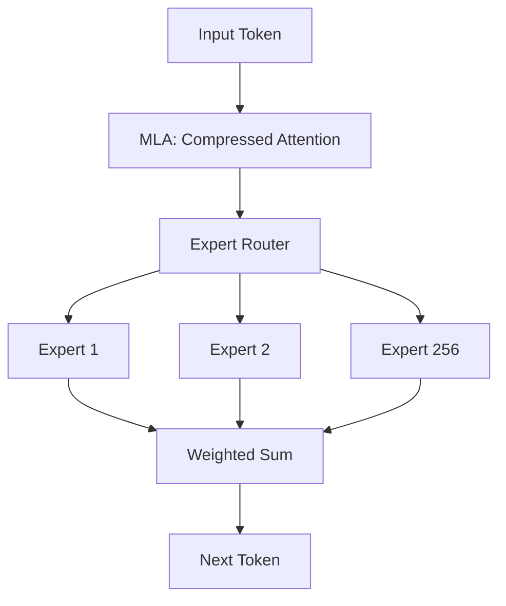

# Case Study: DeepSeek-V3 - The Efficiency King

## 1. Beginner-friendly Hinglish Explanation 🇮🇳
Bhai, 2024-2025 mein ek Chinese company "DeepSeek" ne puri duniya ko hairan kar diya. Unhone ek aisi model banayi (DeepSeek-V3) jo performance mein GPT-4 ke barabar hai, lekin usne training mein **10x kam paisa** kharch kiya. 

Inhone kya "Magic" kiya? Inhone **MoE (Mixture of Experts)** use kiya jismein sirf 3B-5B parameters active hote hain har token ke liye. Inhone **Multi-Head Latent Attention** use kiya memory bachane ke liye. Yeh case study tumhe dikhayegi ki "Smart Engineering" kaise "Unlimited Compute" ko hara sakti hai. 

---

## 2. Deep Technical Explanation
DeepSeek-V3 is a massive 671B parameter Mixture-of-Experts (MoE) model.
- **Architecture**: It uses **MLA (Multi-head Latent Attention)** which compresses KV cache significantly compared to standard MHA.
- **MoE Strategy**: 256 experts, with only 8 experts activated per token. Uses "Load Balancing" loss to ensure all experts are trained equally.
- **FP8 Training**: One of the first models to successfully use 8-bit floats during the *entire* training process, cutting memory and compute time by 50%.
- **Reinforcement Learning**: Uses **GRPO (Group Relative Policy Optimization)** which removes the need for a separate Critic model, making RLHF much faster.

---

## 3. Mathematical Intuition
**MLA (Multi-head Latent Attention)**:
Standard KV cache size is $O(L \cdot d_{head} \cdot n_{heads})$.
MLA compresses $K$ and $V$ into a latent vector $c_{kv}$ of much smaller dimension $d_{latent}$:
$$k, v = f(c_{kv})$$
This allows the model to support 128k context while using the KV cache memory of a much smaller model. It's a "Compressed Memory" approach.

---

## 4. Architecture Diagrams


---

## 5. Production-ready Examples
Conceptual MLA vs MHA (Python):

```python
# MHA (Memory Heavy)
keys = torch.randn(batch, heads, seq, head_dim) # Huge

# MLA (Memory Efficient)
latent_kv = torch.randn(batch, seq, latent_dim) # Compressed
keys = up_project(latent_kv) # Reconstruct only when needed
```

---

## 6. Real-world Use Cases
- **Low-Cost Large Model**: Proving that you can serve a "GPT-4 class" model for 1/10th the price.
- **Coding Excellence**: DeepSeek-Coder-V2 (built on this architecture) became the #1 open-source coding model in 2024.

---

## 7. Failure Cases
- **Expert Specialization**: Sometimes the router "Forgot" certain experts, leading to gaps in knowledge.
- **Communication Overhead**: In a distributed MoE, "Passing" tokens between experts on different GPUs can cause latency if the network is slow.

---

## 8. Debugging Guide
1. **Expert Utilization**: Check if some experts are being used 90% of the time and others 0%. This indicates "Expert Collapse".
2. **Precision Stability**: Monitor for "NaN" during FP8 training—it's very sensitive to large gradients.

---

## 9. Tradeoffs
| Feature | Dense Model (Llama-3) | MoE Model (DeepSeek) |
|---|---|---|
| Training Cost | High | Low |
| Inference RAM | Low | High (Need all experts in RAM) |
| Inference Compute| High | Low (Only 8 experts active) |

---

## 10. Security Concerns
- **Expert Fingerprinting**: An attacker could potentially identify which "Expert" is being used for a specific topic, revealing the model's internal data organization.

---

## 11. Scaling Challenges
- **Pipeline Parallelism**: Distributing 256 experts across hundreds of GPUs requires advanced networking (InfiniBand).

---

## 12. Cost Considerations
- **Open Source Savings**: DeepSeek released their weights for free, allowing startups to build "Enterprise-grade" AI without paying OpenAI's high fees.

---

## 13. Best Practices
- **Use MoE for huge models**: It's the only way to scale beyond 100B parameters efficiently.
- **FP8 for training**: If you have H100s, there's no reason to stay on BF16.
- **MLA for long context**: If your model supports 100k+ tokens, MLA is a must-have.

---

## 14. Interview Questions
1. How does Multi-head Latent Attention (MLA) save KV cache memory?
2. What is the benefit of activating only 8 out of 256 experts per token?

---

## 15. Latest 2026 Patterns
- **DeepSeek-V4 Preview**: Rumored to use "Vision-MoE" where images are also processed by expert networks.
- **Native FP8 Inference**: Using the new Blackwell architecture to run DeepSeek models at 4x higher speeds natively.
