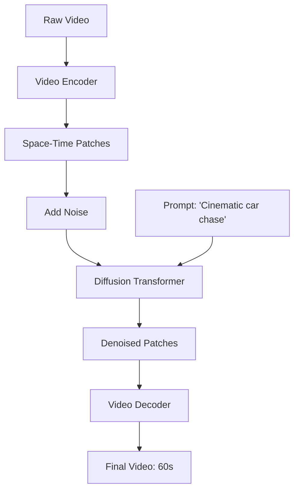

# Case Study: OpenAI Sora - World Simulation

## 1. Beginner-friendly Hinglish Explanation 🇮🇳
Bhai, 2024 mein OpenAI ne ek aisa model launch kiya jismein tum sirf "Text" likhte ho aur woh ek 60-second ki realistic movie bana deta hai. Iska naam hai **Sora**. 

Yeh koi simple video generator nahi hai. Sora duniya ke "Physics" ko samajhta hai. Agar koi cup girta hai, toh woh toot-ta hai; agar pani behta hai, toh woh realistic dikhta hai. Sora ne dikhaya ki LLMs ko sirf "Words" hi nahi, balki "Visual Dynamics" (harkat aur movement) sikhayi ja sakti hai. Is module mein hum seekhenge ki kaise Diffusion models aur Transformers ko mila kar ek "Virtual World" banayi jati hai.

---

## 2. Deep Technical Explanation
Sora is a **Diffusion Transformer (DiT)** architecture.
- **Space-Time Patches**: Sora breaks video into 3D patches (patches across space and time) and treats them like tokens in an LLM.
- **Transformer Backbone**: Unlike previous U-Net based diffusion models, Sora uses a Transformer to handle the denoising process. This allows it to scale better and handle variable resolutions/aspect ratios.
- **Recaptioning**: Using a separate model (DALL-E 3 style) to generate highly descriptive captions for the training videos, ensuring the model understands complex instructions.
- **Latent Space**: The model operates in a compressed latent space using a Video Encoder/Decoder.

---

## 3. Mathematical Intuition
Sora combines **Diffusion Models** and **Transformers**.
Diffusion process: $x_t \to x_{t-1}$ by predicting the noise $\epsilon_\theta(x_t, t, c)$.
Transformer replaces the U-Net for $\epsilon_\theta$.
For a video $V \in \mathbb{R}^{T \times H \times W \times C}$, it is projected into $N$ patches:
$$z = \text{Flatten}(\text{Proj}(V))$$
The Transformer calculates attention between all $N$ space-time patches, allowing it to maintain temporal consistency (e.g., an object doesn't disappear when it goes behind a tree).

---

## 4. Architecture Diagrams


---

## 5. Production-ready Examples
Conceptual DiT Block (Python):

```python
class DiTBlock(nn.Module):
    def __init__(self, hidden_size):
        super().__init__()
        self.attn = MultiHeadAttention(hidden_size)
        self.ffn = FeedForward(hidden_size)
        self.adaLN = AdaptiveLayerNorm(hidden_size) # Conditional on time step t

    def forward(self, x, t, c):
        # Apply time-step and condition embedding
        x = x + self.attn(self.adaLN(x, t, c))
        x = x + self.ffn(self.adaLN(x, t, c))
        return x
```

---

## 6. Real-world Use Cases
- **Film & Entertainment**: Generating background scenes or complex VFX shots without a full CGI team.
- **Education**: Creating realistic "Historical Re-enactments" for learning.
- **Advertising**: Making 100 different versions of a video ad in seconds.

---

## 7. Failure Cases
- **Physics Violations**: A person eating a cookie, but the cookie doesn't show a bite mark.
- **Entity Morphing**: A cat suddenly turning into a dog mid-video because the model got confused between frames.

---

## 8. Debugging Guide
1. **Temporal Stability**: Check if the background "Wobbles". If yes, your temporal attention window is too small.
2. **Coherence Check**: Ensure objects that leave the frame and return still have the same color and shape.

---

## 9. Tradeoffs
| Feature | U-Net Diffusion (Stable Video) | Sora (DiT) |
|---|---|---|
| Scaling | Limited | Excellent |
| Consistency | Medium | High |
| Compute | Medium | Ultra-High |

---

## 10. Security Concerns
- **Misinformation**: Generating fake videos of events that never happened (e.g., a fake natural disaster to cause panic).
- **Copyright**: Training on movies without permission from the studios.

---

## 11. Scaling Challenges
- **The Context Wall**: A 60-second video at 24fps has 1440 frames. Processing all of them at once requires massive VRAM and Ring Attention.

---

## 12. Cost Considerations
- **Generation Time**: Generating 1 minute of video can take 10-20 minutes on a cluster of H100s, making it very expensive per second.

---

## 13. Best Practices
- **Use Latent Diffusion**: Never work with raw pixels; always work in a compressed latent space.
- **Long Context Transformers**: Use RoPE or Ring Attention to handle the massive number of patches in a long video.

---

## 14. Interview Questions
1. How does Sora treat video as a "Sequence of Patches"?
2. What are the benefits of using a Transformer instead of a U-Net for diffusion?

---

## 15. Latest 2026 Patterns
- **Interactable World Models**: Sora-like models where you can "Click" on an object and change its movement in real-time.
- **Zero-Shot Video-to-Video**: Taking a stick-figure animation and turning it into a realistic cinematic scene using Sora as a "Renderer".
