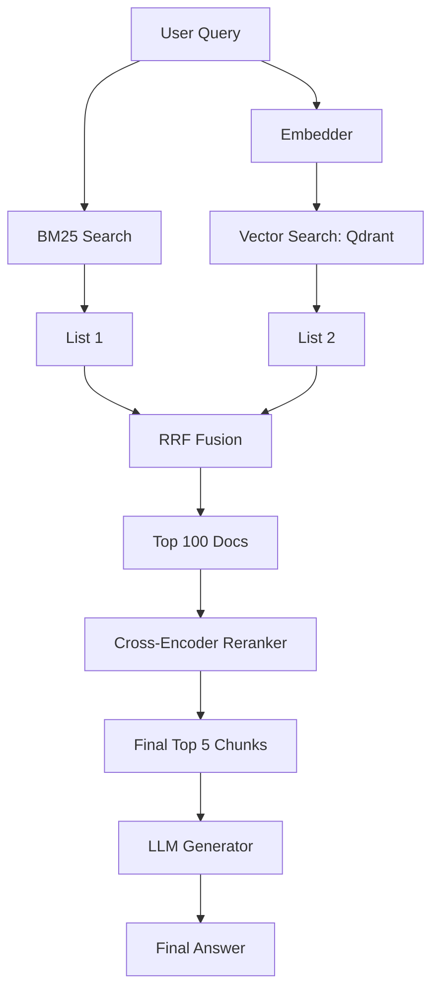

# Project: Enterprise RAG System with Hybrid Search

## 1. Beginner-friendly Hinglish Explanation 🇮🇳
Bhai, yeh tumhara "Grand Project" hai. Tumhe ek aisi system banani hai jo kisi company ke saare PDFs, Emails, aur SQL data ko padh sake aur employees ke sawalon ka sahi jawab de sake. 

Sirf "Vector search" kaafi nahi hoga. Tumhe **Hybrid Search** use karni hogi (Keywords + Vectors), **Reranking** use karni hogi (Accuracy ke liye), aur **Semantic Caching** (Paisa bachane ke liye). Yeh project karne ke baad, tum kisi bhi AI company mein "Senior RAG Engineer" ke role ke liye apply kar sakte ho.

---

## 2. Deep Technical Explanation
The goal is to build a production-grade RAG pipeline that handles complex enterprise requirements.
- **Data Ingestion**: Using `LlamaIndex` or `LangChain` to parse messy PDFs and sync with a SQL DB.
- **Hybrid Retrieval**: Combining BM25 (Lexical) and Dense Vectors (Semantic) using Reciprocal Rank Fusion (RRF).
- **Multi-Stage Reranking**: Using a Cross-Encoder (like BGE-Reranker) to filter the top 100 docs down to the top 5.
- **LLM Synthesis**: Using Llama-3-70B (via vLLM) with a strict system prompt to avoid hallucinations.
- **Observability**: Tracking faithfulness and relevance using RAGAS.

---

## 3. Mathematical Intuition
**Reciprocal Rank Fusion (RRF)**:
Given multiple ranked lists of documents, the final score for document $d$ is:
$$RRFscore(d \in D) = \sum_{r \in R} \frac{1}{k + r(d)}$$
where $r(d)$ is the rank of document $d$ in list $r$, and $k$ is a constant (usually 60). This allows you to combine results from Keyword search and Vector search fairly without needing to normalize scores.

---

## 4. Architecture Diagrams


---

## 5. Production-ready Examples
Implementing RRF Fusion (Conceptual Python):

```python
def rrf_fusion(vector_results, keyword_results, k=60):
    scores = {}
    for rank, doc_id in enumerate(vector_results):
        scores[doc_id] = scores.get(doc_id, 0) + 1 / (k + rank)
    for rank, doc_id in enumerate(keyword_results):
        scores[doc_id] = scores.get(doc_id, 0) + 1 / (k + rank)
    
    return sorted(scores.items(), key=lambda x: x[1], reverse=True)
```

---

## 6. Real-world Use Cases
- **Internal HR Portal**: Employees asking "What is the maternity leave policy in Germany?"
- **Technical Support**: Support agents asking "How do I fix error code X-999 for Model Y?"

---

## 7. Failure Cases
- **The "Wrong Version" problem**: The agent finds the policy from 2021 instead of 2024. (Solution: Add metadata filtering for 'Date').
- **Context Window Overflow**: Too many retrieved chunks make the model forget the user's original question.

---

## 8. Debugging Guide
1. **Retrieval Analysis**: If the answer is wrong, check the top 5 chunks. If the correct info isn't there, your retriever failed.
2. **Hallucination Check**: Use the `Faithfulness` metric from RAGAS. If it's low, the model is making up facts that aren't in the chunks.

---

## 9. Tradeoffs
| Metric | Simple Vector RAG | Enterprise Hybrid RAG |
|---|---|---|
| Accuracy | 70% | 90%+ |
| Latency | < 1s | 2-4s |
| Complexity | Low | High |

---

## 10. Security Concerns
- **Document Access Control**: User A should not be able to retrieve a document that only User B (Manager) has access to. You must include `user_id` filters in every vector search.

---

## 11. Scaling Challenges
- **Cold Storage**: Moving trillions of old logs to a slower disk while keeping them "Searchable".

---

## 12. Cost Considerations
- **Reranker Cost**: Running a Cross-Encoder for every user query can add $0.01 per request.

---

## 13. Best Practices
- **Use "Semantic Chunking"**: Don't just split by characters; split by paragraph or semantic meaning.
- **Cache Embeddings**: Don't re-calculate the embedding for the same query.
- **Implement a Feedback Loop**: Let users click "Incorrect" so you can add that query to your test set.

---

## 14. Interview Questions
1. Why is Hybrid Search better than Vector-only search for enterprise data?
2. How do you handle document updates in a RAG system?

---

## 15. Latest 2026 Patterns
- **Agentic RAG**: The system decides if it needs to search more, or if it needs to ask the user a clarifying question before searching.
- **GraphRAG Integration**: Connecting documents via a Knowledge Graph to answer "Multi-hop" questions.
