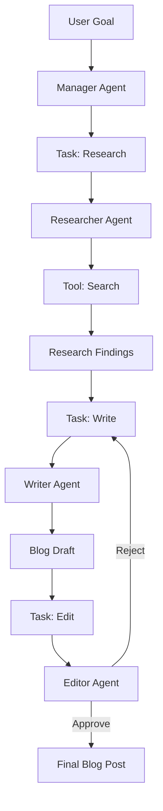

# Project: Autonomous Multi-Agent Team

## 1. Beginner-friendly Hinglish Explanation 🇮🇳
Bhai, socho tumne ek "Virtual Office" banaya hai. Ismein ek **Researcher** hai, ek **Writer** hai, aur ek **Reviewer** hai. Tumne unhe ek task diya: "AI in 2026 par ek blog post likho". 

Yeh teeno AI agents aapas mein baat karenge. Researcher google karega, Writer draft banayega, aur Reviewer galtiyan nikalega. Yeh tab tak chalta rahega jab tak blog post perfect na ho jaye. Tumhe sirf goal dena hai, baaki sab agents khud karenge. Yeh project tumhe **CrewAI** aur **LangGraph** jaise advanced tools ka master bana dega.

---

## 2. Deep Technical Explanation
Building a multi-agent system involves defining specialized roles, tools, and communication protocols.
- **Roles & Personas**: Explicitly defining the "Mission" and "Expertise" of each agent.
- **Task Delegation**: Using a "Manager" agent or a "State Graph" to decide which agent works next.
- **Inter-Agent Communication**: Passing messages or shared state (context) between agents.
- **Tool Access**: Assigning specific tools (e.g., Python Interpreter, Web Search, PDF Reader) to specific agents.

---

## 3. Mathematical Intuition
Multi-agent coordination can be modeled as a **Cooperative Game**.
The goal is to find a set of actions $\{a_1, a_2, ..., a_n\}$ across $n$ agents that maximizes a global utility function $U$.
We use **Hierarchical Planning** where a top-level LLM breaks the goal into sub-goals and assigns them to worker nodes.

---

## 4. Architecture Diagrams


---

## 5. Production-ready Examples
Implementing a team with `CrewAI`:

```python
from crewai import Agent, Task, Crew

# 1. Define Agents
researcher = Agent(
    role='Researcher',
    goal='Find the latest 2026 AI trends',
    backstory='Expert in tech journalism',
    tools=[search_tool]
)
writer = Agent(
    role='Writer',
    goal='Write a viral blog post',
    backstory='Master storyteller'
)

# 2. Define Tasks
task1 = Task(description='Search for 2026 trends', agent=researcher)
task2 = Task(description='Draft the post', agent=writer)

# 3. Create the Crew
my_crew = Crew(agents=[researcher, writer], tasks=[task1, task2])
result = my_crew.kickoff()
```

---

## 6. Real-world Use Cases
- **Software Dev Team**: One agent for UI, one for Backend, one for Testing.
- **Investment Research**: One agent for financial news, one for stock prices, one for risk analysis.
- **Legal Team**: One agent for case law, one for contract drafting, one for compliance check.

---

## 7. Failure Cases
- **Agent Hallucination**: The Researcher makes up a fake trend, and the Writer writes a 2000-word blog post based on that lie.
- **Infinite Looping**: The Editor keeps rejecting the Writer's draft for minor reasons forever.

---

## 8. Debugging Guide
1. **Thought History**: Look at the "Internal Monologue" of every agent. If the Researcher says "I am done" but the Manager says "Go back", your delegation logic is flawed.
2. **Context Window Management**: As agents chat with each other, the history grows. Use **Summarization** of past steps to save tokens.

---

## 9. Tradeoffs
| Metric | Single Agent | Multi-Agent Team |
|---|---|---|
| Quality | Medium | High |
| Latency | Fast | Slow |
| Cost | Low | High |

---

## 10. Security Concerns
- **Agent Collusion**: If one agent is compromised by prompt injection, it might "Convince" other agents to perform harmful actions.

---

## 11. Scaling Challenges
- **Synchronization**: Ensuring all agents are working on the *latest* version of the data.

---

## 12. Cost Considerations
- **Multiplier Effect**: A multi-agent project can easily use 20x-50x more tokens than a single chat prompt. Use small models for the "Editor" and "Reviewer" steps.

---

## 13. Best Practices
- **Define clear "Input" and "Output" schemas** for every agent.
- **Set a max number of iterations** (e.g., max 3 revisions).
- **Use "Self-Correction" loops**: Let the agent check its own work before sending it to the next one.

---

## 14. Interview Questions
1. When would you choose a Multi-Agent system over a single LLM with a long prompt?
2. How do you prevent agents from getting stuck in infinite feedback loops?

---

## 15. Latest 2026 Patterns
- **Meta-Agents**: Agents that can "Hire" other agents or "Write" new tools on-the-fly to solve a problem.
- **Human-in-the-Loop Orchestration**: The system pauses and waits for a human signature before any "Real-world" action is taken.
