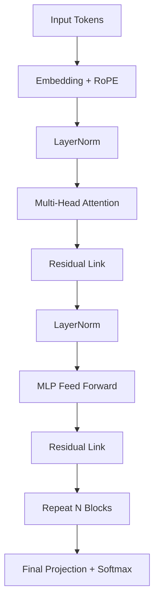

# 🏗️ Transformer Architecture Inside-Out (Deep Deep Dive)
> **Level:** Beginner → Expert | **Language:** Hinglish | **Goal:** Master every layer of GPT/Llama models (Attention, MLP, Normalization, Positional Encodings).

## 🧭 Core Concepts (Concept-First)
+- Transformer Building Blocks: Embeddings, positional encodings, attention, MLP, normalization layers
+- Attention Mechanism: Query-Key-Value interactions, multi-head attention, scaled dot-product
+- Information Flow: Residual connections, layer normalization, feed-forward networks
+- Positional Encoding: RoPE vs sinusoidal, handling long context and sequence order
+- Scaling & Optimization: GQA, MQA, KV-cache efficiency, parameter distribution
+- Practical Applications: Understanding model behavior from components to full architecture
---

## 📋 Table of Contents: From Input to Prediction

| Layer | Topic | Function |
|-------|-------|----------|
| **1. Input** | Embeddings & Tokenizer | Text ko numbers/vectors mein badalna. |
| **2. Physics** | Positional Encodings (RoPE) | Word ki "Position" yaad rakhna (Order matters!). |
| **3. Dil** | Multi-Head Attention (MHA) | Tokens ke beech ka context samajhna. |
| **4. Body** | MLP (Feed-Forward) | Features process karna (Knowledge store). |
| **5. Balance** | LayerNorm & RMSNorm | Gradients ko explode hone se rokna. |
| **6. Output** | Final Softmax | Next token ki probability nikalna. |

---

## 1. 🔤 Tokenizer & Embeddings (The Entryway)

Text directly model mein nahi jata. 
1. **Tokenizer:** "Hello World" -> `[15496, 995]`.
2. **Embedding:** Har ID ke liye ek chota vector (Numbers ki list) uthaya jata hai. 
   - GPT-3 embeddings `d_model = 12288`. 

---

## 2. 📍 Positional Encodings (RoPE)

Transformer ek saath saare words dekhta hai (Parallelism). To use order kaise pata chalega? "Dog bites Man" vs "Man bites Dog" mein fark hai.

- **Old Way (Sinusoidal):** Addition of sine/cosine waves.
- **Modern Way (RoPE - Rotary Positional Embeddings):** Llama-3 mein vectors ko rotate kiya jata hai relative to their position. 
  - Isse model "Long Context" (128k tokens) handle kar sakta hai.

---

## 3. 🧠 Multi-Head Attention (MHA) - The Core Brain

Self-attention akela nahi hota. Hum multiple "Heads" use karte hain.
- **Head 1:** "Grammar" par dhyan deta hai.
- **Head 2:** "Noun-Verb" relationship par.
- **Head 3:** "Emotional tone" par.

**Formula:** $ \text{Softmax}(\frac{QK^T}{\sqrt{d_k}})V $
- **Query ($Q$):** Main kya dhund raha hoon?
- **Key ($K$):** Dusre tokens ke paas kya relevance hai?
- **Value ($V$):** Wo extra info jo pass hogi.

> 💡 **Mnemonic:** **Q**uestion, **K**ey-match, **V**alue-get (Q-K-V).

---

## 4. 🏢 MLP (Feed Forward Network)

Attention sirf "relationship" dekhta hai. **MLP (Multi-Layer Perceptron)** har word ki apni private "knowledge" process karta hai.
- Isme usually **GELU** or **SwiGLU** activation functions use hote hain (Mistral/Llama standard).
- Transformer ke 2/3 parameters in layers mein hote hain.

---

## 5. ⚖️ RMSNorm & Residual Connections

100+ layers mein weights bohot bade (Exploding) ya bohot chote (Vanishing) ho sakte hain.
- **Residual Connections ($x + f(x)$):** Information ko skip connections ke through bhejte hain taki "Purana signal" niche na kho jaye.
- **RMSNorm:** Layers ki values ko "Normal" range (0 to 1) mein rakhta hai. Standard for Llama series.

---

## 6. 🛣️ GQA & MQA: Advanced Scaling (Llama-3 Secrets)

Standard MHA bohot heavy hota hai (KV-Cache problem).
- **MQA (Multi-Query Attention):** Ek hi Key/Value head for all Query heads (Very fast, less accurate).
- **GQA (Grouped-Query Attention):** Queries ko groups mein baant kar KV heads share karna. **Llama-3 design choice.**

---

## 📝 Test Yourself (Interview level)

### Q1: Transformer mein Encoder vs Decoder ka kya panga hai?
Bert sirf **Encoder** hai (Context samajhne ke liye). GPT/Llama sirf **Decoder** hain (Text generate karne ke liye). Stable Diffusion dono use karta hai.

### Q2: Scaled Dot product mein Division kyu karte hain ($\sqrt{d_k}$)?
Agar embeddings bohot lambi honge, toh dot product bohot bada ho jayega, aur Softmax "Flat" ho jayegi (Gradients will become zero). Isliye division "Scaling" ke liye zaroori hai.

---

## 🔗 Resources
- [The Illustrated Transformer (Jay Alammar)](https://jalammar.github.io/illustrated-transformer/)
- [Attention is All You Need (Paper)](https://arxiv.org/abs/1706.03762)
- [Llama 3 Architecture implementation from scratch](https://github.com/karpathy/minGPT)

---

## 🏆 Summary Checklist
- [ ] Tokenizer vs Embedding ka fark explain kar sakte ho?
- [ ] RoPE kyu better hai relative sin/cos se?
- [ ] Multi-Head Attention mein "Heads" ka kya fayda hai?
- [ ] Residual connections gradients ko kaise bachate hain?

> **Final Insight:** Transformer architecture is essentially **Communication (Attention)** + **Computation (MLP)** repeated 32 to 100 times.
