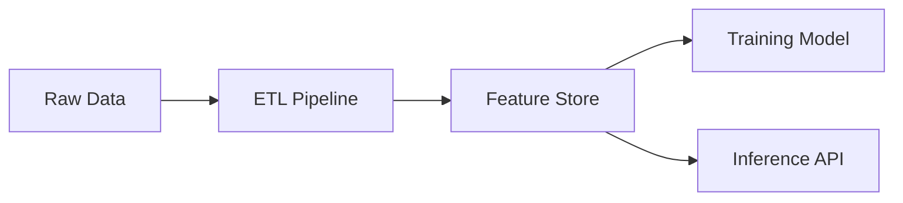
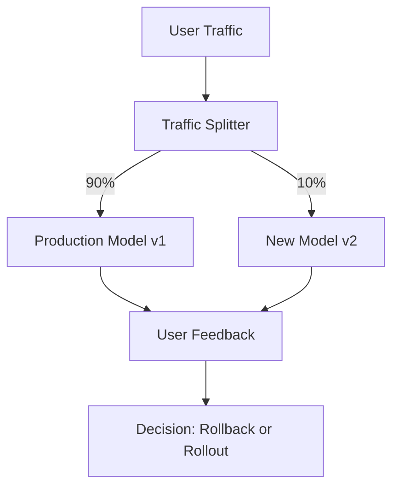

# 🏗️ MLOps Guide v2: AI Operations Lifecycle (Expert Edition)
> **Level:** Beginner → Expert | **Language:** Hinglish | **Goal:** Master CI/CD for LLMs, Data Versioning, Model Registries, and A/B Testing

---

## 📋 Is Guide Se Kya Seekhoge

| Section | Topic | Why? |
|---------|-------|------|
| 1. CI/CD for LLMs | Automated Testing & Deployment | Fast releases |
| 2. Feature Stores | Centralized Data Management | Unified features |
| 3. Model Versioning (MLflow) | Registry, Tracking, Staging | Model lifecycle |
| 4. Data Version Control (DVC) | Git for data files | Dataset management |
| 5. A/B Testing & Canary | Traffic splitting, Metrics | Safe production |
| 6. Data Pipelines & Airflow | DAGs, ETL, Scheduling | Automated training |

---

## 1. ⚙️ CI/CD for LLMs: Automate the AI Workflow

Har software team code track karti hai (GitHub), lekin ML team ko **Code + Metadata + Model Weights** teenon track karne hote hain.

### A. CI (Continuous Integration)
Har git push par running:
- **Lints:** PEP8 (Python standards).
- **Unit Tests:** `pytest` model call returns expected shape.
- **Model Eval:** Small test dataset par accuracy check.

### B. CD (Continuous Deployment)
- Auto-build Docker Image.
- Push to Hub (Docker Hub/GHCR).
- Deploy to Kubernetes/Cloud.

```yaml
# GitHub Action logic
# jobs:
#   build:
#     - run: docker build -t susagpt:v1 .
#     - run: docker push susagpt:v1
```

---

## 2. 🗄️ Feature Stores (Feast): Data Centralization

AI models ko features (e.g. User age, Shopping history) fast chahiye. 
**Feature Store** data ko **Offline (Training)** aur **Online (Inference)** dono ke liye consistently serve karta hai.



---

## 3. 📉 Model Versioning with MLflow

Aapne models train kiye aur result CSV mein likh diye? **Galti!**
`MLflow` track karta hai:
1. **Params:** Learning Rate, Epochs.
2. **Metrics:** Accuracy, F1 Score.
3. **Artifacts:** Actual `.pth` ya `.safetensors` model files.

```python
import mlflow

# 1. Start tracking logic
with mlflow.start_run():
    mlflow.log_param("optimizer", "AdamW")
    mlflow.log_metric("eval_acc", 0.92)
    # mlflow.pytorch.log_model(model, "model_v1")
```

---

## 4. 📂 Data Version Control (DVC): Git for Datasets

Large datasets (10GB+) Git mein push nahi ho sakte. **DVC** metadata local git mein rakhta hai aur actual data cloud (S3/GCP) mein store karta hai.

```bash
# Terminal logic
# dvc init
# dvc add dataset.zip
# git add dataset.zip.dvc .gitignore
# git commit -m "Add dataset v1"
```

---

## 5. 🚦 Production Deployment: Traffic Splitting

Directly model replace karna unsafe hai. 
- **Canary Deployment:** Sabse pehle naya model 5% users ko dikhao. Agar output sahi hai, toh 100% karo.
- **A/B Testing:** "Model A" vs "Model B" ka accuracy real users ke feedback ke basis pe compare karo.



---

## 6. 🔄 Data Pipelines: Airflow & DAGs

Manual training band karein. **Airflow** workflow banata hai jo raw data se model weights tak ki journey ko automate karta hai.

- **Tasks:** Extract -> Clean -> Train -> Evaluate -> Deploy.
- **DAG (Directed Acyclic Graph):** Step-by-step logic nodes.

---

## 🏗️ Mega Project: End-to-End MLOps Pipeline for Llama Model

Workflow Logic (Production):
1. **GitHub Trigger:** Code change triggers CI.
2. **DVC Pull:** Fetch training data from S3.
3. **Training Node:** Train model via PyTorch on remote server.
4. **MLflow Log:** Every run logged to server.
5. **Docker Build:** Create image of best model version.
6. **Kubernetes Deploy:** Serve via vLLM behind a Load Balancer.

---

## 🧪 Quick Test — Professional Level Check!

### Q1: Model Registry logic
"Model Staging" aur "Model Production" mein kya fark hai?
<details><summary>Answer</summary>
**Staging** model wo hai jo tests pass kar chuka hai lekin abhi internal testers use kar rahe hain. **Production** model wo hai jo real traffic (Public users) handle kar raha hai. MLflow tags change karke ye management asan hota hai.
</details>

### Q2: Data Leakage logic
"Data leakage" production mein kyu harmful hai?
<details><summary>Answer</summary>
Agar training data mein test data ke features leaked hain, toh model high performance dikhayega metrics mein but real production environment mein fail ho jayega (Unexpected results).
</details>

---

## 🔗 Resources
- [Full MLOps Course (FreeCodeCamp)](https://www.youtube.com/watch?v=06-AZXmwHjo)
- [MLflow Documentation](https://www.mlflow.org/docs/latest/index.html)
- [DVC Official Guide](https://dvc.org/doc)
- [Airflow for Beginners](https://airflow.apache.org/docs/apache-airflow/stable/index.html)
