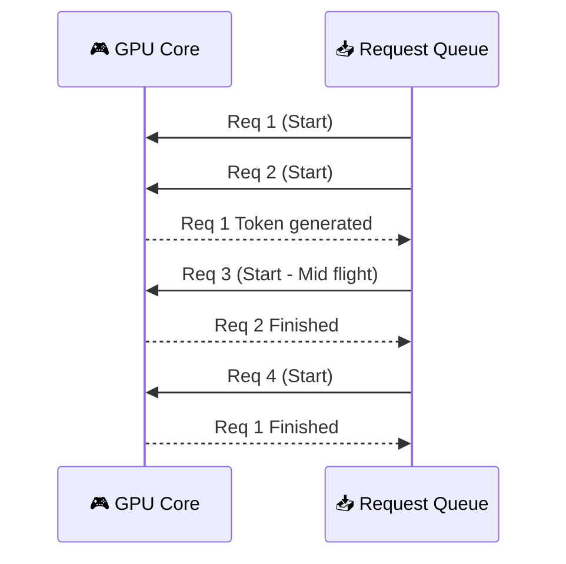

# 🚀 Model Serving: AI Production (Expert Guide)
> **Level:** Beginner → Expert | **Language:** Hinglish | **Goal:** Master vLLM, TGI, Ollama, Batching, and Quantization internals

---

## 📋 Is Guide Se Kya Seekhoge

| Section | Topic | Why? |
|---------|-------|------|
| 1. Serving Internals | Latency vs Throughput | Production KPIs |
| 2. vLLM Deep Dive | PagedAttention, KV-Cache | State-of-the-art serving |
| 3. Continuous Batching | Algorithm efficiency | Maximize GPU |
| 4. TGI (HF Tool) | Rust-based safety | Enterprise standard |
| 5. Ollama & Local AI | GGUF, Easy setup | Developer experience |
| 6. Quantization Math | AWQ, GPTQ, GGUF | Memory compression |

---

## 1. ⚡ Serve Models Like a Pro: Metrics that Matter

AI serving mein normal web serving se 100x zyada memory aur compute lagta hai. 
- **Time to First Token (TTFT):** User ko response kab milna shuru hua (Latency).
- **Inter-token Latency (ITL):** Har naya word kitne millisecond mein aa raha hai.
- **Throughput:** Ek saath kitne users handle ho rahe hain (Requests/Sec).

---

## 2. 🧠 vLLM Deep Dive: The King of Efficiency

vLLM (Virtual Large Language Model) aaj LLM serving mein best hai because of **PagedAttention**.

### A. PagedAttention — Key Concept
Operating System ki tarah, vLLM blocks mein memory manage karta hai. Isse **KV-Cache** logic 95% efficient ho jata hai.
- **Problem:** Fixed memory allocate karne se fragmentation hoti hai.
- **Solution:** Memory ko pages mein divide karna (Non-contiguous blocks).

```bash
# Terminal local server logic
# vLLM automatically OpenAI-like server start kar deta hai
python -m vllm.entrypoints.openai.api_server \
    --model mistralai/Mistral-7B-v0.1 \
    --tensor-parallel-size 1 # Force single-GPU
```

---

## 3. 🔄 Continuous Batching: Maximizing GPU

Pehle models **Static Batching** use karte the (Sabka finish hone tak ruko). 
**Continuous Batching** model ko stop nahi karta. Jab ek sequence finish hota hai, naya sequence bich mein hi add ho jata hai.



---

## 4. 🐚 TGI (Text Generation Inference)

HF ne TGI banaya hai with **Rust** implementation.
- **Advantage:** Low-level memory management aur safety. 
- **Docker implementation:** production deployment ke liye use TGI.

```bash
# Docker local run logic
# docker run --gpus all --shm-size 1g -p 8080:80 \
# -v $PWD/data:/data ghcr.io/huggingface/text-generation-inference:2.0 \
# --model-id Llama-3-8B-Instruct
```

---

## 5. 🏠 Ollama: AI for Every Developer

Ollama GGUF (Llama.cpp based) format use karta hai. Ise Mac, Windows, ya Linux pe 1 min mein setup kar sakte hain.

```bash
# CLI commands
ollama pull llama3
ollama run llama3 "Explain quantum physics."
```

- **Custom Models (Modelfile):** Aap apni `Modelfile` banakar system prompts aur parameters set kar sakte hain.

---

## 6. 📉 Quantization: Compression for Scale

Bade models (70B+) single GPU(24GB VRAM) pe nahi chal sakte. Hum compress karte hain weights ko.

| Method | Target | Compression | Precision |
|--------|--------|-------------|-----------|
| **AWQ** | GPU Inference | High Accuracy | 4-bit |
| **GPTQ** | GPU Inference | Medium Speed | 4-bit |
| **GGUF** | CPU + GPU | High Versatility | 2-bit to 8-bit |

**Quantization logic check:**
- 16-bit Model (FP16): 7B model requires ~14GB VRAM.
- 4-bit Model (INT4): 7B model requires ~4.5GB VRAM.

---

## 🏗️ Mega Project: Production-Ready Local vLLM Server

Is project mein hum:
1. Mistral 7B ya Llama 3 model ko vLLM se host karenge Docker (nvidia-container-toolkit) use karke.
2. Batching benchmarks test karenge multi-query simulator se script ke through.
3. LoRA Adapters dynamically load karenge vLLM multi-lora feature se.

---

## 🧪 Quick Test — Professional Level Check!

### Q1: KV Cache logic
KV-Cache badhne se memory kyu khatam ho jaati hai (OOM)?
<details><summary>Answer</summary>
Har word (token) generation ke baad context (Keys & Values) store hota hai. Long conversations mein ye storage requirements exponential ho jaati hain, is liye vLLM PagedAttention memory efficient indexing use karta hai.
</details>

### Q2: Streaming vs Batching
Streaming response dene par throughput par kya asar padta hai?
<details><summary>Answer</summary>
Throughput slighty reduce ho sakti hai network overhead ki wajah se, lekin UI experience (perceived latency) much better hota hai users ke liye.
</details>

---

## 🔗 Resources
- [vLLM Performance Benchmarks](https://vllm.ai/stats)
- [Ollama Model Library](https://ollama.com/library)
- [Quantization Guide (HF)](https://huggingface.co/docs/optimum/concept_guides/quantization)
