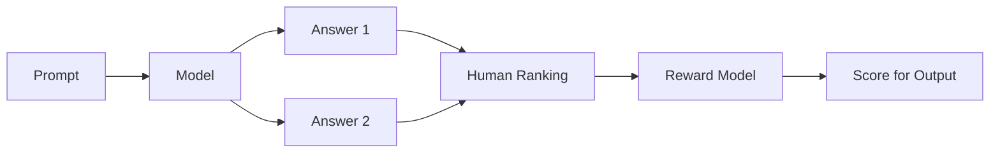
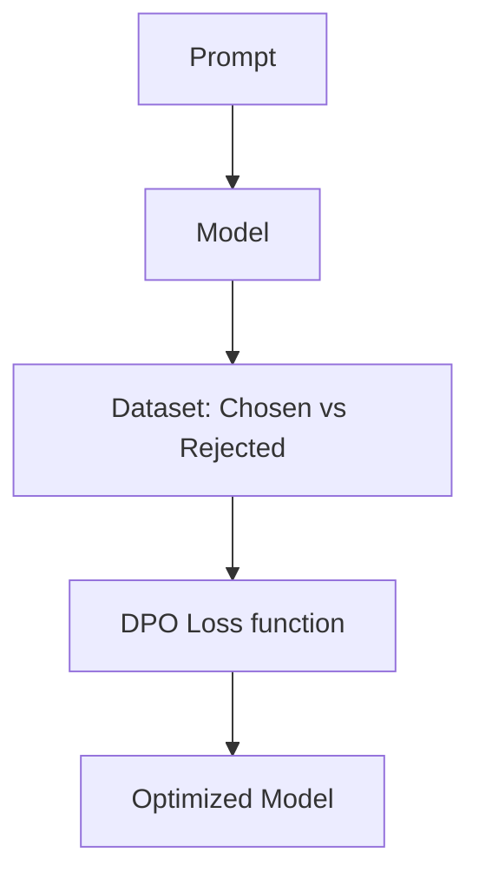

# 🛡️ RLHF: Human-Aligned AI (Deep Dive Guide)
> **Level:** Intermediate → Advanced | **Language:** Hinglish | **Goal:** Master RLHF, PPO, DPO, and Reward Modeling

---

## 📋 Is Guide Se Kya Seekhoge

| Section | Topic | Why? |
|---------|-------|------|
| 1. RLHF Foundations | Values Alignment | Safe AI generation |
| 2. PPO (Proximal Policy Optimization) | Clipping, Policy update | Advanced math intuition |
| 3. Reward Model (RM) | Preference Pairs, Scoring | LLM Ranking |
| 4. DPO (Direct Preference Optimization) | Math trick for RLHF | Simpler modern alternative |
| 5. Evaluation & Drift | Metric monitoring | Output quality |
| 6. Mega Project | TRL library DPO pipeline | Practical training |

---

## 1. 🤝 RLHF: Why is it the "Heart" of ChatGPT?

Normal training (SFT - Supervised Fine-Tuning) se model sirf **Next Token Prediction** seekhta hai. Wo harmful, rude ya biased bhi ho sakta hai. 
**RLHF (Reinforcement Learning from Human Feedback)** use train karta hai "Helpful, Harmless, and Honest" (3H) answers dene ke liye.

---

## 2. 🧠 RLHF Workflow: 3 Golden Steps

### A. Stage 1: SFT (Supervised Fine-Tuning)
Bade context pairs (Prompt + Ideal Answer) par training. 
- **Goal:** Language model ko command-following seekhana.

### B. Stage 2: Reward Model (RM)
Insaan (Annotators) AI ke multi-answers ko rank karte hain (`A > B`). Is preference data se hum naya model train karte hain jo results ko "Score" deta hai.



### C. Stage 3: PPO (RL Loop)
RM ka score use karke RL algorithm (PPO) base model ko update karta hai. Reward badhana hi goal hai.

---

## 3. 📉 PPO Algorithm: Intuition

PPO (Proximal Policy Optimization) RL ka ek stable algorithm hai. Ye model ko "Dheere-dheere" optimize karta hai (Clipping function) taki naya behavior pichli knowledge poori tarah destroy na kar de.

**PPO Loss Components:**
1. **Policy Loss:** Goal ko maximize karna.
2. **Value Loss:** Reward prediction error kam karna.
3. **Entropy:** Model ko creative rakhna.

```python
# Pseudo-code update logic
# new_policy / old_policy ratio check
# loss = min(ratio * advantage, clipped_ratio * advantage)
```

---

## 4. 🚀 DPO (Direct Preference Optimization): The Game Changer

Stanford research ne DPO propose kiya. Isme Stage 2 (RM) aur Stage 3 (PPO) ko ek hi loss function mein combine kar diya gaya hai.
- **Advantage:** Stability aur faster training.
- **No separate Reward Model needed!**



---

## 5. 🛠️ TRL (Transformer Reinforcement Learning) library

Hugging Face ki `trl` library RLHF aur DPO process ko streamline karti hai.

### A. DPO Trainer in 3 lines
```python
from trl import DPOTrainer, DPOConfig
from transformers import AutoModelForCausalLM, AutoTokenizer

model_id = "gpt2" # Example base model
ref_model = AutoModelForCausalLM.from_pretrained(model_id) # Reference model is mandatory for PPO/DPO comparison

# Dataset format logic: [{"prompt": "...", "chosen": "...", "rejected": "..."}]

# dpo_trainer = DPOTrainer(
#     model=model,
#     ref_model=ref_model,
#     args=DPOConfig(output_dir="./dpo_out", beta=0.1),
#     train_dataset=dataset,
#     tokenizer=tokenizer
# )
```

---

## 🏗️ Mega Project: Sentiment-Aligned Model with DPO

Problem: Hum gpt2 model ko positive sentiments generate karne ke liye align karenge.
- **Input:** Negative/Neutral prompts.
- **Target:** Always positive completion.
- **Logic:** Human preference pairs generate karke `DPOTrainer` se train karenge.

---

## 🧪 Quick Test — Expert Level Check!

### Q1: Reward Model logic
Reward Model (RM) hamesha Classifier kyu hota hai, Generator kyu nahi?
<details><summary>Answer</summary>
RM ka kaam generation nahi, balki generation ko **Score** dena hai. Ise 'Discriminator' bhi bolte hain jo text-score (linear logit) output deta hai.
</details>

### Q2: SFT vs RLHF difference
"SFT model output control ke liye kaafi nahi hai" — Kyu?
<details><summary>Answer</summary>
SFT model sirf pattern repeat karta hai. RLHF se hum model ko high-level preferences (Helpful vs Direct answer) seekhate hain bina complex logic code kiye.
</details>

---

## 🔗 Resources
- [Instruction Tuning paper (InstructGPT)](https://openai.com/research/instruction-following)
- [TRL Documentation](https://huggingface.co/docs/trl/index)
- [DPO Paper (Arxiv)](https://arxiv.org/abs/2305.18290)
