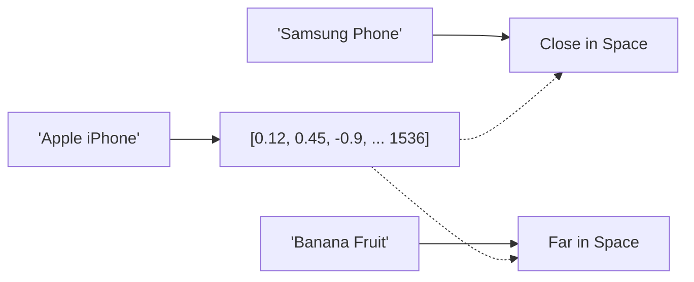
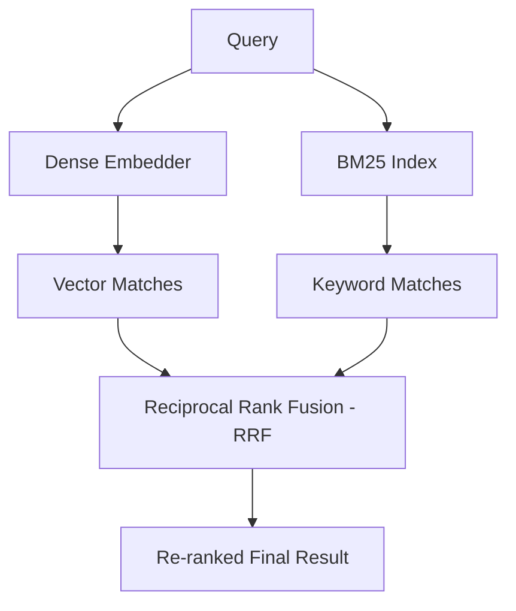

# 🗄️ Vector Databases: AI Storage (Expert Guide)
> **Level:** Beginner → Expert | **Language:** Hinglish | **Goal:** Master Semantic Search, Vector Indexing, and RAG architectures

---

## 📋 Is Guide Se Kya Seekhoge

| Section | Topic | Why? |
|---------|-------|------|
| 1. Vector Embeddings Deep Dive | Dimensions, Models, Dense vs Sparse | AI data representation |
| 2. Similarity Search Math | Cosine, Dot, L2 Distance | Accurate matching |
| 3. Indexing Algorithms | Flat, HNSW, IVF, Product Quantization | Performance at Scale |
| 4. ChromaDB & Pinecone | Local vs Cloud Storage | Tool Selection |
| 5. Hybrid Search | Metadata filtering + Semantic | Production RAG |
| 6. Mega Project | Large-scale PDF Vector Search | System architecture |

---

## 1. 🔢 Vector Embeddings: Text to High-Dimensions

AI model text ko nahi, vectors (numbers) ko samajhta hai. **Embedding** ek aisa mathematical function hai jo Semantic meaning ko vector space mein project karta hai.

- **Dense Vectors:** Transformers (BERT/OpenAI) 768 or 1536 dimensions mein store karte hain.
- **Sparse Vectors:** Keyword matching (BM25) algorithm use hota hai.



---

## 2. 📏 Similarity Metrics: Do Vectors Kaise Match Karein?

Har Vector DB kafi sare metrics support karti hai. Galat selection se accuracy drop ho sakti hai.

| Metric | Formula | Best For |
|--------|---------|----------|
| **Cosine Similarity** | (A⋅B) / (||A||*||B||) | Text & Document search |
| **Dot Product** | A⋅B | Recommendations & LLM Attention |
| **L2 (Euclidean)** | sqrt(sum((Ai-Bi)^2)) | Images & Physical points |

---

## 3. 🚄 Indexing Algorithms: Speed at Scale

Millions of entries mein linear search slow hai. Vector DBs specialized indexes use karti hain.

- **HNSW (Hierarchical Navigable Small World):** Sabse fast aur popular modern index. Graph-based structure use hota hai.
- **IVF (Inverted File Index):** Space ko clusters (voronoi cells) mein divide karta hai.
- **PQ (Product Quantization):** Vectors ko compress karta hai (memory save).

```python
# !pip install faiss-gpu
import faiss
import numpy as np

# Random Vector Indexing logic
dimension = 128
n_list = 100 # clusters
quantizer = faiss.IndexFlatL2(dimension)
index = faiss.IndexIVFFlat(quantizer, dimension, n_list)
# index.train(data)
```

---

## 4. 🗃️ ChromaDB: The Local King (Perfect for Devs)

ChromaDB SQLite-based open-source storage hai.

```python
import chromadb
from chromadb.utils import embedding_functions

# 1. Setup Client
client = chromadb.PersistentClient(path="./my_db")

# 2. Embedding Model (Sentence Transformers)
embed_func = embedding_functions.SentenceTransformerEmbeddingFunction(model_name="all-MiniLM-L6-v2")

# 3. Collection Management
collection = client.get_or_create_collection(name="ai_course", embedding_function=embed_func)

# 4. Insert logic
collection.add(
    documents=["Vector databases are efficient for RAG.", "Llama-3 is a powerful LLM."],
    metadatas=[{"topic": "db"}, {"topic": "ai"}],
    ids=["id1", "id2"]
)

# 5. Semantic Query logic
results = collection.query(query_texts=["Tell me about vector stores"], n_results=1)
print(results['documents'][0])
```

---

## 5. ☁️ Pinecone: Managed Infrastructure for Production

Pinecone fully managed cloud service hai jahan server manage nahi karna padta. Enterprise level scaling ke liye Pinecone best hai.

---

## 6. 🔄 Hybrid Search: Production Secret

Sirf vector search fail ho sakta hai specific proper nouns (e.g. name, ID) ke liye. **Hybrid Search** combining Keyword (BM25) + Semantic (Vector) accuracy ko 10x tak badha deti hai.



---

## 🏗️ Mega Project: Semantic Search Engine for Wikipedia Chunks

Workflow:
1. `WikipediaLoader` se data load kiya.
2. `RecursiveCharacterTextSplitter` se chunks banaye (Overlap 100 char).
3. `ChromaDB` mein persistent storage setup kiya.
4. Custom metadata filtering ("topic": "history/science") apply kiya query ke time.

---

## 🧪 Quick Test — Professional Level Check!

### Q1: HNSW vs FLAT logic
"Flat" index aur "HNSW" index mein performance difference kyu hai?
<details><summary>Answer</summary>
**Flat** Index har query ko har item se match karta hai (Extremely slow). **HNSW** Graph structure use karke "jump" karta hai nearest clusters pe (Speed up to 100-1000x for large datasets).
</details>

### Q2: Metadata Filtering logic
Metadata filter lagane se search cost kam hoti hai ya nahi?
<details><summary>Answer</summary>
Nahi, search space small ho jaata hai accuracy ke liye, lekin index scan optimization DB internals pe depend karta hai (Pre-filtering vs Post-filtering).
</details>

---

## 🔗 Resources
- [Vector DB Comparison Table](https://www.vector-databases.com/)
- [FAISS Documentation (Meta AI)](https://github.com/facebookresearch/faiss/wiki)
- [HNSW Algorithm Explained](https://www.pinecone.io/learn/series/faiss/hnsw/)
