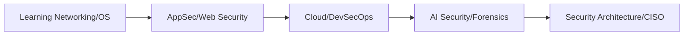

# Cybersecurity Roadmap 2026: From Zero to Security Architect

## 1. Beginner-friendly Hinglish Explanation 🇮🇳
Bhai, 2026 mein Security sirf "Password" badalne tak limited nahi hai. Ab duniya cloud, AI, aur distributed systems par chal rahi hai. Agar tum security mein career banana chahte ho, toh tumhe sirf tools nahi, balki "Systems" ki gehri samajh honi chahiye. 

Yeh roadmap tumhe batayega ki pehle "Foundations" (Networking, OS) kaise pakki karni hai, phir "Application Security" mein kaise ghusna hai, aur end mein "AI Security" aur "Cloud Architecture" ka master kaise banna hai. Yaad rakho, ek achha security engineer woh nahi hota jo sirf "Hack" karna janta ho, balki woh hota hai jo "Secure Systems" design karna janta ho.

---

## 2. Deep Technical Explanation
The 2026 Security landscape requires a multi-layered expertise model:
- **Phase 1: Foundations**: Mastery of TCP/IP, Linux Internals, and basic scripting (Python/Go).
- **Phase 2: AppSec & DevSecOps**: Understanding the Secure SDLC, SAST/DAST/IAST, and integrating security into CI/CD pipelines.
- **Phase 3: Infrastructure & Cloud**: Identity & Access Management (IAM), Kubernetes Security, and Infrastructure as Code (IaC) scanning.
- **Phase 4: Advanced Realms**: AI Security (Prompt Injection, RAG security), Cryptography, and Incident Response.

---

## 3. Attack Flow Diagrams

---

## 4. Real-world Attack Examples
- **Supply Chain Attack**: A developer uses a compromised npm package (like the `left-pad` incident but malicious), which then spreads through the enterprise CI/CD.
- **Identity Theft**: Bypassing weak MFA using session hijacking or AitM (Adversary-in-the-Middle) phishing kits.

---

## 5. Defensive Mitigation Strategies
- **Zero Trust Architecture**: Never trust, always verify. Every request must be authenticated, authorized, and encrypted.
- **Shift Left**: Testing for vulnerabilities in the IDE and during PR reviews, not just after deployment.

---

## 6. Failure Cases
- **Tool Fatigue**: Buying 20 security tools but having nobody to monitor the alerts, leading to "Alert Blindness."
- **Compliance vs. Security**: Being "SOC2 compliant" on paper but having an open S3 bucket in production.

---

## 7. Debugging and Investigation Guide
- **Log Correlation**: Using a SIEM (like Splunk or ELK) to connect a failed login on the VPN with an unusual file access on a database server.
- **Traffic Analysis**: Using Wireshark or tcpdump to find the signature of a beaconing malware.

---

## 8. Tradeoffs
| Feature | High Security | High Developer Velocity |
|---|---|---|
| Manual Reviews | Very Secure | Very Slow |
| Automated Scans | Fast | Higher False Positives |
| Zero Trust | Secure | Complex UX |

---

## 9. Security Best Practices
- **Principle of Least Privilege (PoLP)**: Give users/services the minimum access they need.
- **Defense in Depth**: Multiple layers of security so if one fails, others protect the asset.

---

## 10. Production Hardening Techniques
- **Immutable Infrastructure**: Instead of patching servers, kill them and spin up new ones with the latest security updates.
- **Secret Management**: Never hardcode keys; use HashiCorp Vault or AWS Secrets Manager.

---

## 11. Monitoring and Logging Considerations
- **Immutable Logs**: Ensure logs cannot be deleted or altered by an attacker (S3 Object Lock).
- **Audit Trails**: Log who accessed what, when, and from where.

---

## 12. Common Mistakes
- **Neglecting Fundamentals**: Jumping into "AI Hacking" without knowing how a TCP handshake works.
- **Ignoring Internal Threats**: Focusing only on external firewalls while leaving internal databases wide open.

---

## 13. Compliance Implications
- **GDPR/CCPA**: Failing to secure PII can lead to massive fines (up to 4% of global turnover).
- **ISO 27001**: Requires documented proof of security controls and risk management.

---

## 14. Interview Questions
1. What is the difference between Symmetric and Asymmetric encryption?
2. How does a Cross-Site Scripting (XSS) attack work at the DOM level?
3. Explain the "Shared Responsibility Model" in Cloud Security.

---

## 15. Latest 2026 Security Patterns and Threats
- **AI-Driven Phishing**: Using LLMs to create 100% personalized, grammatically perfect phishing emails at scale.
- **Quantum-Resistant Cryptography**: Preparing systems for the era when quantum computers can break RSA.
- **Agentic AI Security**: Protecting autonomous AI agents from being manipulated into deleting data or leaking secrets.
