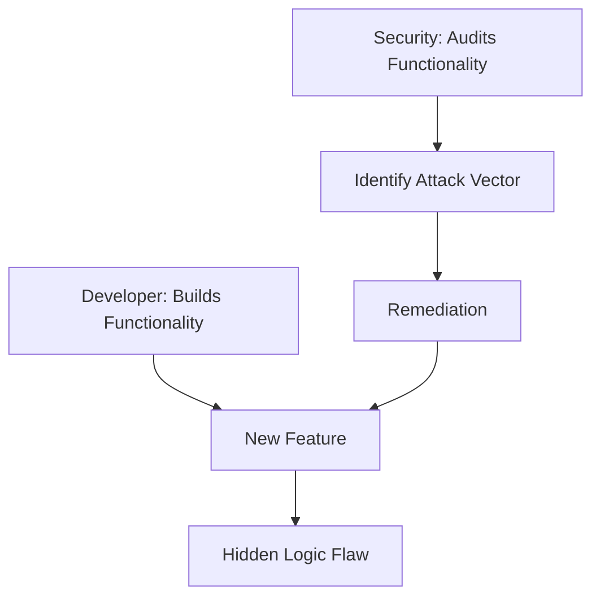

# Security Mindset: Thinking Like an Adversary

## 1. Beginner-friendly Hinglish Explanation 🇮🇳
Bhai, security engineer banna sirf coding nahi hai, yeh ek "Dimaag ka khel" (Mindset) hai. Ek developer hamesha sochta hai: "Main yeh feature kaise banau?" Lekin ek security engineer hamesha sochta hai: "Main is feature ko kaise 'Tod' (Break) sakta hoon?"

Isse hum kehte hain **Adversarial Thinking**. Tumhe us chor ki tarah sochna padega jo ghar ki khidki se ghusne ki koshish kar raha hai kyunki darwaza lock hai. Is mindset mein char main pillars hote hain: **Least Privilege** (Sirf utna kaam do jitna zaruri ho), **Defense in Depth** (Layers banao), **Fail-Safe** (Agar system fail ho toh secure mode mein fail ho), aur **Zero Trust** (Kisi par bharosa mat karo).

---

## 2. Deep Technical Explanation
The security mindset is built on core architectural principles:
- **Defense in Depth**: Implementing multiple, redundant security controls. If a firewall is bypassed, the WAF catches it. If the WAF is bypassed, the host-based IDS catches it.
- **Least Privilege (PoLP)**: Every module, service, and user should have only the permissions absolutely necessary for its function.
- **Attack Surface Reduction**: Disabling all features, ports, and services that are not strictly required.
- **Zero Trust Architecture (ZTA)**: Moving away from "Perimeter Security" (The idea that everything inside the office network is safe) to "Identity-based Security" (Verify every request regardless of origin).

---

## 3. Attack Flow Diagrams

---

## 4. Real-world Attack Examples
- **The "Business Logic" Attack**: An attacker finds that a shopping site allows a "Negative Quantity" in the cart, making the total price negative and getting a refund for free.
- **Social Engineering**: Tricking a Helpdesk employee into resetting a password by pretending to be a CEO in a hurry.

---

## 5. Defensive Mitigation Strategies
- **Threat Modeling**: Before writing a single line of code, sit down and ask: "Where could this go wrong? Who would want to attack this?"
- **Automated Guardrails**: Using tools to block PRs that contain hardcoded secrets or insecure libraries.

---

## 6. Failure Cases
- **Over-Security**: Making a system so secure that users can't do their work, leading them to find "Workarounds" (like writing passwords on sticky notes).
- **Silent Failures**: A security system that crashes but doesn't alert anyone, leaving the door wide open.

---

## 7. Debugging and Investigation Guide
- **Kill Chain Analysis**: Mapping an attack back to the 7 steps: Recon, Weaponization, Delivery, Exploitation, Installation, C2, and Actions on Objectives.
- **Red Teaming**: Hiring people to actively try and "Hack" you to find the holes in your mindset.

---

## 8. Tradeoffs
| Principle | Benefit | Pain Point |
|---|---|---|
| Least Privilege | Minimal blast radius | Complex management (RBAC/ABAC) |
| Air-gapping | Ultra-secure | Impossible to update/monitor |
| Zero Trust | Data-centric security | High latency for verification |

---

## 9. Security Best Practices
- **Never trust user input**: Treat every string coming from the internet as a potential bomb.
- **Security is a Process, not a Product**: You don't "Buy" security; you "Do" security every single day.

---

## 10. Production Hardening Techniques
- **Security Headers**: Implementing CSP (Content Security Policy), HSTS, and X-Frame-Options to tell the browser how to stay safe.
- **Sandboxing**: Running untrusted code in a restricted environment (like a Docker container with no network access).

---

## 11. Monitoring and Logging Considerations
- **Contextual Logging**: Don't just log "Login Failed." Log "Login Failed for User X from IP Y using Browser Z."
- **Alert Fatigue Management**: Grouping 100 similar alerts into one "Incident" to save the engineer's sanity.

---

## 12. Common Mistakes
- **Assuming "We are too small to be targeted"**: Most attacks are automated and don't care about your company size.
- **Relying on Cloud Defaults**: Thinking "AWS is secure, so I don't need to do anything." (AWS secures the cloud, YOU secure what's IN the cloud).

---

## 13. Compliance Implications
- **Duty of Care**: Legal responsibility to protect user data, regardless of specific laws like GDPR.
- **Audit Trails**: Essential for demonstrating to regulators that you have a "Security Mindset" in place.

---

## 14. Interview Questions
1. What does "Security by Design" mean to you?
2. How would you explain "Zero Trust" to a non-technical stakeholder?
3. If you had to choose between "Security" and "Usability," how would you find the middle ground?

---

## 15. Latest 2026 Security Patterns and Threats
- **AI-Augmented Defense**: Using small, local LLMs to monitor system calls and detect "Strange behavior" in real-time.
- **Supply Chain Integrity (SLSA)**: Ensuring that every bit of code in your production was actually written by you and hasn't been tampered with.
- **Privacy-First Engineering**: Using Zero-Knowledge Proofs (ZKP) to verify identities without ever seeing the user's actual password or data.
