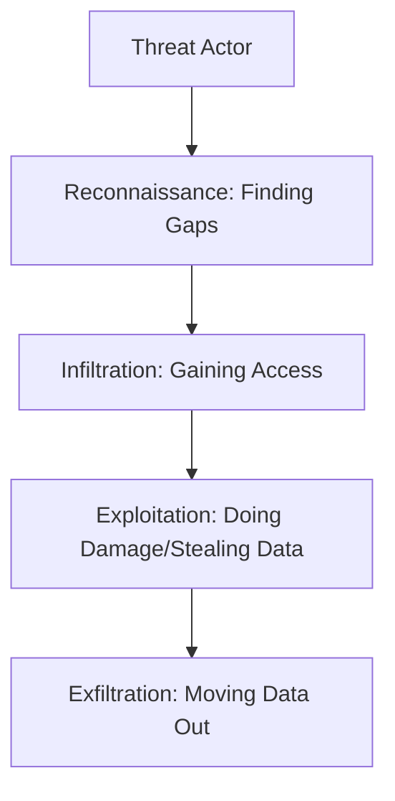

# What is Cybersecurity? The Foundation of Protection

## 1. Beginner-friendly Hinglish Explanation 🇮🇳
Bhai, socho tumne ek naya ghar banaya. Tum sirf darwaza lock nahi karte, tum walls banate ho, camera lagate ho, aur valuables ko locker mein rakhte ho. **Cybersecurity** wahi hai digital duniya ke liye. 

Iska kaam sirf hackers ko rokna nahi hai, balki yeh ensure karna hai ki:
1. Tumhara data kisi ghalat hath mein na lage (**Confidentiality**).
2. Tumhara data koi change na kar sake (**Integrity**).
3. Tumhara system hamesha kaam karta rahe jab tumhe zarurat ho (**Availability**).
Isse hum **CIA Triad** kehte hain. Bina cybersecurity ke, hamari digital identity, paisa, aur privacy sab danger mein hain.

---

## 2. Deep Technical Explanation
Cybersecurity is the practice of protecting systems, networks, and programs from digital attacks. It operates on several planes:
- **Application Security**: Protecting software and APIs.
- **Network Security**: Securing the plumbing (Routers, Switches, Traffic).
- **Endpoint Security**: Protecting laptops, phones, and IoT devices.
- **Identity Security**: Managing who can access what (IAM).
- **Data Security**: Encryption and privacy controls.

The core framework used for risk assessment is **NIST Cybersecurity Framework (CSF)**: Identify, Protect, Detect, Respond, and Recover.

---

## 3. Attack Flow Diagrams

---

## 4. Real-world Attack Examples
- **Ransomware**: A company's entire database is encrypted by a hacker, and they demand 10 Bitcoin to give the key back.
- **DDoS (Distributed Denial of Service)**: Sending 100 million requests to a website in 1 second so it crashes for real users.

---

## 5. Defensive Mitigation Strategies
- **Multi-Factor Authentication (MFA)**: Even if a hacker has your password, they can't get in without your physical phone or key.
- **Firewalls/WAF**: Inspecting incoming traffic and blocking anything that looks like an attack.

---

## 6. Failure Cases
- **Single Point of Failure**: Having all your security rely on one firewall. If it breaks, everything is exposed.
- **Human Error**: An employee clicking a link in an email that says "You won a free iPhone."

---

## 7. Debugging and Investigation Guide
- **Audit Logs**: Checking "Who logged in at 3 AM from North Korea?"
- **Packet Sniffing**: Using Wireshark to see if data is being sent to a suspicious IP address.

---

## 8. Tradeoffs
| Metric | High Security | Low Security |
|---|---|---|
| User Experience | Hard (Frequent logins) | Easy (Auto-login) |
| System Performance | Slower (Encryption/Scans) | Faster |
| Implementation Cost | Expensive | Cheap |

---

## 9. Security Best Practices
- **Assume Breach**: Always operate as if the attacker is already inside the network.
- **Patch Management**: Keep all software updated to fix known bugs.

---

## 10. Production Hardening Techniques
- **Kernel Hardening**: Disabling unnecessary drivers in the Linux kernel.
- **Network Partitioning**: Keeping the "Web Server" and "Database" in different segments so if the web server is hacked, the database is still safe.

---

## 11. Monitoring and Logging Considerations
- **Anomaly Detection**: Alerts that trigger when a user who usually downloads 10MB of data suddenly downloads 10GB.
- **Real-time Alerting**: If a critical server goes offline, the security team should get a Slack/PagerDuty notification instantly.

---

## 12. Common Mistakes
- **Security through Obscurity**: Thinking "Hackers won't find my hidden URL." (They will).
- **Default Credentials**: Leaving the admin password as `admin` or `password123`.

---

## 13. Compliance Implications
- **PCI-DSS**: Mandatory if you store or process credit card data.
- **HIPAA**: Mandatory for medical and health-related data.

---

## 14. Interview Questions
1. Explain the CIA Triad with an example.
2. What is the difference between an IDS (Intrusion Detection System) and an IPS (Intrusion Prevention System)?
3. What is a "Zero-Day" vulnerability?

---

## 15. Latest 2026 Security Patterns and Threats
- **Deepfake Phishing**: Attackers using AI-generated voice or video of a CEO to trick employees into transferring money.
- **AI Hallucination Exploits**: Tricking an AI agent into providing internal server secrets through clever prompt engineering.
- **Quantum-Safe Encryption**: The transition to algorithms like Kyber that can resist future quantum computer attacks.
