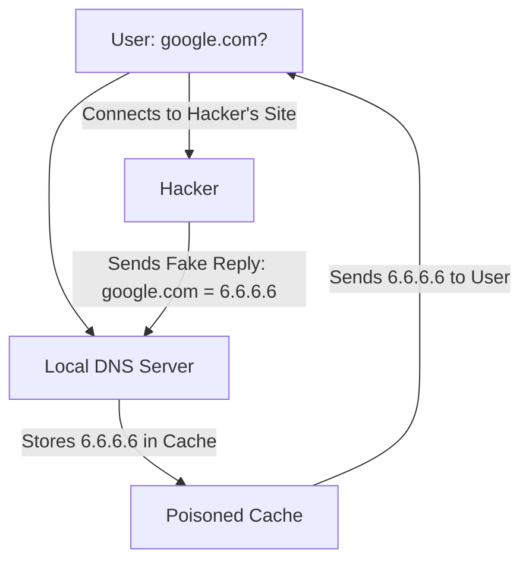

# DNS and DHCP Security: Protecting the Network Infrastructure

## 1. Beginner-friendly Hinglish Explanation 🇮🇳
Bhai, **DNS aur DHCP** network ke "Silent Workers" hain. 

**DNS (Domain Name System)** internet ki "Phonebook" hai—yeh `google.com` ko `142.250...` IP mein badalta hai. Agar hacker DNS ko hack karle, toh aap `google.com` type karoge lekin pahunchoge hacker ki fake website par.
**DHCP (Dynamic Host Configuration Protocol)** "Receptionist" hai jo har naye device ko IP address deta hai. Agar koi hacker "Nakli Receptionist" (Rogue DHCP) ban jaye, toh woh saara traffic apne through bhej sakta hai. In dono ko secure karna network security ki buniyad hai.

---

## 2. Deep Technical Explanation
- **DNS Attacks**:
    - **DNS Cache Poisoning**: Injecting fake IP records into a DNS server's memory.
    - **DNS Hijacking**: Changing the DNS settings on a router or computer.
    - **DNS Tunneling**: Using DNS queries to steal data or talk to a C2 server (bypass firewalls).
- **DHCP Attacks**:
    - **DHCP Starvation**: Attacker requests ALL available IP addresses, so real users can't get one.
    - **Rogue DHCP Server**: Setting up a fake server to give users a "Fake Gateway" (MITM).

---

## 3. Attack Flow Diagrams
**DNS Cache Poisoning:**

---

## 4. Real-world Attack Examples
- **MyEtherWallet Hack (2018)**: Hackers hijacked Amazon's DNS (Route 53) to redirect users to a fake crypto wallet site and stole $17 Million.
- **Kaminsky Vulnerability**: A major 2008 flaw that allowed anyone to poison DNS caches worldwide.

---

## 5. Defensive Mitigation Strategies
- **DNSSEC**: Digitally signing DNS records so they can't be faked.
- **DHCP Snooping**: A switch-level feature that only allows DHCP replies from "Trusted" ports.
- **DoH / DoT**: DNS over HTTPS/TLS to encrypt the DNS query itself.

---

## 6. Failure Cases
- **Legacy Systems**: Many old printers or IoT devices don't support DNSSEC.
- **Internal DNS**: Companies often forget to secure their *internal* DNS servers, focusing only on the external ones.

---

## 7. Debugging and Investigation Guide
- **`nslookup` / `dig`**: Tools to query DNS records.
- **`ipconfig /renew`**: Forcing a DHCP request.
- **`arp -a`**: Checking for MITM anomalies.

---

## 8. Tradeoffs
| Feature | DNSSEC | DoH (DNS over HTTPS) |
|---|---|---|
| Security Goal | Integrity (No faking) | Privacy (No snooping) |
| Complexity | High | Medium |
| Network Visibility| Visible | Hidden (Hard for firewalls) |

---

## 9. Security Best Practices
- **Use Trusted DNS**: Like Cloudflare (1.1.1.1) or Google (8.8.8.8) which have advanced protection.
- **Disable Dynamic Updates**: Only allow authorized servers to change DNS records.

---

## 10. Production Hardening Techniques
- **RPZ (Response Policy Zones)**: A "DNS Firewall" that blocks queries for known malicious domains.
- **IP Source Guard**: Working with DHCP snooping to prevent IP spoofing.

---

## 11. Monitoring and Logging Considerations
- **Unusual DNS Volume**: A sudden spike in DNS traffic could be "DNS Tunneling" data theft.
- **DHCP Log Audits**: Looking for unknown MAC addresses requesting IPs.

---

## 12. Common Mistakes
- **Open Resolvers**: Running a DNS server that anyone on the internet can use (often used in DDoS attacks).
- **Ignoring DHCP Starvation**: Not setting up port security on switches to limit MAC addresses per port.

---

## 13. Compliance Implications
- **GDPR**: Encrypting DNS (via DoH/DoT) is recommended to protect user privacy and prevent tracking by ISPs.

---

## 14. Interview Questions
1. How does DNSSEC prevent Cache Poisoning?
2. What is 'DHCP Snooping'?
3. Explain 'DNS Tunneling' and how to detect it.

---

## 15. Latest 2026 Security Patterns and Threats
- **AI-Generated Malicious Domains**: Hackers using DGA (Domain Generation Algorithms) that are AI-powered to bypass static blocklists.
- **Quantum-Resistant DNSSEC**: New digital signatures for DNS that can't be broken by quantum computers.
- **Privacy-Preserving DNS**: Integration of **Oblivious DNS-over-HTTPS (ODoH)** to separate the user's IP from their query.
