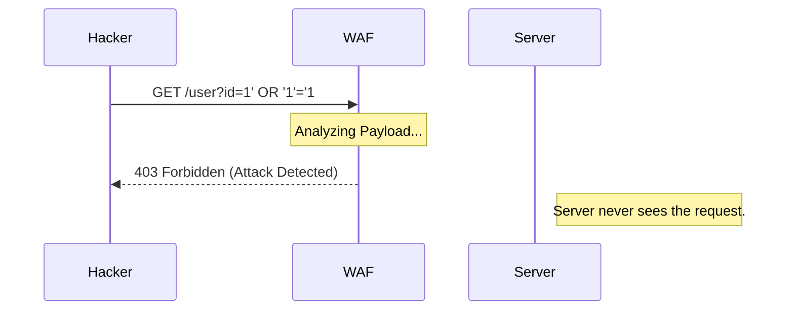

# Firewalls & Proxies: The Digital Bouncers

## 1. Beginner-friendly Hinglish Explanation 🇮🇳
Bhai, socho tum ek bohot bade club ke malik ho. Tum har kisi ko andar nahi aane de sakte. Tum darwaze par ek "Bouncer" khada karte ho. **Firewall** wahi bouncer hai jo decide karta hai ki kaunsa "Network Traffic" andar aayega aur kaunsa bahar jayega.

Lekin agar koi celebrity VIP entrance se aana chahe bina apni identity dikhaye? Wahan kaam aata hai **Proxy**. Proxy ek "Middleman" hai jo tumhari identity chhupa leta hai. Jab tum internet chalate ho, toh tum direct nahi jate, pehle proxy ke paas jate ho, aur proxy server internet se baat karta hai. Isse hackers ko tumhara asli address (IP) nahi pata chalta. Firewalls rokte hain, aur Proxies chhupate/filter karte hain.

---

## 2. Deep Technical Explanation
- **Firewalls**:
    - **Packet Filtering (Layer 3)**: Inspects source/destination IP and port. Fast but dumb.
    - **Stateful Inspection (Layer 4)**: Remembers established connections. If a packet is part of an existing session, it's allowed.
    - **Next-Gen Firewall (NGFW / Layer 7)**: Inspects the *content* (Payload) of the packet. Can distinguish between "Facebook Chat" and "Facebook Video."
- **Proxies**:
    - **Forward Proxy**: Used by clients to access the internet (Anonymity/Filtering).
    - **Reverse Proxy**: Used by servers to handle incoming traffic (Load balancing/SSL termination).
    - **Transparent Proxy**: Intercepts traffic without the user knowing.

---

## 3. Attack Flow Diagrams
**WAF (Web Application Firewall) blocking SQL Injection:**

---

## 4. Real-world Attack Examples
- **Firewall Bypass**: A hacker sends data over Port 53 (DNS) because the firewall allows all DNS traffic, but the data is actually a command for malware.
- **SSRF (Server Side Request Forgery)**: An attacker tricks a reverse proxy into making a request to an internal admin server that isn't exposed to the public internet.

---

## 5. Defensive Mitigation Strategies
- **Default Deny Policy**: Block EVERYTHING by default, and only allow specific ports/IPs that are absolutely needed.
- **Deep Packet Inspection (DPI)**: Using NGFWs to look for malware signatures inside encrypted traffic.

---

## 6. Failure Cases
- **Misconfiguration**: Accidentally leaving a "Rule 0" that says `Allow All from All` at the top of the firewall list.
- **Proxy Loop**: A misconfigured proxy that sends a request to itself, leading to infinite recursion and a server crash.

---

## 7. Debugging and Investigation Guide
- **Checking Firewall Logs**: Looking for `REJECT` or `DROP` packets to see why a service is down.
- **cURL through Proxy**: Testing a proxy with `curl -x http://proxy:port http://google.com`.

---

## 8. Tradeoffs
| Tool | Pros | Cons |
|---|---|---|
| Firewall | Strong Perimeter Control | Can't stop "Inside" threats |
| WAF | Protects Web Apps specifically | High Latency / False Positives |
| Reverse Proxy | Great for Load Balancing | Single Point of Failure |

---

## 9. Security Best Practices
- **Egress Filtering**: Don't just block what comes IN; block what goes OUT. If a database server starts talking to a Russian IP, something is wrong.
- **Regular Rule Audits**: Deleting old firewall rules that are no longer needed.

---

## 10. Production Hardening Techniques
- **IP Whitelisting**: Only allowing your home IP to access the SSH port of your server.
- **SSL Termination at Proxy**: Decrypting HTTPS at the Reverse Proxy (Nginx/HAProxy) so you can inspect the traffic before it hits your app.

---

## 11. Monitoring and Logging Considerations
- **Log SIEM Integration**: Sending firewall logs to a central place to detect "Port Scanning" attempts across the whole network.
- **Health Checks**: Monitoring if the proxy itself is alive and not overloaded.

---

## 12. Common Mistakes
- **Relying on IP alone**: Hackers use VPNs/Tor, so blocking one IP is like playing Whack-a-Mole.
- **Blocking your own Access**: Making a firewall rule that accidentally kicks you out of your own server.

---

## 13. Compliance Implications
- **PCI-DSS Requirement 1**: Requires the installation and maintenance of a firewall configuration to protect cardholder data.

---

## 14. Interview Questions
1. What is the difference between a Stateful and a Stateless firewall?
2. Why would you use a Reverse Proxy for an API?
3. How does a WAF detect an XSS attack?

---

## 15. Latest 2026 Security Patterns and Threats
- **Identity-Aware Proxies (IAP)**: Instead of a VPN, users log in to a proxy that checks their identity, device health, and location before granting access.
- **AI-Managed Firewalls**: Firewalls that use machine learning to detect "Strange traffic patterns" that don't match any known signature.
- **Micro-segmentation**: Using software-defined firewalls to isolate every single microservice from each other (East-West traffic security).
