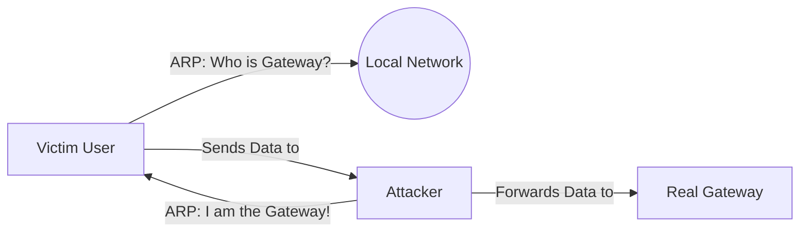

# Network Attacks: Breaking the Plumbing

## 1. Beginner-friendly Hinglish Explanation 🇮🇳
Bhai, network attacks ka matlab hai internet ke "Raste" (Path) ko hijack karna ya band kar dena. 

Socho ek delivery boy tumhara khana lekar aa raha hai.
1. **MITM (Man-in-the-middle)**: Koi raste mein use rok kar tumhara khana chakhta hai aur phir pack karke tumhe de deta hai. Tumhe pata hi nahi chala ki khane ke saath chher-chhar hui hai.
2. **ARP Spoofing**: Tumne chillaya "Golu delivery boy kahan hai?", aur kisi ghalat aadmi ne hath utha diya. Tumne use apna address de diya.
3. **DDoS**: Ek saath 10,000 log restaurant ke bahar khade ho gaye, toh delivery boy bahar hi nahi nikal paya. Tum bhooke reh gaye.
In attacks ko samajhna zaruri hai taaki hum apne networks ko "Bulletproof" bana sakein.

---

## 2. Deep Technical Explanation
- **ARP Spoofing (Layer 2)**: Sending fake ARP messages to map the attacker's MAC address to a legitimate IP address (usually the Gateway).
- **DNS Poisoning (Layer 7)**: Injecting a false IP address into a DNS cache so users are redirected to a malicious site.
- **BGP Hijacking (Layer 3)**: Announcing false routing prefixes to redirect traffic at an internet scale.
- **MITM (Man-in-the-middle)**: Intercepting communication between two parties. Often achieved via SSL Stripping (forcing a downgrade from HTTPS to HTTP).
- **DDoS (Distributed Denial of Service)**:
    - **Volumetric**: Flooding the pipe (SYN Flood, UDP Flood).
    - **Protocol**: Targeting firewall/load balancer resources.
    - **Application (L7)**: Flooding a specific heavy API endpoint (e.g., Search).

---

## 3. Attack Flow Diagrams
**ARP Spoofing Attack:**

---

## 4. Real-world Attack Examples
- **GitHub DDoS**: GitHub was once hit by a 1.35 Tbps attack using "Memcached Amplification." Attackers sent tiny requests to Memcached servers, which replied with massive data to GitHub's IP.
- **DigiNotar Breach**: A CA was hacked, and the hackers issued fake certificates for `google.com`, allowing them to perform MITM attacks on millions of Iranian citizens.

---

## 5. Defensive Mitigation Strategies
- **Dynamic ARP Inspection (DAI)**: Switches that check if an ARP message is legitimate before forwarding it.
- **DNSSEC**: Adding cryptographic signatures to DNS records to prevent poisoning.
- **HSTS**: Preventing SSL Stripping by telling the browser to NEVER use HTTP.

---

## 6. Failure Cases
- **BGP Propagation Delay**: Once a BGP hijack starts, it takes time to "Un-poison" the global internet routing table, even after the fix is applied.
- **DDoS Mitigation Latency**: Some DDoS filters are so slow that they protect the site but make it so slow that it's practically unusable.

---

## 7. Debugging and Investigation Guide
- **arp -a**: Command to see your local ARP table. If two different IPs have the same MAC, you are being spoofed.
- **dig +short google.com**: Checking if you are getting the correct IP address from DNS.

---

## 8. Tradeoffs
| Attack | Impact | Difficulty |
|---|---|---|
| ARP Spoofing | High (Local) | Low |
| BGP Hijack | Global | High |
| L7 DDoS | High (Targeted) | Medium |

---

## 9. Security Best Practices
- **Use VPNs on Public Wi-Fi**: To encrypt Layer 2/3 traffic and prevent local sniffing.
- **Zero Trust**: Don't trust the network; encrypt everything at the application layer (TLS).

---

## 10. Production Hardening Techniques
- **BGP Flowspec**: Automatically dropping attack traffic at the ISP level before it reaches your data center.
- **Anycast Networking**: Spreading your IP across 100s of global servers so a DDoS attack is "Diluted."

---

## 11. Monitoring and Logging Considerations
- **Flow Analysis**: Watching for "Unusual traffic spikes" that indicate a DDoS start.
- **Certificate Transparency (CT) Logs**: Monitoring for any new certificates issued for your domain that you didn't request.

---

## 12. Common Mistakes
- **Ignoring Internal Attacks**: Thinking "My office network is safe." 80% of attacks happen from a compromised device inside the network.
- **Weak TLS Config**: Allowing old versions like TLS 1.0 or 1.1 which are vulnerable to MITM attacks like POODLE or BEAST.

---

## 13. Compliance Implications
- **FISA/GDPR**: If an attacker intercepts data via MITM, it counts as a data breach and must be reported to regulators.

---

## 14. Interview Questions
1. How does an SSL Stripping attack work?
2. What is the difference between a SYN Flood and a UDP Flood?
3. How can you detect BGP Hijacking for your own company?

---

## 15. Latest 2026 Security Patterns and Threats
- **AI-Generated DDoS**: Attackers using AI to find the "Heaviest" API calls in your system and flooding only those, bypassing volumetric filters.
- **Encrypted Client Hello (ECH)**: A new standard that hides the domain name you are visiting from the ISP/Sniifer, making MITM much harder.
- **Quantum-Safe Handshakes**: Protocols that prevent "Store now, decrypt later" attacks using future quantum computers.
