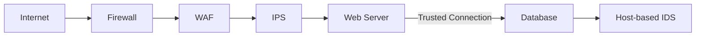

# Network Security: Securing the Perimeter and Beyond

## 1. Beginner-friendly Hinglish Explanation 🇮🇳
Bhai, Network Security ka matlab hai apne digital infrastructure ke charo taraf ek "Kila" (Fort) banana. 

Pehle security ka matlab hota tha "Outer Wall" (Firewall) banana. Lekin aaj kal hackers "Deewar phand kar" (Bypass) nahi aate, woh "Ghar ke andar ke logon" (Phishing/Inside threat) ke zariye aate hain. Isliye modern Network Security mein hum sirf bahar ka rasta nahi rokte, hum ghar ke andar ke har kamre ko lock karte hain (**Micro-segmentation**) aur har kisi se ID puchte hain (**Zero Trust**). Is module mein hum seekhenge ki kaise ek pura network "Defense-in-depth" ke saath design kiya jata hai.

---

## 2. Deep Technical Explanation
Modern network security is a collection of multi-layered defenses:
- **Intrusion Detection/Prevention (IDS/IPS)**: Analyzing traffic for signatures of known attacks.
- **Network Access Control (NAC)**: Ensuring only authorized devices (laptops with antivirus) can join the network.
- **VLAN Segmentation**: Physically or logically separating traffic (e.g., separating IoT devices from Production Servers).
- **DMZ (Demilitarized Zone)**: A subnetwork that exposes external-facing services (Web, Mail) to the internet while keeping internal data servers hidden.
- **Micro-segmentation**: Using software-defined networking (SDN) to isolate individual workloads/containers from each other.

---

## 3. Attack Flow Diagrams
**Defense-in-Depth Pipeline:**

---

## 4. Real-world Attack Examples
- **Target Breach**: Hackers entered Target's network by stealing the credentials of a small HVAC vendor. Because Target's network wasn't segmented, the hackers could move from the "Air Conditioning system" to the "Credit Card servers."
- **STUXNET**: A network-based worm that spread via LAN and USB to specifically target Iranian nuclear centrifuges, bypassing physical air-gaps via human error.

---

## 5. Defensive Mitigation Strategies
- **Zero Trust Network Access (ZTNA)**: Moving the perimeter from the "Network Edge" to the "User Identity."
- **Network Discovery Scans**: Regularly running tools like `nmap` or `Nessus` to find "Shadow IT" (servers your employees set up without telling you).

---

## 6. Failure Cases
- **Bypass via VPN**: A hacker gets into an employee's home Wi-Fi and uses their VPN to enter the office network, bypassing all external firewalls.
- **Configuration Drift**: Over time, engineers add "Temporary" firewall rules that never get deleted, creating a "Swiss Cheese" security policy.

---

## 7. Debugging and Investigation Guide
- **NetFlow Analysis**: Using tools like `ElastiFlow` to visualize who is talking to who. If your Printer is talking to a server in North Korea, it's a red flag.
- **SIEM Alerts**: Monitoring for "Lateral Movement" (e.g., an admin account logging into 50 different servers in 5 minutes).

---

## 8. Tradeoffs
| Feature | Traditional Perimeter | Zero Trust |
|---|---|---|
| Ease of Use | High (Once inside, it's easy) | Low (Constant auth) |
| Security | Low (Trust everyone inside) | High (Trust no one) |
| Maintenance | Low | High (Needs IAM integration) |

---

## 9. Security Best Practices
- **Least Privilege Networking**: Services should only be able to talk to the specific IPs and ports they need.
- **Default Deny All**: If you haven't explicitly allowed a connection, it should be blocked.

---

## 10. Production Hardening Techniques
- **Unused Service Removal**: If a server doesn't need to run `telnet` or `rsh`, remove the binaries entirely.
- **Encrypted East-West Traffic**: Using mTLS (Mutual TLS) between microservices inside your Kubernetes cluster.

---

## 11. Monitoring and Logging Considerations
- **Log Everything**: Not just "Rejected" connections, but also "Accepted" ones. You'll need these for forensics after a breach.
- **Immutable Log Storage**: Logs should be sent to a dedicated logging server that even the main server admins cannot edit.

---

## 12. Common Mistakes
- **Flat Networks**: Putting the Guest Wi-Fi and the Payroll Database on the same network.
- **Relying on "Internal" Security**: Thinking "We are on a private network, so we don't need encryption." (Packet sniffing is easy on a flat network).

---

## 13. Compliance Implications
- **SOC2 Type II**: Requires proof that you monitor and control all network access for a long period (usually 6-12 months).

---

## 14. Interview Questions
1. What is the difference between a DMZ and an Intranet?
2. Explain the concept of "Lateral Movement" in a cyberattack.
3. How does Micro-segmentation differ from traditional VLAN segmentation?

---

## 15. Latest 2026 Security Patterns and Threats
- **SASE (Secure Access Service Edge)**: A cloud-based architecture that combines networking (SD-WAN) and security (Firewall-as-a-Service) into one platform.
- **Network Detection and Response (NDR)**: Using AI to analyze raw network traffic in real-time to find "Zero-day" attacks that have no signature.
- **Quantum-Key Distribution (QKD)**: Using physics (photons) to share encryption keys that are physically impossible to intercept.
